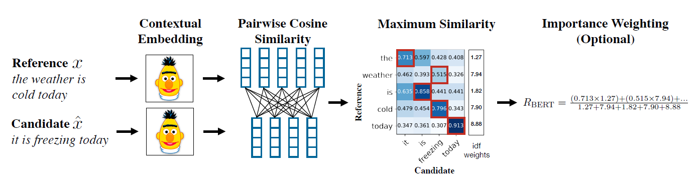

# Session 9

### Authors

* **Deepak Hazarika**
* **Parinita Bora**
* **Mohan Sai Srinivas Y**    

Sunday, 11 July 2021
----------

### Language model evaluation metrics

*  Recall, Precision, and F1 Score
   
*  BLEU (Bilingual Evaluation Understudy)

*  Perplexity (explain whether you are using bigram, trigram, or something else, what does your PPL score represent?)
    
*  BERTScore

Let us start by defining the above metrics

#### Precision

It is a measure of true positive out of total predicted positive.This is illustrated by the highlighted cells in the confusion matrix and the formula given below.

#### Recall

This is a measure of true positive over total actual positive.THe diagram below highlights the same and the formula is given below.

#### F1 score

F1 score is a better measure if we seek a balance between precision and recall and there is an uneven class distribution (true negatives) .It is a function of precision and recall as shown by the formula below.

The above metrics are used by BLEU and BERTscore

### BLEU score

'The cornerstone of our metric is the familiar pre-cision measure.To compute precision, one simply counts up the number of candidate translation words(unigrams) which occur in any reference translation and then divides by the total number of words in the candidate translation. Unfortunately,  machine translation sys-tems can overgenerate "reasonable" words, resulting in improbable, but high-precision, translations like that of example below.  Intuitively the problem is clear: a reference word should be considered exhausted after a matching candidate word is identified.We  formalize this intuition as the modified unigram precision. To compute this, one first counts the maximum number of times a word occurs in any single reference translation. Next, one clips the total count of each candidate word by its maximum reference count, adds these clipped counts up, and divides by the total(unclipped) number of candidate words.'

* Example2.

Candidate: *the the the the the the the.*

Reference1:*The* cat is on *the* mat.

Reference2:There is a cat on the mat.

Modified Unigram Precision of word 'the' =2/7

##### **Modified n gram precision**

'We first compute the n-gram matches sentence by sentence. Next, we add the clipped n-gram counts for all the candidate sentences and divide by the number of candidate n-grams in the test corpus to compute a modified precision score, pn,  for the entire test corpus.'

A weighted average of the logarithm of modified precisions is used to combine them and given a precision.

##### **Sentence brevity penalty**

With this brevity penalty in place, a high-scoring candidate translation must now match the reference translations in length, in word choice, and in word order. Note that neither this brevity penalty nor the modified n-gram precision length effect directly considers the source length; in-stead, they consider the range of reference translation lengths in the target language.

#### BLEU details

We  take  the geometric mean of the test corpus' modified precision scores and then multiply the result by an exponential brevity penalty factor. Currently,  case folding is the only text normalization performed before computing the precision. We   first compute the geometric average of the modified n-gram precisions, pn,  using n-grams up to length N and positive  weights wn summing to one. Next, let **c** be the length of  the candidate translation and **r** be the effective reference corpus length.We  compute the brevity penalty BP,

Then,

(source - BLEU: a MethodforAutomaticEvaluationofMachineTranslationKishore Papineni,SalimRoukos,ToddWard,andWei-JingZhuIBMT. J. WatsonResearchCenterYorktownHeights,NY10598,USAfpapineni,roukos,toddward,weijingg@us.ibm.com)

BLEU score on test model

BLEU score was calculated for multi30k dataset

BLEU score = 0.00

The BLEU metric ranges from 0 to 1. Few translations will attain a  score of 1 unless they are identical to a reference translation.

---

## BERT score

Natural language text generation is commonly evaluated using annotated reference sentences. Given a reference sentence x tokenized to k tokens.

<x1; : : : ; xk >

and a candidate ^x tokenized to l tokens
 
<^x1; : : : ; ^xl >
                                    
, a generation evaluation metric is a function

we use contextual embeddings to represent the tokens, and compute matching using cosine similarity, optionally weighted with inverse document frequency scores. figure illustrates the computation.

The main model we use is BERT, which tokenizes the input text into a sequence
of word pieces , where unknown words are split into several commonly observed
sequences of characters. The representation for each word piece is computed with a Transformer encoder by repeatedly applying self-attention and nonlinear transformations
in an alternating fashion.

**Similarity Measure** 

The vector representation allows for a soft measure of similarity instead of exact-string or heuristic matching. The cosine similarity of a reference token xi and a candidate token ^xj is 

While this measure considers tokens in isolation, the contextual embeddings contain information from the rest of the sentence.

**BERTSCORE**

The complete score matches each token in x to a token in ^x to compute recall,
and each token in ^x to a token in x to compute precision. We use greedy matching to maximize the matching similarity score, where each token is matched to the most similar token in the other sentence. We combine precision and recall to compute an F1 measure. For a reference x and candidate ^x, the recall, precision, and F1 scores are:

(source : BERTSCORE: EVALUATING TEXT GENERATION WITH
BERT
Tianyi Zhangyz, Varsha Kishorez, Felix Wuz, Kilian Q. Weinbergeryz, and Yoav Artzizx
zDepartment of Computer Science and xCornell Tech, Cornell University)

### BERT score was used to evaluate the proformance of the model on multi30k dataset

A plot of BERT precision is shown below for reference

The above graph shows the  distribution of cosine similarity between tokens of candidate and reference sentence.

* The model is able to predict words with higher cosine similarity 

  *  higher cosine similarity of (>= 0.9) for most of the tokens

  *  minimum cosine similarity is 0.8

*  A higher precision means fewer false positive

A plot of BERT recall is shown below for reference

The above graph shows the  distribution of cosine similarity between tokens of candidate and reference sentence.

* The model is able to predict words with higher cosine similarity 

  *  higher cosine similarity of (>= 0.9) for most of the tokens

  *  minimum cosine similarity is 0.8

*  A higher recall means fewer false negative 

A plot of BERT F1 is shown below for reference

As pointed out earlier , only if both measure - Precision and Recall are higher , F1 score will be high.The above plot does reflect that,

*  The distribution is right skewed with higher cosine similarity ( > 0.91 )

*  minimum cosine similarity is 0.82

The model seems to be performing good.

A cosine similarity plot for a pair of candidate and target sentence is shown below

## Perplexity 

Perplexity (PPL) is one of the most common metrics for evaluating language models. Before diving in, we should note that the metric applies specifically to classical language models (sometimes called autoregressive or causal language models) and is not well defined for masked language models.

Perplexity is defined as the exponentiated average negative log-likelihood of a sequence. If we have a tokenized sequence X=(x0,x1,.,xt), then the perplexity of X is,

where , 

is the log-likelihood of the ith token conditioned on the preceding tokens x<i according to our model. Intuitively, it can be thought of as an evaluation of the model's ability to predict uniformly among the set of specified tokens in a corpus. Importantly, this means that the tokenization procedure has a direct impact on a model's perplexity which should always be taken into consideration when comparing different models.

The PPL of fixed-length models should be evaluated with a sliding-window strategy. This involves repeatedly sliding the context window so that the model has more context when making each prediction.

(source :- https://huggingface.co/transformers/perplexity.html)

#### Code implementation for perplexity measurement

The train and validation function was re purposed to add a sliding window to predict a word given a context of i preceeding words.The predicted word is then compared with the actual word in the target sentence to calculate the loss.

Some observations in this implementation

*  In the target word tensor , when all the preceeding words except the last word is masked , the masking was getting applied inconsistently. Sometimes even the last word was getting masked.

*  The perplexity of the model was worsening after every epoch.

*  THe model suddenly started taking very long time to complete 1 epoch , it increased from 4 mins to 42 mins,

A plot of model PPL is given below

The validation PPL is increasing , maybe tuning has to be done in terms of size of the sliding winding.

A plot of model loss also shows a similar trend

## Last 2-3 epochs/stage logs for all of your 4 metrics separately (A, B, C, D) 

and describe your understanding about the numbers you're seeing, are they good/bad? Why?

### Test logs for BLEU score and BERT score

The same model was used to calculate BLEU and BERT score

validation.tar.gz: 100%|??????????????????????????????| 46.3k/46.3k [00:00<00:00, 90.7kB/s]

Epoch: 01 | Time: 0m 59s
	Train Loss: 5.149 | Train PPL: 172.290
	 Val. Loss: 4.821 |  Val. PPL: 124.130
Epoch: 02 | Time: 0m 56s
	Train Loss: 3.964 | Train PPL:  52.678
	 Val. Loss: 4.223 |  Val. PPL:  68.236
Epoch: 03 | Time: 0m 56s
	Train Loss: 3.325 | Train PPL:  27.798
	 Val. Loss: 3.985 |  Val. PPL:  53.780
Epoch: 04 | Time: 0m 56s
	Train Loss: 2.835 | Train PPL:  17.029
	 Val. Loss: 3.749 |  Val. PPL:  42.496
Epoch: 05 | Time: 0m 57s
	Train Loss: 2.465 | Train PPL:  11.762
	 Val. Loss: 3.648 |  Val. PPL:  38.380
Epoch: 06 | Time: 0m 56s
	Train Loss: 2.154 | Train PPL:   8.618
	 Val. Loss: 3.676 |  Val. PPL:  39.483
Epoch: 07 | Time: 0m 56s
	Train Loss: 1.935 | Train PPL:   6.923
	 Val. Loss: 3.718 |  Val. PPL:  41.180
Epoch: 08 | Time: 0m 56s
	Train Loss: 1.736 | Train PPL:   5.675
	 Val. Loss: 3.629 |  Val. PPL:  37.671
Epoch: 09 | Time: 0m 56s
	Train Loss: 1.593 | Train PPL:   4.920
	 Val. Loss: 3.716 |  Val. PPL:  41.110
Epoch: 10 | Time: 0m 57s
	Train Loss: 1.491 | Train PPL:   4.441
	 Val. Loss: 3.791 |  Val. PPL:  44.322

#### Analysis of logs

The model is designed and trained well , so the validation loss is reducing progressively.

BLEU score is calculated on test dataset.

* BLEU score is 0 , probably because the Precision is low (it depends on the word match between the candidate and reference sentence )

* Other reason could be corpus of words in multi30k dataset , need more data to make the model robust.

BERT score is a combined metric of Precision Recall and F1 score

* Histogram of precision shows a median of > 0.9 cosine similarity

* Histogram of recall also shows a median of > 0.9 cosine similarity

* Histogram of F1 shows a median of > 0.9 cosine similarity

* since all the 3 measures are > 0.9 , the model is able to predict a correct target sentence.The same is evident in the similarity matrix.There is high cosine similarity between word pairs form the predicted sentence and target sentence.

### Test logs for perplexity

	 Loss: 0.000 | perplexity:   1.000
	 Loss: 0.000 | perplexity:   1.000

validation.tar.gz: 100%|??????????????????????????????| 46.3k/46.3k [00:00<00:00, 1.48MB/s]

	 Loss: 0.000 | perplexity:   1.000

	 Val Loss: 0.000 | Val perplexity:   1.000
	 Val Loss: 0.000 | Val perplexity:   1.000
	 Val Loss: 0.000 | Val perplexity:   1.000
Epoch: 01 | Time: 41m 51s
	Train Loss: 1.363 | Train PPL:   3.907
	 Val. Loss: 1.627 |  Val. PPL:   5.087
	 Loss: 0.000 | perplexity:   1.000
	 Loss: 0.000 | perplexity:   1.000
	 Loss: 0.000 | perplexity:   1.000
	 Val Loss: 0.000 | Val perplexity:   1.000
	 Val Loss: 0.000 | Val perplexity:   1.000
	 Val Loss: 0.000 | Val perplexity:   1.000
Epoch: 02 | Time: 41m 29s
	Train Loss: 1.679 | Train PPL:   5.363
	 Val. Loss: 1.828 |  Val. PPL:   6.222
	 Loss: 0.000 | perplexity:   1.000
	 Loss: 0.000 | perplexity:   1.000
	 Loss: 0.000 | perplexity:   1.000
	 Val Loss: 0.000 | Val perplexity:   1.000
	 Val Loss: 0.000 | Val perplexity:   1.000
	 Val Loss: 0.000 | Val perplexity:   1.000
Epoch: 03 | Time: 41m 29s
	Train Loss: 1.896 | Train PPL:   6.659
	 Val. Loss: 2.062 |  Val. PPL:   7.860
	 Loss: 0.000 | perplexity:   1.000
	 Loss: 0.000 | perplexity:   1.000
	 Loss: 0.000 | perplexity:   1.000
	 Val Loss: 0.000 | Val perplexity:   1.000
	 Val Loss: 0.000 | Val perplexity:   1.000
	 Val Loss: 0.000 | Val perplexity:   1.000
Epoch: 04 | Time: 41m 18s
	Train Loss: 2.339 | Train PPL:  10.368
	 Val. Loss: 3.111 |  Val. PPL:  22.442
	 Loss: 0.000 | perplexity:   1.000
	 Loss: 0.000 | perplexity:   1.000
	 Loss: 0.000 | perplexity:   1.000
	 Val Loss: 0.000 | Val perplexity:   1.000
	 Val Loss: 0.000 | Val perplexity:   1.000
	 Val Loss: 0.000 | Val perplexity:   1.000
Epoch: 05 | Time: 41m 15s
	Train Loss: 2.815 | Train PPL:  16.693
	 Val. Loss: 3.002 |  Val. PPL:  20.129

#### Analysis of log

*  6 sliding windows were used to calculate the perplexity  , there is an inverse relation between number of sliding window and number of preceeding words in the window.

*  Thus the context will be richer with lesser number of sliding window.

*  In this case a probable reason for increasing perplexity could be inconsistent masking of words in the target tensor, if the masking was correct , then the loss will be less and reduce progressiveley as the model learns.Future work is required.

*  If the masking issue is corrected then the benefit of perplexity can be seen in the translation.

## Summary :

BERT score is a better metric for model performance evaluation.

### Future work

* Investigate why perplexity is increasing

* Investigate why masking is inconsistent.