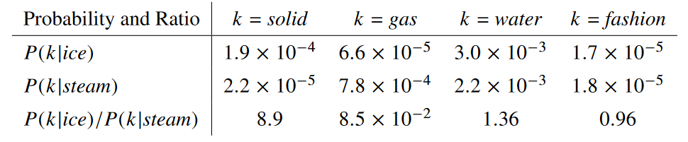
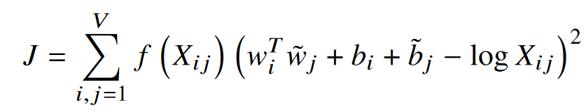
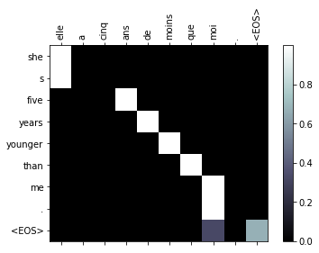
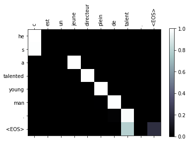

# Session 10

### Authors

* **Deepak Hazarika**
* **Parinita Bora**
* **Mohan Sai Srinivas Y**    

Saturday, 17 July 2021
----------

### pre trained word embedding - GLOVE - Global Vectors for Word Representation

**Motivation**

It is obvious that every mathematical system or algorithm needs some sort of numeric input to  work  with.

The naive way of converting words to vectors might  assign  each  word  a  one-hot  vector equal to vocabulary size.  This vector will be all zeros except one unique index for each word. Representing words in this way leads to substantial data sparsity and usually means that we may need more data in order to successfully train statistical models.

So we want semantically similar words to be mapped to nearby points, thus making the representation carry useful information about the word actual meaning.

**Word Embeddings Methods**

Word embeddings models can be divided into main categories:

* Count-based methods

* Predictive methods

One of the most influential early works in count-based methods is the LSI/LSA(Latent Semantic Indexing/ Analysis).This method is based on the Firth's hypothesis that the meaning of a word is  defined  "by  the  company  it  keeps". This hypothesis leads to a very simple albeit a very high-dimensional word embedding. Formally,each word can be represented as a vector of N unique number of words in a given dictionary (in practice N=100,000). Then, by taking a very large corpus (e.g. Wikipedia),let Count5(w1,w2) be  the  number  of  times w1 and w2 occur within a distance 5 of each other in the corpus. Then the word embedding for  a  word  w  is  a  vector  of  dimension  N,with one coordinate for each dictionary word.The coordinate corresponding to word w2 is Count5(w,w2).

The problem with the resulting embedding is that it uses extremely high dimensional vectors. 

The second family of methods, sometimes also referred as neural probabilistic language models.Unlike count based models, predictive models try to predict a word from its neighbors in terms of learned small, dense embedding vectors.

Two  of  the  most  popular  methods  which appeared   recently   are   the   

* Glove   (Global Vectors   for   Word   Representation) method which is an unsupervised learning method, although not predictive in the common sense.

* Word2Vec, a family of energy based predictive models,

(source: Word Embeddings and Their Use In Sentence Classification Tasks, by Amit Mandelbaum Adi Shalev, Hebrew University of Jerusalm , amit.mandelbaum@mail.huji.ac.il bitan.adi@gmail.com October 27, 2016)

Here we will discuss mainly about GloVe method.

**GloVe**

Most word vector methods rely on the distance or angle between pairs of word vectors as the primary  method  for  evaluating  the  intrinsic  quality of such a set of word representations.

In this method, we analyze the model properties necessary to produce linear directions of meaning and argue that global log-bilinear regression models are appropriate for doing so. We propose a specific weighted least squares model that trains on global word-word co-occurrence counts and thus makes efficient use of statistics.The model produces a word vector space with meaningful substructure.

**GloVe model**

The statistics of word occurrences in a corpus is the primary source of information available to all unsupervised methods for learning word representations, and although many such methods now exist, **the question still remains as to how meaning is generated from these statistics**, and how the resulting word vectors might represent that meaning.In this section, we shed some light on this ques-tion. We use our insights to construct a new model for word representation which we call GloVe, for Global Vectors, because the global corpus statistics are captured directly by the model.

First we establish some notation. Let the matrix of word-word co-occurrence counts be denoted by X, whose entries $X_{ij}$ tabulate the number of times $word_{j}$ occurs in the context of $word_{i}$. Let 

$X_{i} = \sum_{k} X_{ik}$ 

be the number of times any word appears in the context of $word_{i}$.

Finally, let 

$P_{ij} = P(j|i) = X_{ij}/X_{i}$ 

be the probability that $word_{j}$ appear in the context of $word_{i}$.

Consider two words i and j that exhibit a particular aspect of interest; for concreteness, suppose we are interested in the concept of thermodynamic phase,for which we might take i=ice and j=steam. The relationship of these words can be examined by studying the ratio of their co-occurrence prob-abilities with various probe words,k.  For words k related to ice but not steam, say k=solid, we expect the ratio 

$P_{ik}/P_{jk}$

will be large. Similarly,for words k related to steam but not ice, say k=gas, the ratio should be small. For words k like water or fashion, that are either related to both ice and steam, or to neither, the ratio should be close to one.

Table 1 shows these probabilities and their ratios for a large corpus, and the numbers confirm these expectations. Compared to the raw probabilities, the ratio is better able to distinguish relevant words (solid and gas) from irrelevant words (water and fashion) and it is also better able to discriminate between the two relevant words.

We  propose  a  new  weighted  least  squares  regression  model

where,

* V is the size of the vocabulary. 

* $f(X_{ij})$ is a weighting function 

* $w \in R^{d}$ are  word  vectors

* $\tilde w  \in R^{d}$ are separate context word vector

* bias $b_{i}$ for $w_{i}$

* additional bias $\tilde b_{j}$ for $w_{j}$

The weighting function should obey the following properties:

* f(0)=0.   If f is  viewed  as  a  continuous function,  it  should  vanish  as ${x\to 0}$  fast enough that the $\lim_{x\to 0} f(x) log^{2}x$ is finite.

* f(x)  should  be  non-decreasing  so  that  rare co-occurrences are not overweighted

* f(x) should be relatively small for large values of x, so that frequent co-occurrences are not overweighted.

(source : Jeffrey Pennington, Richard Socher, and Christopher D. Manning. 2014. GloVe: Global Vectors for Word Representation.)

**Learning from this exercise**

* After inspecting the word vectors for few words in glove dataset , a better understanding of what it means.

* The glove dataset is only for english language , since the dataset used in the model is bi-lingual, so a thought came to mind how to use this pre-trained embedding.

* Then 2 language class were created one for english model and one for generic language.

* In the english language class the words , word2index are initialized with values from glove dataset.

* The english sentences from the dataset are then tokenized and checked if the words are already present in the 0.4 M word repository.In the process 5 new words were found from the english sentence dataset.

* This is the reason the pretrained weights could not be used directly in the embedding layer.

* The weights had to be manually copied to a local array and initialized, for non existing words they are initialized from a normal distribution with mean 0 and std. deviation 1.

* An additional point is whether the input sentence is english or output sentence is english.

* In this case output language is english , so the attention decoder embedding layer weights had to initialized with the pretrained weights

* a provision is already made to account for english sentence as input , in this case the encoder embedding layer will be populated with pretrained weights.

* Since the embedding weights are already optimized , so the require_grad flag was set to false.This will save back propagating the embedding weights during training.

### a glimpse of model performance

## Summary

The model performance improved with pre trained embedding weights

| model | average loss | total time  |  english words corpus  |
| --- | --- | --- | --- |
| without pre- trained embedding | **0.6437** | 23m 42s |  2803 |
| with pre- trained embedding | **0.4985** | 77m 23s |  400005 |

As evident from the table above , the corpus of english words is 200 times more in the case of pre trained embedding, hence the execution time was high , but the model performed better with pre trained embeddings.

### Test logs

5m 2s (- 70m 28s) (5000 6%) 3.5390
10m 7s (- 65m 47s) (10000 13%) 2.6173
15m 13s (- 60m 54s) (15000 20%) 2.2009
20m 20s (- 55m 57s) (20000 26%) 1.8947
25m 29s (- 50m 58s) (25000 33%) 1.6736
30m 37s (- 45m 56s) (30000 40%) 1.4324
35m 49s (- 40m 56s) (35000 46%) 1.2794
40m 59s (- 35m 51s) (40000 53%) 1.0828
46m 9s (- 30m 46s) (45000 60%) 0.9577
51m 21s (- 25m 40s) (50000 66%) 0.8736
56m 33s (- 20m 33s) (55000 73%) 0.7881
61m 45s (- 15m 26s) (60000 80%) 0.7013
66m 57s (- 10m 18s) (65000 86%) 0.6301
72m 10s (- 5m 9s) (70000 93%) 0.5606
77m 23s (- 0m 0s) (75000 100%) 0.4985

### Future work

* swap the input language to english and see the performance

* increase the english sentence dataset

