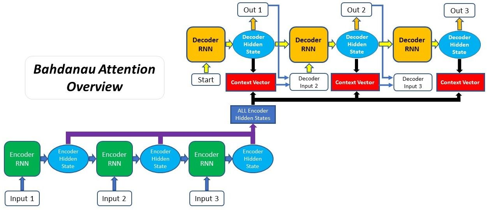
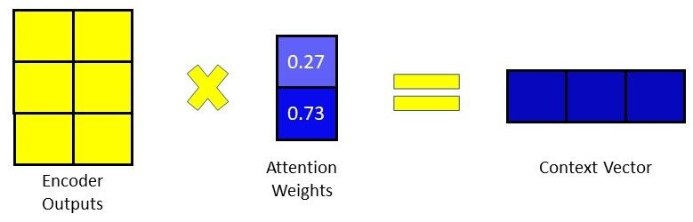
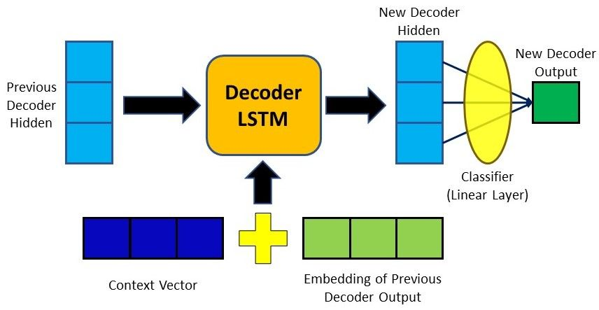

# Session 11

### Authors

* **Deepak Hazarika**
* **Parinita Bora**
* **Mohan Sai Srinivas Y**    

Saturday, 24 July 2021
----------

### Encoder/Decoder feed-forward manual steps using Bahdanau attention mechanism

#### Encoder

* The input words are passed through an embedding layer to get the embedding vector.

* The embedding vector is then passed through a lstm layer with 1 number of layer , the hidden states are stored as a single vector.

* This single vector will then be used in Bahdanau attention to get the context of input sentence relative to the decoder word.

The block of code where feed forward manual steps are done

```
encoder_outputs = torch.zeros(MAX_LENGTH, 256, device=device)
encoder_hidden_states = torch.zeros(MAX_LENGTH, 256, device=device)

hidden = torch.zeros(1, 1, 256, device=device)
cell = torch.zeros(1, 1, 256, device=device)

pos = 0

embedded_input = embedding(input_tensor[pos].view(-1, 1))

output, (hidden , cell) = lstm(embedded_input, (hidden,cell))

encoder_outputs[pos] += output[0,0]

encoder_hidden_states[pos] += hidden[0,0]

```

#### Bahdanau attention mechanism

An illustration of Bahdanau attention will make this journey simple



(source: https://blog.floydhub.com/attention-mechanism/)

All the encoder outputs are wrapped as a single vector , then in the decoder for each word , the decoder hidden state is paired with the encoder output for each word.

e.g if the decoder hidden state is d0 and the encoder hidden states are h0 , h1 , h2 , h3

* then they are paired [d0 , h0] , [d0 , h1] , [d0 , h2] , [d0 , h3]

* each of the pair is passed through a linear layer to get the weight of encoder hidden state 

* these weights are accumulated and passed through a softmax function to get the relative weight of the input sentence words.

* a batch matrix multiplication is done between the weights and encoder output states to get the context for the decoder word.


(source: https://blog.floydhub.com/attention-mechanism/)

#### Decoder

The attention mechanism is embedded in the decoder 


(source: https://blog.floydhub.com/attention-mechanism/)

* The context vector created above along with the previous decoder hidden state is fed to the LSTM layer.

* a linear layer is created to transform the context vector and hidden vector to match the input dimension of LSTM layer.

* The output of the LSTM layer is passed through an activation function to add non-linearity.

* This output is then passed through a linear layer , then a softmax function to get the weights of words in the target vocabulary.

* topk function will return the value and index of the predicted word.

**feed-forward manual step of the attention decoder is given below**

```
decoder_input = torch.tensor([[SOS_token]], device=device)

decoder_hidden = torch.zeros(1, 1, 256, device=device)
decoder_cell = torch.zeros(1, 1, 256, device=device)


output_size = output_lang.n_words
embedding = nn.Embedding(output_size, 256).to(device)
embedded = embedding(decoder_input)

attn_applied , attn_weights = getattentioncontext(decoder_hidden ,  encoder_hidden_states)

input_to_lstm_layer = nn.Linear(256 * 2, 256).to(device)
input_to_lstm = input_to_lstm_layer(torch.cat((embedded[0], attn_applied[0]), 1))
lstm = nn.LSTM(256, 256).to(device)
input_to_lstm = input_to_lstm.unsqueeze(0)
output, (decoder_hidden,decoder_cell) = lstm(input_to_lstm, (decoder_hidden,decoder_cell))
output_word_layer = nn.Linear(256, output_lang.n_words).to(device)
output = F.relu(output)
output = F.softmax(output_word_layer(output[0]), dim = 1)
top_value, top_index = output.data.topk(1)

predicted_sentence.append(output_lang.index2word[top_index.item()])

output_lang.index2word[top_index.item()] , attn_weights


```

### a glimpse of model performance


*output and attention weights of first feed-forward manual step of decoder*

('conscientious',
 tensor([[0.1062, 0.0996, 0.0994, 0.1077, 0.0937, 0.0929, 0.1033, 0.0990, 0.0990,
          0.0990]], device='cuda:0', grad_fn=<SoftmaxBackward>))

*output and attention weights of second feed-forward manual step of decoder*
          
('adequate',
 tensor([[0.1062, 0.0996, 0.0994, 0.1077, 0.0937, 0.0929, 0.1033, 0.0990, 0.0990,
          0.0990]], device='cuda:0', grad_fn=<SoftmaxBackward>))

### Future work

* Investigate why the attention weights are not changing across iterations although the weights of individual encoder hidden states are different across iteration.


