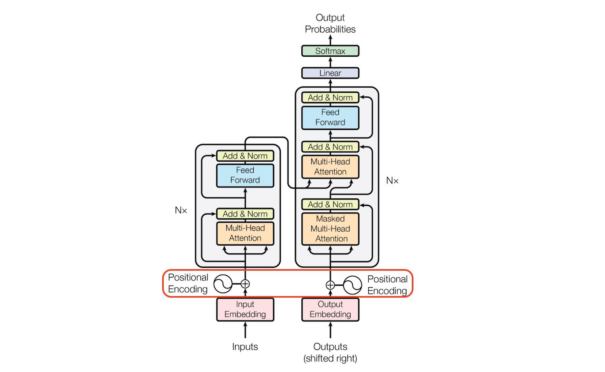
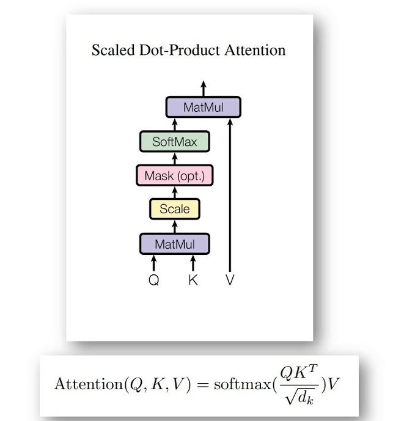
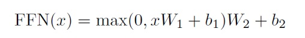

# Session 12

### Authors

* **Deepak Hazarika**
* **Parinita Bora**
* **Mohan Sai Srinivas Y**    

Thursday, 29 July 2021
----------

## Transformer

(source: Attention Is All You Need
Ashish Vaswani,
Noam Shazeer,
Niki Parmar,
Jakob Uszkoreit,
Llion Jones,
Aidan N. Gomez,
Lukasz Kaiser,
Illia Polosukhin)

This readme is inspired by the above paper **Attention is all you need**

### Model 

Most competitive neural sequence transduction models have an encoder-decoder structure .Here, the encoder maps an input sequence of symbol representations $(x_{1}; :::; x_{n})$ to a sequence of continuous representations z = $(z_{1}; :::; z_{n})$. Given z, the decoder then generates an output sequence $(y_{1}; :::; y_{m})$ of symbols one element at a time. At each step the model is auto-regressive, consuming the previously generated symbols as additional input when generating the next.

The Transformer follows this overall architecture using stacked self-attention and point-wise, fully connected layers for both the encoder and decoder, shown in the left and right halves of Figure, respectively.

### Encoder: 

The encoder is composed of a stack of N = 6 identical layers. Each layer has two
sub-layers. The first is a multi-head self-attention mechanism, and the second is a simple, position wise fully connected feed-forward network. We employ a residual connection around each of the two sub-layers, followed by layer normalization. That is, the output of each sub-layer is LayerNorm(x + Sublayer(x)), where Sublayer(x) is the function implemented by the sub-layer itself. To facilitate these residual connections, all sub-layers in the model, as well as the embedding layers, produce outputs of dimension d_model = 512.

### Decoder: 

The decoder is also composed of a stack of N = 6 identical layers. In addition to the two sub-layers in each encoder layer, the decoder inserts a third sub-layer, which performs multi-head attention over the output of the encoder stack. Similar to the encoder, we employ residual connections around each of the sub-layers, followed by layer normalization. We also modify the self-attention sub-layer in the decoder stack to prevent positions from attending to subsequent positions. This masking, combined with fact that the output embeddings are offset by one position, ensures that the predictions for position i can depend only on the known outputs at positions less than i.

### Attention

An attention function can be described as mapping a query and a set of key-value pairs to an output,where the query, keys, values, and output are all vectors. The output is computed as a weighted sum of the values, where the weight assigned to each value is computed by a compatibility function of the query with the corresponding key.

### Scaled Dot-Product Attention

We call our particular attention "Scaled Dot-Product Attention" in the figure below. The input consists of queries and keys of dimension dk, and values of dimension dv. We compute the dot products of the query with all keys, divide each by square root of dk, and apply a softmax function to obtain the weights on the values.

In practice, we compute the attention function on a set of queries simultaneously, packed together into a matrix Q. The keys and values are also packed together into matrices K and V . We compute the matrix of outputs as:

The two most commonly used attention functions are additive attention, and dot-product (multiplicative) attention. Dot-product attention is identical to our algorithm, except for the scaling factor of inverse of square root of dk. Additive attention computes the compatibility function using a feed-forward network with a single hidden layer. While the two are similar in theoretical complexity, dot-product attention is much faster and more space-efficient in practice, since it can be implemented using highly optimized
matrix multiplication code. While for small values of dk the two mechanisms perform similarly, additive attention outperforms dot product attention without scaling for larger values of dk. We suspect that for large values of dk, the dot products grow large in magnitude, pushing the softmax function into regions where it has extremely small gradients. To counteract this effect, we scale the dot products by inverse of square root of dk.

### Position-wise Feed-Forward Networks

In addition to attention sub-layers, each of the layers in our encoder and decoder contains a fully connected feed-forward network, which is applied to each position separately and identically. This consists of two linear transformations with a ReLU activation in between.

While the linear transformations are the same across different positions, they use different parameters from layer to layer. Another way of describing this is as two convolutions with kernel size 1. The dimensionality of input and output is dmodel = 512, and the inner-layer has dimensionality dff = 2048.

### Embeddings and Softmax

Similarly to other sequence transduction models, we use learned embeddings to convert the input tokens and output tokens to vectors of dimension dmodel. We also use the usual learned linear transformation and softmax function to convert the decoder output to predicted next-token probabilities. In our model, we share the same weight matrix between the two embedding layers and the pre-softmax linear transformation. In the embedding layers, we multiply those weights by square root of dmodel.

### Positional Encoding

Since our model contains no recurrence and no convolution, in order for the model to make use of the order of the sequence, we must inject some information about the relative or absolute position of the tokens in the sequence. To this end, we add "positional encodings" to the input embeddings at the bottoms of the encoder and decoder stacks. The positional encodings have the same dimension dmodel as the embeddings, so that the two can be summed.

## Coming to this readme , 3 issues are addressed

### what dataset you have used

French to english translation dataset downloaded from 

https://download.pytorch.org/tutorial/data.zip

### what problem have you solved?

The transformer is used to translate from french to english.

### Training logs

The model was run for 35000 iterations , because of reource constraint in google colab

3m 40s (- 22m 5s) (5000 14%) 5.0556

7m 22s (- 18m 27s) (10000 28%) 5.0039

11m 4s (- 14m 45s) (15000 42%) 5.0123

14m 44s (- 11m 3s) (20000 57%) 4.9814

18m 27s (- 7m 22s) (25000 71%) 4.9935

22m 9s (- 3m 41s) (30000 85%) 5.0020

25m 51s (- 0m 0s) (35000 100%) 5.0021

### Random Evaluation of translation

aaaaaaaaaaaaaaaaaaaaaaaaaaaaaaaaaaaaaaaaaaaaaaaaaa 

src -  j ai tres faim . 

tgt -  i m very hungry . 

pred -  . re m not 

aaaaaaaaaaaaaaaaaaaaaaaaaaaaaaaaaaaaaaaaaaaaaaaaaa 

src -  il a une assuetude a l heroine . 

tgt -  he s addicted to heroin . 

pred -  . re m not to 

aaaaaaaaaaaaaaaaaaaaaaaaaaaaaaaaaaaaaaaaaaaaaaaaaa 

src -  tu es fort serviable . 

tgt -  you re very helpful . 

pred -  . re m not 

aaaaaaaaaaaaaaaaaaaaaaaaaaaaaaaaaaaaaaaaaaaaaaaaaa 

src -  il depend completement de ses parents . 

tgt -  he is totally dependent on his parents . 

pred -  . re m not to a is 

aaaaaaaaaaaaaaaaaaaaaaaaaaaaaaaaaaaaaaaaaaaaaaaaaa 

src -  ce ne sont que des etudiants . 

tgt -  they re just students . 

pred -  . re m not 

aaaaaaaaaaaaaaaaaaaaaaaaaaaaaaaaaaaaaaaaaaaaaaaaaa 

src -  nous sommes plutot occupes ici . 

tgt -  we re kind of busy here . 

pred -  . re m not to a 

aaaaaaaaaaaaaaaaaaaaaaaaaaaaaaaaaaaaaaaaaaaaaaaaaa 

src -  t es un vrai thesauriseur . 

tgt -  you re such a pack rat . 

pred -  . re m not to a 

aaaaaaaaaaaaaaaaaaaaaaaaaaaaaaaaaaaaaaaaaaaaaaaaaa 

src -  elles sont en colere . 

tgt -  they re angry . 

pred -  . re m 

aaaaaaaaaaaaaaaaaaaaaaaaaaaaaaaaaaaaaaaaaaaaaaaaaa 

src -  je ne fais que supposer . 

tgt -  i m just guessing . 

pred -  . re m not 

aaaaaaaaaaaaaaaaaaaaaaaaaaaaaaaaaaaaaaaaaaaaaaaaaa 

src -  tu n es pas si vieille . 

tgt -  you re not that old . 

pred -  . re m not to 

*Legend* : 

* src - French sentence

* tgt - English sentence

* pred - Predicted sentence in english

#### Observation

There is stickiness in self attention , the same word seems to be used across translation.

### Future work

* Investigate why some words are picked too often in the translation 

