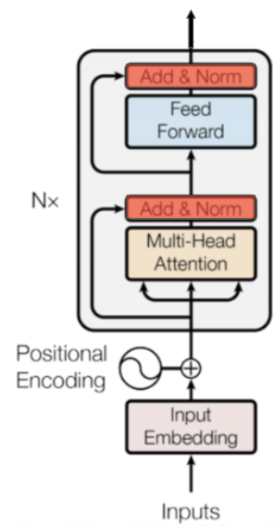
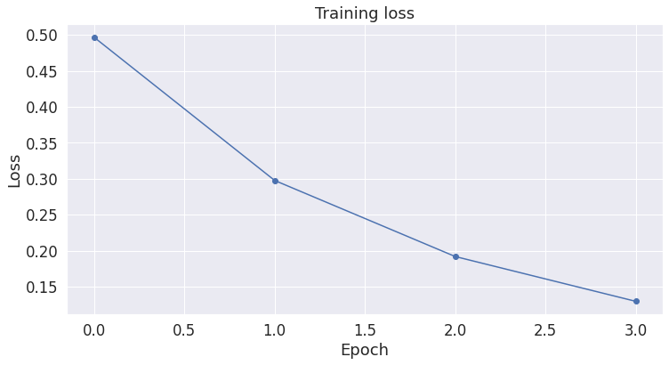

# Session 14

### Authors

* **Deepak Hazarika**
* **Parinita Bora**
* **Mohan Sai Srinivas Y**    

Friday, 13 August 2021
----------

## Fine-Tuning BERT for Sentence Classification

### Model architecture

#### Encoder




* As seen in the model architecture below , the positional and word embedding layer are at the bottom.

* The concatenated output is passed through a normalization layer

* After that 12 Bert layers are stacked one above the other

* Each Bert layer has 3 blocks

  * Self attention block
  
    * There are 3 linear layers
    
      * one each for query , key and value tensors as seen in the diagram above , 3 inputs to the multi head attention block.
     
      * the output of these 3 layers are passed through a linear layer, the input dimension is 768 , i.e the output of Q K and V are added element wise to get the same shape as that of Q , K and V.
      
      * this output is passed through a normalization layer
      
  * Feed forward block
  
    * In this block the linear layer explodes the dimension to 4 times the input dimension i.e 768 dim is exploded to 3072.
    
  * Output block
  
    * the output of above is passed to a linear layer, where the dimension is reduced to  768.This is normalized and sent to the next Bert layer
    


```
BertForQuestionAnswering(
  (bert): BertModel(
    (embeddings): BertEmbeddings(
      (word_embeddings): Embedding(30522, 768, padding_idx=0)
      (position_embeddings): Embedding(512, 768)
      (token_type_embeddings): Embedding(2, 768)
      (LayerNorm): LayerNorm((768,), eps=1e-12, elementwise_affine=True)
      (dropout): Dropout(p=0.1, inplace=False)
    )
    (encoder): BertEncoder(
      (layer): ModuleList(
        (0 ...11): BertLayer(
          (attention): BertAttention(
            (self): BertSelfAttention(
              (query): Linear(in_features=768, out_features=768, bias=True)
              (key): Linear(in_features=768, out_features=768, bias=True)
              (value): Linear(in_features=768, out_features=768, bias=True)
              (dropout): Dropout(p=0.1, inplace=False)
            )
            (output): BertSelfOutput(
              (dense): Linear(in_features=768, out_features=768, bias=True)
              (LayerNorm): LayerNorm((768,), eps=1e-12, elementwise_affine=True)
              (dropout): Dropout(p=0.1, inplace=False)
            )
          )
          (intermediate): BertIntermediate(
            (dense): Linear(in_features=768, out_features=3072, bias=True)
          )
          (output): BertOutput(
            (dense): Linear(in_features=3072, out_features=768, bias=True)
            (LayerNorm): LayerNorm((768,), eps=1e-12, elementwise_affine=True)
            (dropout): Dropout(p=0.1, inplace=False)
          )
        )
      )
    )
    (pooler): BertPooler(
      (dense): Linear(in_features=768, out_features=768, bias=True)
      (activation): Tanh()
    )
  )
  (qa_outputs): Linear(in_features=768, out_features=2, bias=True)
)
```

## Important points

* a pre trained model is used and a linear layer is added at the top , to return the classification code

  * 1 - grammatically correct
  
  * 0 - grammatically not correct

* for sentence classification CLS and SEP tokens have to be explicitly set in the input tensor

* input sentences should be of the same length , so a max_length limit is set and the sentences are padded to match the max length.

* max limit of sentence length should be <= 512

* an attention mask is also feed to the network , this explicitly specifies which tokens are words and which are pads

  * 0 for pad
  
  * 1 for word
  
* the model is run for 4 epochs


### 32 sample output generated by the model


| Sentence                                                                                                                                                       | True label | Predicted label |
|----------------------------------------------------------------------------------------------------------------------------------------------------------------|------------|-----------------|
| somebody just left - guess who .                                                                                                                               | 1          | 1               |
| they claimed they had settled on   something , but it wasn ' t clear what they had settled on .                                                                | 1          | 1               |
| if sam was going , sally would know where   .                                                                                                                  | 1          | 1               |
| they ' re going to serve the guests   something , but it ' s unclear what .                                                                                    | 1          | 1               |
| she ' s reading . i can ' t imagine what   .                                                                                                                   | 1          | 1               |
| john said joan saw someone from her   graduating class .                                                                                                       | 1          | 1               |
| john ate dinner but i don ' t know who .                                                                                                                       | 0          | 1               |
| she mail ##ed john a letter , but i don '   t know to whom .                                                                                                   | 0          | 1               |
| i served lee ##k soup to my guests .                                                                                                                           | 1          | 1               |
| i served my guests .                                                                                                                                           | 1          | 1               |
| she was bathing , but i couldn ' t make   out who .                                                                                                            | 0          | 1               |
| she knew french for tom .                                                                                                                                      | 0          | 0               |
| john is tall on several occasions .                                                                                                                            | 0          | 1               |
| the ship sank , but i don ' t know with   what .                                                                                                               | 0          | 1               |
| they noticed the painting , but i don ' t   know for how long .                                                                                                | 0          | 1               |
| john was tall , but i don ' t know on   what occasions .                                                                                                       | 0          | 1               |
| joan ate dinner with someone but i don '   t know who .                                                                                                        | 1          | 1               |
| joan ate dinner with someone but i don '   t know who with .                                                                                                   | 1          | 0               |
| i know that meg ' s attracted to harry ,   but they don ' t know who .                                                                                         | 0          | 1               |
| since jill said joe had invited sue , we   didn ' t have to ask who .                                                                                          | 0          | 1               |
| i know that meg ' s attracted to harry ,   but they don ' t know who .                                                                                         | 1          | 1               |
| she said she had spoken to everybody ,   but he wasn ' t sure who .                                                                                            | 0          | 1               |
| each of the performers came in , but were   sitting so far back that we couldn ' t see who .                                                                   | 0          | 1               |
| she didn ' t talk to one student .                                                                                                                             | 1          | 1               |
| she doesn ' t meet anyone for dinner ,   but they can ' t figure out who .                                                                                     | 0          | 1               |
| everyone relies on someone . it ' s   unclear who .                                                                                                            | 1          | 1               |
| each student wrote a paper on a maya ##n   language , but i don ' t remember which one .                                                                       | 1          | 1               |
| the newspaper has reported that they are   about to appoint someone , but i can ' t remember who the newspaper has   reported that they are about to appoint . | 1          | 1               |
| the newspaper has reported that they are   about to appoint someone , but i can ' t remember who they are about to   appoint .                                 | 1          | 1               |
| most columnist ##s claim that a senior   white house official has been briefing them , and the newspaper today reveals   which one .                           | 1          | 1               |
| most columnist ##s claim that a senior   white house official has been briefing them , but none will reveal which one   .                                      | 1          | 1               |
| bill wondered how many papers sandy had   read , but he didn ' t care which ones .                                                                             | 1          | 1               |

### model performance

A plot of training loss for 4 epochs is shown below




## Summary:

* The model was run for 4 epoch

* A pre trained model is a big saving in terms of time required to train on classification data


### training logs

``` 
======== Epoch 1 / 4 ========
Training...
  Batch    40  of    241.    Elapsed: 0:00:08.
  Batch    80  of    241.    Elapsed: 0:00:17.
  Batch   120  of    241.    Elapsed: 0:00:25.
  Batch   160  of    241.    Elapsed: 0:00:33.
  Batch   200  of    241.    Elapsed: 0:00:41.
  Batch   240  of    241.    Elapsed: 0:00:49.

  Average training loss: 0.50
  Training epcoh took: 0:00:49

Running Validation...
  Accuracy: 0.80
  Validation took: 0:00:02

======== Epoch 2 / 4 ========
Training...
  Batch    40  of    241.    Elapsed: 0:00:08.
  Batch    80  of    241.    Elapsed: 0:00:16.
  Batch   120  of    241.    Elapsed: 0:00:25.
  Batch   160  of    241.    Elapsed: 0:00:33.
  Batch   200  of    241.    Elapsed: 0:00:41.
  Batch   240  of    241.    Elapsed: 0:00:49.

  Average training loss: 0.30
  Training epcoh took: 0:00:49

Running Validation...
  Accuracy: 0.82
  Validation took: 0:00:02

======== Epoch 3 / 4 ========
Training...
  Batch    40  of    241.    Elapsed: 0:00:08.
  Batch    80  of    241.    Elapsed: 0:00:16.
  Batch   120  of    241.    Elapsed: 0:00:25.
  Batch   160  of    241.    Elapsed: 0:00:33.
  Batch   200  of    241.    Elapsed: 0:00:41.
  Batch   240  of    241.    Elapsed: 0:00:49.

  Average training loss: 0.19
  Training epcoh took: 0:00:49

Running Validation...
  Accuracy: 0.82
  Validation took: 0:00:02

======== Epoch 4 / 4 ========
Training...
  Batch    40  of    241.    Elapsed: 0:00:08.
  Batch    80  of    241.    Elapsed: 0:00:16.
  Batch   120  of    241.    Elapsed: 0:00:25.
  Batch   160  of    241.    Elapsed: 0:00:33.
  Batch   200  of    241.    Elapsed: 0:00:41.
  Batch   240  of    241.    Elapsed: 0:00:49.

  Average training loss: 0.13
  Training epcoh took: 0:00:49

Running Validation...
  Accuracy: 0.82
  Validation took: 0:00:02

Training complete!


```