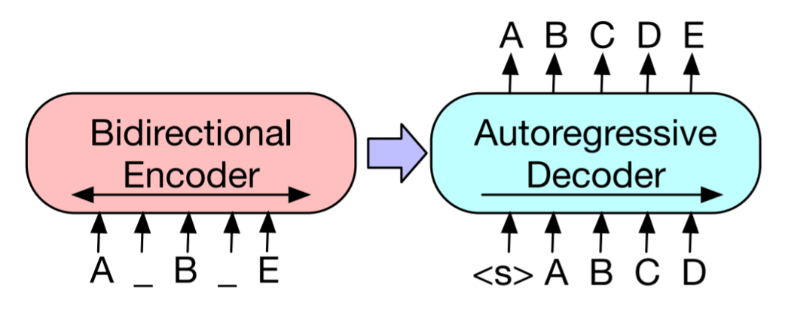

# Session 14

### Authors

* **Deepak Hazarika**
* **Parinita Bora**
* **Mohan Sai Srinivas Y**    

Friday, 13 August 2021
----------

##  BART: Denoising Sequence-to-Sequence Pre-training for Natural Language Generation, Translation, and Comprehension

### Model architecture


* BART uses a standard encoder-decoder architecture, but also includes some changes from BERT (encoder only) and GPT (decoder only)



* The encoder uses a denoising objective similar to BERT while the decoder attempts to reproduce the original sequence (autoencoder), token by token, using the previous (uncorrupted) tokens and the output from the encoder.

(source: https://towardsdatascience.com/bart-for-paraphrasing-with-simple-transformers-7c9ea3dfdd8c)

* paws dataset is used to train the model

* A pretrained BART model

  * facebook/bart-base is used to test para phrasing 
  
  * facebook/bart-large could not be used due to RAM constraint
  

### sample output from the model - model run for 4 epoch


``` 

Enter text to paraphrase: Her life spanned years of incredible change for women as they gained more rights than ever before.

Generating outputs: 100%
1/1 [00:00<00:00, 3.57it/s]

---------------------------------------------------------
Her life spanned years of incredible change for women as they gained more rights than ever before.

Predictions >>>
Her life spanned years of incredible change for women as they gained more rights than ever before.
Her life spanned years of incredible change for women as they gained more rights than ever before.
Her life spanned years of incredible change for women as they gained more rights than ever before.
---------------------------------------------------------

Enter text to paraphrase: Giraffes like Acacia leaves and hay, and they can consume 75 pounds of food a day.

Generating outputs: 100%
1/1 [00:00<00:00, 3.05it/s]

---------------------------------------------------------
Giraffes like Acacia leaves and hay, and they can consume 75 pounds of food a day.

Predictions >>>
Giraffes like Acacia leaves and hay, and they can consume 75 pounds of food a day.
Giraffes like Acacia leaves and hay, and they can consume 75 pounds of food a day.
Giraffes like Acacia leaves and hay, and they can consume 75 pounds of food a day.
---------------------------------------------------------

Enter text to paraphrase: Any trip to Italy should include a visit to Tuscany to sample the region's exquisite wines.

Generating outputs: 100%
1/1 [00:00<00:00, 3.50it/s]

---------------------------------------------------------
Any trip to Italy should include a visit to Tuscany to sample the region's exquisite wines.

Predictions >>>
Any trip to Italy should include a visit to Tuscany to sample the region's exquisite wines.
Any trip to Italy should include a visit to Tuscany to sample the region's exquisite wines.
Any trip to Italy should include a visit to Tuscany to sample the region's exquisite wines.
---------------------------------------------------------

Enter text to paraphrase: Symptoms of influenza include fever and nasal congestion.

Generating outputs: 100%
1/1 [00:00<00:00, 5.67it/s]

---------------------------------------------------------
Symptoms of influenza include fever and nasal congestion.

Predictions >>>
Sym symptoms of influenza include fever and nasal congestion.
Sym symptoms of influenza include fever and nasal congestion.
Sym symptoms of influenza include fever and nasal congestion.
---------------------------------------------------------

Enter text to paraphrase: He has tons of stuff to throw away. 

Generating outputs: 100%
1/1 [00:00<00:00, 6.28it/s]

---------------------------------------------------------
He has tons of stuff to throw away. 

Predictions >>>
He has tons of stuff to throw away.
He has tons of stuff to throw away.
He has tons of stuff to throw away.
---------------------------------------------------------

Enter text to paraphrase: 
```
(source : https://examples.yourdictionary.com/examples-of-paraphrasing.html)
  
## Summary:

* The model was trained for 4 epoch, because of ram constraint

* The model does not perform well if trained for only 4  epoch.Out of 6 sentence , it could not para phrase any sentence.

### training logs

``` 


INFO:filelock:Lock 139778297700432 acquired on /root/.cache/huggingface/transformers/f5310d276a6d1648d00c32fadc8bf7b4607e0fbd5b404fc4a0045960aa2bdfdb.8512cdf8592f538a7fd4b40eecaa096285410ec6494049568b3300922ab71165.lock

Downloading: 100%
1.63k/1.63k [00:00<00:00, 57.6kB/s]

INFO:filelock:Lock 139778297700432 released on /root/.cache/huggingface/transformers/f5310d276a6d1648d00c32fadc8bf7b4607e0fbd5b404fc4a0045960aa2bdfdb.8512cdf8592f538a7fd4b40eecaa096285410ec6494049568b3300922ab71165.lock
INFO:filelock:Lock 139778297700432 acquired on /root/.cache/huggingface/transformers/486355ec722ef05fd480e999d4c763be56549ae930f6a3742ee721a5d2a05647.9faea28a6782a9589c09b1942c039943df02232d83d2ac288a69ddfa928eae22.lock

Downloading: 100%
558M/558M [00:10<00:00, 51.9MB/s]

INFO:filelock:Lock 139778297700432 released on /root/.cache/huggingface/transformers/486355ec722ef05fd480e999d4c763be56549ae930f6a3742ee721a5d2a05647.9faea28a6782a9589c09b1942c039943df02232d83d2ac288a69ddfa928eae22.lock
INFO:filelock:Lock 139778317168400 acquired on /root/.cache/huggingface/transformers/43978bdeaa326572886b44fcfed82f932f76571095ce31973e51c3da8ccade7f.d67d6b367eb24ab43b08ad55e014cf254076934f71d832bbab9ad35644a375ab.lock

Downloading: 100%
899k/899k [00:00<00:00, 2.05MB/s]

INFO:filelock:Lock 139778317168400 released on /root/.cache/huggingface/transformers/43978bdeaa326572886b44fcfed82f932f76571095ce31973e51c3da8ccade7f.d67d6b367eb24ab43b08ad55e014cf254076934f71d832bbab9ad35644a375ab.lock
INFO:filelock:Lock 139778299559504 acquired on /root/.cache/huggingface/transformers/3c167ed8af56e6605eeb794b63a79d65d85e6708c9b04408d41946337030f5cd.5d12962c5ee615a4c803841266e9c3be9a691a924f72d395d3a6c6c81157788b.lock

Downloading: 100%
456k/456k [00:00<00:00, 1.26MB/s]

INFO:filelock:Lock 139778299559504 released on /root/.cache/huggingface/transformers/3c167ed8af56e6605eeb794b63a79d65d85e6708c9b04408d41946337030f5cd.5d12962c5ee615a4c803841266e9c3be9a691a924f72d395d3a6c6c81157788b.lock
INFO:filelock:Lock 139778317168400 acquired on /root/.cache/huggingface/transformers/a878fcd69bba037c9b1b227f4213579ae43d0aaa9374e167bc6c5f41b1cfeb30.fc9576039592f026ad76a1c231b89aee8668488c671dfbe6616bab2ed298d730.lock

Downloading: 100%
1.36M/1.36M [00:00<00:00, 3.43MB/s]

INFO:filelock:Lock 139778317168400 released on /root/.cache/huggingface/transformers/a878fcd69bba037c9b1b227f4213579ae43d0aaa9374e167bc6c5f41b1cfeb30.fc9576039592f026ad76a1c231b89aee8668488c671dfbe6616bab2ed298d730.lock
INFO:simpletransformers.seq2seq.seq2seq_utils: Creating features from dataset file at cache_dir/

100%
4365/4365 [00:01<00:00, 2886.81it/s]

INFO:simpletransformers.seq2seq.seq2seq_model: Training started

Epoch 3 of 3: 100%
3/3 [05:06<00:00, 101.41s/it]

wandb: Appending key for api.wandb.ai to your netrc file: /root/.netrc

Tracking run with wandb version 0.12.0
Syncing run silver-breeze-11 to Weights & Biases (Documentation).
Project page: https://wandb.ai/deepakh/Paraphrasing%20with%20BART
Run page: https://wandb.ai/deepakh/Paraphrasing%20with%20BART/runs/1ich5a3g
Run data is saved locally in /content/wandb/run-20210814_162241-1ich5a3g

Epochs 0/3. Running Loss: 0.6301: 100%
546/546 [01:09<00:00, 8.54it/s]

INFO:simpletransformers.seq2seq.seq2seq_model:Saving model into outputs/checkpoint-546-epoch-1
INFO:simpletransformers.seq2seq.seq2seq_utils: Creating features from dataset file at cache_dir/

100%
3539/3539 [00:05<00:00, 599.07it/s]

INFO:simpletransformers.seq2seq.seq2seq_model:{'eval_loss': 0.7702553548983165}
INFO:simpletransformers.seq2seq.seq2seq_model:Saving model into outputs/best_model

Epochs 1/3. Running Loss: 0.6400: 100%
546/546 [01:07<00:00, 8.51it/s]

INFO:simpletransformers.seq2seq.seq2seq_model:Saving model into outputs/checkpoint-1092-epoch-2
INFO:simpletransformers.seq2seq.seq2seq_utils: Creating features from dataset file at cache_dir/

100%
3539/3539 [00:05<00:00, 607.60it/s]

INFO:simpletransformers.seq2seq.seq2seq_model:{'eval_loss': 0.7058637578572545}
INFO:simpletransformers.seq2seq.seq2seq_model:Saving model into outputs/best_model

Epochs 2/3. Running Loss: 0.2927: 100%
546/546 [01:08<00:00, 8.56it/s]

INFO:simpletransformers.seq2seq.seq2seq_model:Saving model into outputs/checkpoint-1638-epoch-3
INFO:simpletransformers.seq2seq.seq2seq_utils: Creating features from dataset file at cache_dir/

100%
3539/3539 [00:06<00:00, 587.94it/s]

INFO:simpletransformers.seq2seq.seq2seq_model:{'eval_loss': 0.7035525547606605}
INFO:simpletransformers.seq2seq.seq2seq_model:Saving model into outputs/best_model
INFO:simpletransformers.seq2seq.seq2seq_model:Saving model into outputs/
INFO:simpletransformers.seq2seq.seq2seq_model: Training of facebook/bart-base model complete. Saved to outputs/.

Generating outputs: 100%
56/56 [08:04<00:00, 6.78s/it]

/usr/local/lib/python3.7/dist-packages/torch/_tensor.py:575: UserWarning: floor_divide is deprecated, and will be removed in a future version of pytorch. It currently rounds toward 0 (like the 'trunc' function NOT 'floor'). This results in incorrect rounding for negative values.
To keep the current behavior, use torch.div(a, b, rounding_mode='trunc'), or for actual floor division, use torch.div(a, b, rounding_mode='floor'). (Triggered internally at  /pytorch/aten/src/ATen/native/BinaryOps.cpp:467.)
  return torch.floor_divide(self, other)

os.makedirs("predictions", exist_ok=True)\n\nwith open(f"predictions/predictions_{datetime.now()}.txt", "w") as f:\n    for i, text in enumerate(eval_df["input_text"].tolist()):\n        f.write(str(text) + "\n\n")\n\n        f.write("Truth:\n")\n        f.write(truth[i] + "\n\n")\n\n        f.write("Prediction:\n")\n        for pred in preds[i]:\n            f.write(str(pred) + "\n")\n        f.write(\n            "________________________________________________________________________________\n"\n        )


```

