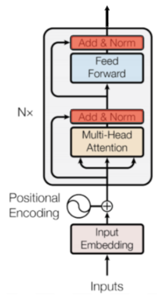

# Session 14

### Authors

* **Deepak Hazarika**
* **Parinita Bora**
* **Mohan Sai Srinivas Y**    

Friday, 13 August 2021
----------

## BERT QA bot

### Model architecture

#### Encoder




* As seen in the model architecture below , the positional and word embedding layer are at the bottom.

* The concatenated output is passed through a normalization layer

* After that 12 Bert layers are stacked one above the other

* Each Bert layer has 3 blocks

  * Self attention block
  
    * There are 3 linear layers
    
      * one each for query , key and value tensors as seen in the diagram above , 3 inputs to the multi head attention block.
     
      * the output of these 3 layers are passed through a linear layer, the input dimension is 768 , i.e the output of Q K and V are added element wise to get the same shape as that of Q , K and V.
      
      * this output is passed through a normalization layer
      
  * Feed forward block
  
    * In this block the linear layer explodes the dimension to 4 times the input dimension i.e 768 dim is exploded to 3072.
    
  * Output block
  
    * the output of above is passed to a linear layer, where the dimension is reduced to  768.This is normalized and sent to the next Bert layer
    


```
BertForQuestionAnswering(
  (bert): BertModel(
    (embeddings): BertEmbeddings(
      (word_embeddings): Embedding(30522, 768, padding_idx=0)
      (position_embeddings): Embedding(512, 768)
      (token_type_embeddings): Embedding(2, 768)
      (LayerNorm): LayerNorm((768,), eps=1e-12, elementwise_affine=True)
      (dropout): Dropout(p=0.1, inplace=False)
    )
    (encoder): BertEncoder(
      (layer): ModuleList(
        (0 ... 11): BertLayer(
          (attention): BertAttention(
            (self): BertSelfAttention(
              (query): Linear(in_features=768, out_features=768, bias=True)
              (key): Linear(in_features=768, out_features=768, bias=True)
              (value): Linear(in_features=768, out_features=768, bias=True)
              (dropout): Dropout(p=0.1, inplace=False)
            )
            (output): BertSelfOutput(
              (dense): Linear(in_features=768, out_features=768, bias=True)
              (LayerNorm): LayerNorm((768,), eps=1e-12, elementwise_affine=True)
              (dropout): Dropout(p=0.1, inplace=False)
            )
          )
          (intermediate): BertIntermediate(
            (dense): Linear(in_features=768, out_features=3072, bias=True)
          )
          (output): BertOutput(
            (dense): Linear(in_features=3072, out_features=768, bias=True)
            (LayerNorm): LayerNorm((768,), eps=1e-12, elementwise_affine=True)
            (dropout): Dropout(p=0.1, inplace=False)
          )
        )
      )
    )
    (pooler): BertPooler(
      (dense): Linear(in_features=768, out_features=768, bias=True)
      (activation): Tanh()
    )
  )
  (qa_outputs): Linear(in_features=768, out_features=2, bias=True)
)
```
## Important methods

### read_squad_examples

It reads through the input jason file and generates examples having the following format

* question id

* question

* context text tokens

* answer text

* start and end position of answer in the context text

### convert_examples_to_features

It converts the examples to following features 

* unique_id

* example_index

* tokens

### 6 sample output generated by the model

| Question Id  |  Question |  Answer |  Predicted  |   |
|---|---|---|---|---|
| 5ad3e96b604f3c001a3ff68c  | "Who did the Normans team up with in Anatolia?"  |  Turkish forces | "upper Euphrates valley in northern Syria"  |   |
| 56de15dbcffd8e1900b4b5c8  | "Who did Emma Marry?"  | "King Ethelred II"  | "Duke Richard II of Normandy"  |   |
| 56de15dbcffd8e1900b4b5cb  |  "Who kicked Ethelred out?" |  "Sweyn Forkbeard" | "Sweyn Forkbeard"  |   |
| 5ad401f2604f3c001a3ffd42 |   "Who dominated Western Europe for 380 years?" |   |  "Anglo-Norman forces of the Third Crusade" |   |
| 56e181d9e3433e1400422fa0 | "In a computational problem, what can be described as a string over an alphabet?"  | "problem instance"  | "binary alphabet (i.e., the set {0,1}), and thus the strings are bitstrings"  |   |
| 56e19557e3433e1400422ff1  | "What encoding decision needs to be made in order to determine an exact definition of the formal language?"  | "how graphs are encoded as binary strings"  | "how graphs are encoded as binary strings" |   |


## Summary:

* The model was run for 1 epoch, because of ram constraint

* The original train dataset is 130319 , only 1/12 of the train dataset was used to train because of resource constraint.

* An interesting observation , the model halucinates and generates answer on its own , an example is seen above.

### training logs

``` 
***** Running training *****
  Num examples = 144262
  Num Epochs = 1
  Batch size = 16
  Total optimization steps = 9016

Epoch:   0%|          | 0/1 [00:00<?, ?it/s]
Iteration:   0%|          | 0/9016 [00:00<?, ?it/s]
Iteration:   3%|???         | 305/9016 [00:00<00:02, 3044.97it/s]
Iteration:   7%|???         | 660/9016 [00:00<00:02, 3337.36it/s]
Iteration:  11%|??????        | 1019/9016 [00:00<00:02, 3449.13it/s]
Iteration:  15%|??????        | 1365/9016 [00:00<00:02, 3450.91it/s]
Iteration:  19%|??????        | 1727/9016 [00:00<00:02, 3509.23it/s]
Iteration:  23%|?????????       | 2078/9016 [00:00<00:01, 3502.46it/s]
Iteration:  27%|?????????       | 2431/9016 [00:00<00:01, 3509.12it/s]
Iteration:  31%|?????????       | 2791/9016 [00:00<00:01, 3536.39it/s]
Iteration:  35%|????????????      | 3145/9016 [00:00<00:01, 3520.16it/s]
Iteration:  39%|????????????      | 3498/9016 [00:01<00:01, 3499.40it/s]
Iteration:  43%|???????????????     | 3850/9016 [00:01<00:01, 3502.19it/s]
Iteration:  47%|???????????????     | 4201/9016 [00:01<00:01, 3494.17it/s]
Iteration:  50%|???????????????     | 4551/9016 [00:01<00:01, 3462.39it/s]
Iteration:  54%|??????????????????    | 4901/9016 [00:01<00:01, 3471.99it/s]
Iteration:  58%|??????????????????    | 5263/9016 [00:01<00:01, 3514.23it/s]
Iteration:  62%|?????????????????????   | 5615/9016 [00:01<00:00, 3514.70it/s]
Iteration:  66%|?????????????????????   | 5967/9016 [00:01<00:00, 3473.16it/s]
Iteration:  70%|?????????????????????   | 6321/9016 [00:01<00:00, 3492.84it/s]
Iteration:  74%|????????????????????????  | 6671/9016 [00:01<00:00, 3471.54it/s]
Iteration:  78%|????????????????????????  | 7022/9016 [00:02<00:00, 3480.84it/s]
Iteration:  82%|??????????????????????????? | 7379/9016 [00:02<00:00, 3505.87it/s]
Iteration:  86%|??????????????????????????? | 7730/9016 [00:02<00:00, 3470.25it/s]
Iteration:  90%|??????????????????????????? | 8086/9016 [00:02<00:00, 3495.55it/s]
Iteration:  94%|??????????????????????????????| 8436/9016 [00:02<00:00, 3485.36it/s]
Iteration:  97%|??????????????????????????????| 8785/9016 [00:02<00:00, 3459.95it/s]/usr/local/lib/python3.7/dist-packages/pytorch_transformers/optimization.py:166: UserWarning: This overload of add_ is deprecated:
	add_(Number alpha, Tensor other)
Consider using one of the following signatures instead:
	add_(Tensor other, *, Number alpha) (Triggered internally at  /pytorch/torch/csrc/utils/python_arg_parser.cpp:1025.)
  exp_avg.mul_(beta1).add_(1.0 - beta1, grad)
Iteration: 100%|??????????????????????????????| 9016/9016 [00:09<00:00, 973.87it/s] 
Epoch: 100%|??????????????????????????????| 1/1 [00:09<00:00,  9.27s/it]


```
