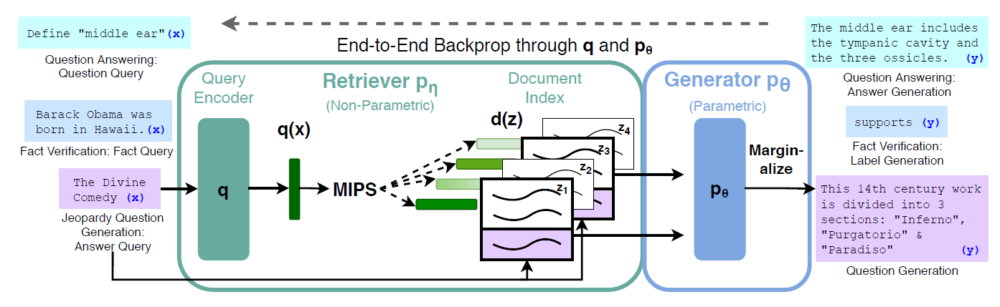
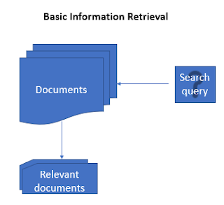
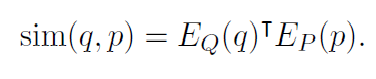

# END 2.0 Capstone project

### Author

* **Deepak Hazarika**

Wednesday, 1 September 2021

## Question and Answer model

This project takes inspiration from Retrieval-Augmented Generation for Knowledge-Intensive NLP Tasks (https://arxiv.org/abs/2005.11401)

The model is a combination of Parametric and Non-parametric knowledge to generate factual answers to questions or any other related NLP task.

GPT is an example of a model that utilizes only parametric knowledge. That is to say, the entirety of its knowledge can be found within the weight values in its parameters that constitute the model.

(source:-https://medium.com/machine-learning-intuition/retrieval-augmented-generation-rag-control-your-models-knowledge-and-hallucinations-ea3c6345a659)

One way to distinguish the two is thinking of parametric knowledge as the knowledge of AI's own, while non-parametric knowledge is something you retrieve from outside sources e.g a search engine on getting a query searches the web for the topic and returns relevant document as shown in the diagram above.

To be more specific , generator is paramteric model whereas retriever is non-parametric.

Since this is a scaled down implementation of ideas from RAG model , there will be 3 components

* An indexed document store of context

* A retriever model like Dense Passage Retriever.

* A generator model like BART.

### dense passage retriever

The goal of dense passage retriever (DPR) is to index all the M passages in a
low-dimensional and continuous space, such that it can retrieve efficiently the top
k passages relevant to the input question for the reader at run-time.

dense passage retriever (DPR) uses a dense encoder Ep which maps any text passage to a
d-dimensional real-valued vectors and builds an index for all the M passages that we will use for retrieval.

At run-time, DPR applies a different encoder Eq that maps the input question to a
d-dimensional vector, and retrieves k passages of which vectors are the closest to the
question vector. The similarity between the question and the passage is defined using
the dot product of their vectors.[[1]](#1)

<!--  -->

The simpler inner product function is used for similarity calculation to improve the
dense passage retriever by learning better encoders.

#### encoders for question and passage

Use pre-trained BERT encoders for question and passage

#### inference

During inference time, the passage encoder Ep will be applied to all the passages and
index them using FAISS offline.

FAISS is an extremely efficient, open-source library for similarity search and
clustering of dense vectors, which can easily be applied to billions of vectors. 

Given a question q at run-time, we derive its embedding vq = Eq(q) and retrieve the top
k passages with embeddings closest to vq.

### Training the encoders

Training the encoders so that the dot-product similarity (Eq. (1)) becomes a good
ranking function for retrieval.The goal is to create a vector space such that relevant
pairs of questions and passages will have smaller distance (i.e., higher similarity )
than the irrelevant ones, by learning a better embedding function.[[1]](#1)

Let <!--  --> be the training data that
consists of *m* instances. Each instance contains one question <!--  --> and one relevant
(positive) passage <!--  -->, along with *n* irrelevant (negative) passages <!--  -->. We optimize the loss function as the negative log likelihood of the positive passage:

<!--  -->

<!--  -->

### Positive and negative passages

For retrieval problems, it is often the case that positive examples are available
explicitly, while negative examples need to be selected from an extremely large pool.
For instance, passages relevant to a question may be given in a QA dataset, or can be
found using the answer. All other passages in the collection, while not specified
explicitly, can be viewed as irrelevant by default. I consider any random passage from the corpus as negative.[[1]](#1)

<!--  -->

<!--  -->

## References
<a id="1">[1]</a> 
@misc{karpukhin2020dense,
      title={Dense Passage Retrieval for Open-Domain Question Answering}, 
      author={Vladimir Karpukhin and Barlas Oguz and Sewon Min and Patrick Lewis and Ledell Wu and Sergey Edunov and Danqi Chen and Wen-tau Yih},
      year={2020},
      eprint={2004.04906},
      archivePrefix={arXiv},
      primaryClass={cs.CL}
}

<!--  -->

The Loss function (one of the many you'd implement)

 

p(y???x)=???pret(z???x)p??(y???x,z)

 

The loss function is simple. We have 2 stages. The first stage is to retrieve the JSON where our answer might be. That get's taken cared of by:

 

pret(z???x)

 

Then given that we have picked the right document (introduce teacher forcing here!), how well our generator is working to generate the answer:

 

p??(y???x,z)

 

This needs to be done for top k (your hyper-parameter, and is the total number of documents you want to be retrieved).

 

So you are literally training this as a "language translation model", were given an input question, you are generating the answer (biased by the document retriever found)

 

 
Dense Passage Retriever

 

We are not following the exact implementation of the original DPR paper, but taking inspiration from it. 

 

Here is how you are going to train your DPR. 

 

You are making your own bi-encoder and minimizing this equation

 

p(z???x)???exp(d(z)Tq(x))

 

What just happened? ????

 

This is actually simple. 

    d(z) is the encoded document vector (CLS Token) coming from a pre-trained BERT1 model (never to be trained)
    q(x) is the encoded question vector (CLS Token) coming from a pre-trained BERT2 model (to be trained (fine-tuned) by you)
    You are training one BERT model (fine-tuning a pre-trained BERT model) such that p(z|x) is minimized, i.e. siamese network, i.e. similarity network!
        you are NOT training the document encoder, cos if we add new data to our system, we would need to retrain it
        you ARE training the question encoder, so we can minimize the loss function, and help in retrieval
    Though you are NOT implementing the exact DPR model, it makes sense to read (Links to an external site.), how they actually trained the model (negative/positive and other samples)
    It is completely OK to take the pre-trained DPR bi-encoder and then train it on your dataset, but not recommended (not enough time). 
    Once you are happy with your bi-encoder, run all of your JSON passages (Z) through the document encoder and store an index of the document vectors.
    On the inferencing mode, you need to implement FAISS (Links to an external site.) to send the top k (your hyper-parameter) documents to the next step. 

 

 

 

 
Generator: BART

 

1_jWecxbzBsJEbNgiy_LOIvw-1.png 

 

    take a pre-trained seq2seq (BART) model (trained as denoising auto-encoder). 
    concatenate the documents you found with the query (raw text) and then feed it to the BART encoder (I would start with some pre-trained document summarization BART for both encoder-decoder as the starting weights):
        this is done to collect answers from multiple documents if required
        you are concatenating the top k documents retrieved by FAISS
        you are concatenating the RAW TEXT of each document, pre-pended by the Question Query
    Now make the decoder predict y, done!
        Remember that you can either train the decoder to predict the exact sentence that you want, OR
        Some other sentence that is semantically similar to yours (I would do this, and compare them using the document encoder outputs)
        For code, I will always make sure that I predict exactly the same code.

 

 

 

 
Training Notes

 

Some key training notes:

    In our dataset, we are sort of writing our own answer, and exact wording may not be available in the document (z). You need to think about how to then compare y with your prediction.
        I would not implement teacher forcing on the final decoder. 
        I would keep an encoded vector for each of the ygound_truch
        I would send the ypredicted to the original BERT1 Document Encoder and then compare it (loss function). I would think of some semantic loss that allows the model to predict sentences that are not word to word same as the ground_truth. We have covered these concepts in earlier sessions
    You have trained NLP models and know, how to compare the outputs (predicted sentence vs ground truth sentence).
    You are not allowed to take RAG model and train it on your dataset. 
    You are not allowed to take the existing DPR model.
    This is not a group assignment, and your code must not match any other student.
    You need to document your training process, and link separate (properly named) notebooks in the readme file along with notes for me to understand how you have trained your model. Your training logs MUST be available for review. 
    Linking the model end to end is not the objective. The objective is to solve the problem end to end. You MUST have trained for over 500 EPOCHS in total (for all the models combined) and show that your loss is reduced substantially from the starting point. 
    You need to split your dataset into 80/20 and then show the test accuracy in the readme file.
    You must show the results on 100 randomly picked samples from the test dataset and the results in the following format:
        Question
        Prediction
        Exact Answer
        Document
    The project is divided into 3 submissions:
        First submission (on the 7th day from today) - Submit the 1000 QnA that you have made. (We will wait exactly 20 days max to collect the dataset, if you do not submit this on time, then you're disqualified.) (Full points on submitting on time. 50% score on any delay)
        Second Submission (on the 20th day from today) - Submit the complete architecture that you have made along with your end-to-end trained DPR model.
        Third Submission (on 30th day from today) - Final submission.
    Missing the first 2 submissions by the 20th day will disqualify you from the CAPSTONE project.
    I am going to read your README to understand the whole thing. If it doesn't cover something (like what loss function you used, or how the logs looked like) I would assume that it's not done and the assignment would be graded accordingly. 

 

