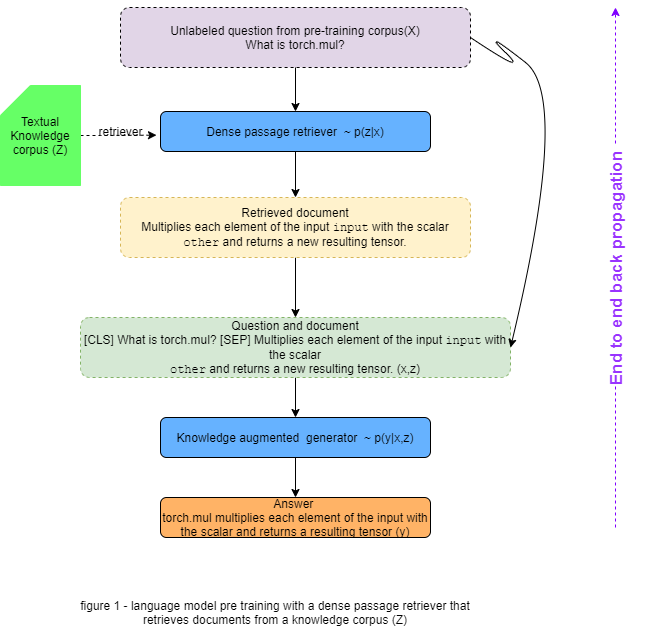

# END 2.0 Capstone project

### Author

* **Deepak Hazarika**

Wednesday, 1 September 2021

## Question and Answer model

This project takes inspiration from Retrieval-Augmented Generation for Knowledge-Intensive NLP Tasks (https://arxiv.org/abs/2005.11401)

The model is a combination of Parametric and Non-parametric knowledge to generate factual answers to questions or any other related NLP task.

GPT is an example of a model that utilizes only parametric knowledge. That is to say, the entirety of its knowledge can be found within the weight values in its parameters that constitute the model.

(source:-https://medium.com/machine-learning-intuition/retrieval-augmented-generation-rag-control-your-models-knowledge-and-hallucinations-ea3c6345a659)

One way to distinguish the two is thinking of parametric knowledge as the knowledge of AI's own, while non-parametric knowledge is something you retrieve from outside sources e.g a search engine on getting a query searches the web for the topic and returns relevant document as shown in the diagram above.

To be more specific , generator is paramteric model whereas retriever is non-parametric.

Since this is a scaled down implementation of ideas from RAG model , there will be 3 components

* An indexed document store of context

* A retriever model like Dense Passage Retriever.

* A generator model like BART.

### dense passage retriever

The goal of dense passage retriever (DPR) is to index all the M passages in a
low-dimensional and continuous space, such that it can retrieve efficiently the top
k passages relevant to the input question for the reader at run-time.

dense passage retriever (DPR) uses a dense encoder Ez which maps any text passage to a
d-dimensional real-valued vectors and builds an index for all the M passages that we will use for retrieval.

At run-time, DPR applies a different encoder Ex that maps the input question to a
d-dimensional vector, and retrieves k passages of which vectors are the closest to the
question vector. The similarity between the question and the passage is defined using
the dot product of their vectors.[[1]](#1)

  

The simpler inner product function is used for similarity calculation to improve the
dense passage retriever by learning better encoders.

#### encoders for question and passage

Use pre-trained BERT encoders for question and passage

#### inference

During inference time, the passage encoder    will be applied to all the passages and index them using FAISS offline.

FAISS is an extremely efficient, open-source library for similarity search and
clustering of dense vectors, which can easily be applied to billions of vectors. 

Given a question *x* at run-time, we derive its embedding    and retrieve the top k passages with embeddings closest to   .

#### Training the encoders

Training the encoders so that the dot-product similarity (Eq. (1)) becomes a good
ranking function for retrieval.The goal is to create a vector space such that relevant
pairs of questions and passages will have smaller distance (i.e., higher similarity )
than the irrelevant ones, by learning a better embedding function.[[1]](#1)

Let    be the training data that
consists of *m* instances. Each instance contains one question    and one relevant
(positive) passage   , along with *n* irrelevant (negative) passages   . We optimize the loss function as the negative log likelihood of the positive passage:

  

  

#### Positive and negative passages

For retrieval problems, it is often the case that positive examples are available
explicitly, while negative examples need to be selected from an extremely large pool.
For instance, passages relevant to a question may be given in a QA dataset, or can be
found using the answer. All other passages in the collection, while not specified
explicitly, can be viewed as irrelevant by default. I consider any random passage from the corpus as negative.[[1]](#1)

### Knowledge-Augmented generator 

Given an input x and a retrieved document z, the knowledge-augmented encoder
defines 
  .
We join x and z into a single sequence that we feed into a Transformer (distinct from
the one used in the retriever). This allows us to perform rich cross-attention between
x and z before predicting y. See Figure 1 for a concrete example.[[2]](#2)

[[2]](#2)

The model leverage two components: 

* a retriever

   with parameters that returns (top-K truncated) distributions over text passages given a query x 

* a generator

  that generates a current token based on a context of the previous i - 1 tokens   , the original
input x and a retrieved passage z.[[3]](#3)
To train the retriever and generator end-to-end, we treat the retrieved document as a latent variable.We marginalize the latent documents using token, which can predict each target token based on a different document. 

#### Token generator model

Token model we draw a different latent document for each target token and marginalize
accordingly. This allows the generator to choose content from several documents when
producing an answer. Concretely, the top K documents are retrieved using the retriever,
and then the generator produces a distribution for the next output token for each
document, before marginalizing, and repeating the process with the following output token, Formally, we define: [[3]](#3)

  

#### pre trained BART as generator

The generator component   could be modelled using any encoder-decoder. I plan to use
BART-large , a pre-trained seq2seq transformer with 400M parameters. To combine the
input x with the retrieved content z when generating from BART, we simply concatenate them. BART was pre-trained using a denoising objective and a variety of different noising functions. 

#### Decoding

At test time, to approximate 

  

in Token approach. It can be seen as a standard, autoregressive seq2seq generator with transition probability: 

  

we can plug   

into a standard beam decoder. [[3]](#3)

### loss function of Generator

calculate similarity of predicted y vs actual y to calculate the model loss.

### Hyper-parameters to consider

* beam depth : try different depth - 2 ,3 

* batch size - 

* variable learning rate

#### Summary 

##### Training strategy

* train the query encoder

* train the generator

#### training logs for a  sample dataset

An end to end dpr model will be refactored to suit the capstone dataset , for now the end to end dpr model was run on a test dataset to check for any issue.Later it will be modified to fit the requirement of this project. a sample of train and evaluation log is given below for reference.

##### train and eval logs

Initialized host ae8ce1557aeb as d.rank -1 on device=cuda, n_gpu=1, world size=1
16-bits training: False 
 **************** CONFIGURATION **************** 
adam_betas                        (0.9, 0.999)
adam_eps                          1e-08
batch_size                        2
checkpoint_file_name              dpr_biencoder
ctx_chunk_size                    8
dev_batch_size                    4
dev_file                          /content/dprdevdata]/data/retriever/nq-dev.json
device                            cuda
distributed_world_size            1
do_lower_case                     False
dropout                           0.1
encoder_model_type                hf_bert
eval_per_epoch                    1
fix_ctx_encoder                   False
fp16                              False
fp16_opt_level                    O1
global_loss_buf_sz                150000
grad_cache                        False
gradient_accumulation_steps       1
hard_negatives                    1
learning_rate                     1e-05
local_rank                        -1
log_batch_step                    100
max_grad_norm                     1.0
model_file                        None
n_gpu                             1
no_cuda                           False
num_train_epochs                  3.0
other_negatives                   0
output_dir                        /content/dprdevdata]/chkpnt
pretrained_file                   None
pretrained_model_cfg              bert-base-uncased
projection_dim                    0
q_chunk_size                      16
seed                              0
sequence_length                   512
shuffle_positive_ctx              False
train_file                        /content/dprdevdata]/data/retriever/nq-dev.json
train_files_upsample_rates        None
train_rolling_loss_step           100
val_av_rank_bsz                   128
val_av_rank_hard_neg              30
val_av_rank_max_qs                10000
val_av_rank_other_neg             30
val_av_rank_start_epoch           10000
warmup_steps                      100
weight_decay                      0.0
 **************** CONFIGURATION **************** 
***** Initializing components for training *****
Checkpoint files []
PyTorch version 1.9.0+cu102 available.
TensorFlow version 2.6.0 available.
Lock 140211685560656 acquired on /root/.cache/torch/transformers/4dad0251492946e18ac39290fcfe91b89d370fee250efe9521476438fe8ca185.7156163d5fdc189c3016baca0775ffce230789d7fa2a42ef516483e4ca884517.lock
https://s3.amazonaws.com/models.huggingface.co/bert/bert-base-uncased-config.json not found in cache or force_download set to True, downloading to /root/.cache/torch/transformers/tmpbrjnlo7e
Downloading: 100% 433/433 [00:00<00:00, 427kB/s]
storing https://s3.amazonaws.com/models.huggingface.co/bert/bert-base-uncased-config.json in cache at /root/.cache/torch/transformers/4dad0251492946e18ac39290fcfe91b89d370fee250efe9521476438fe8ca185.7156163d5fdc189c3016baca0775ffce230789d7fa2a42ef516483e4ca884517
creating metadata file for /root/.cache/torch/transformers/4dad0251492946e18ac39290fcfe91b89d370fee250efe9521476438fe8ca185.7156163d5fdc189c3016baca0775ffce230789d7fa2a42ef516483e4ca884517
Lock 140211685560656 released on /root/.cache/torch/transformers/4dad0251492946e18ac39290fcfe91b89d370fee250efe9521476438fe8ca185.7156163d5fdc189c3016baca0775ffce230789d7fa2a42ef516483e4ca884517.lock
loading configuration file https://s3.amazonaws.com/models.huggingface.co/bert/bert-base-uncased-config.json from cache at /root/.cache/torch/transformers/4dad0251492946e18ac39290fcfe91b89d370fee250efe9521476438fe8ca185.7156163d5fdc189c3016baca0775ffce230789d7fa2a42ef516483e4ca884517
Model config BertConfig {
  "architectures": [
    "BertForMaskedLM"
  ],
  "attention_probs_dropout_prob": 0.1,
  "gradient_checkpointing": false,
  "hidden_act": "gelu",
  "hidden_dropout_prob": 0.1,
  "hidden_size": 768,
  "initializer_range": 0.02,
  "intermediate_size": 3072,
  "layer_norm_eps": 1e-12,
  "max_position_embeddings": 512,
  "model_type": "bert",
  "num_attention_heads": 12,
  "num_hidden_layers": 12,
  "pad_token_id": 0,
  "type_vocab_size": 2,
  "vocab_size": 30522
}

Lock 140209789913552 acquired on /root/.cache/torch/transformers/f2ee78bdd635b758cc0a12352586868bef80e47401abe4c4fcc3832421e7338b.36ca03ab34a1a5d5fa7bc3d03d55c4fa650fed07220e2eeebc06ce58d0e9a157.lock
https://cdn.huggingface.co/bert-base-uncased-pytorch_model.bin not found in cache or force_download set to True, downloading to /root/.cache/torch/transformers/tmpy1lold03
Downloading: 100% 440M/440M [00:07<00:00, 60.2MB/s]
storing https://cdn.huggingface.co/bert-base-uncased-pytorch_model.bin in cache at /root/.cache/torch/transformers/f2ee78bdd635b758cc0a12352586868bef80e47401abe4c4fcc3832421e7338b.36ca03ab34a1a5d5fa7bc3d03d55c4fa650fed07220e2eeebc06ce58d0e9a157
creating metadata file for /root/.cache/torch/transformers/f2ee78bdd635b758cc0a12352586868bef80e47401abe4c4fcc3832421e7338b.36ca03ab34a1a5d5fa7bc3d03d55c4fa650fed07220e2eeebc06ce58d0e9a157
Lock 140209789913552 released on /root/.cache/torch/transformers/f2ee78bdd635b758cc0a12352586868bef80e47401abe4c4fcc3832421e7338b.36ca03ab34a1a5d5fa7bc3d03d55c4fa650fed07220e2eeebc06ce58d0e9a157.lock
loading weights file https://cdn.huggingface.co/bert-base-uncased-pytorch_model.bin from cache at /root/.cache/torch/transformers/f2ee78bdd635b758cc0a12352586868bef80e47401abe4c4fcc3832421e7338b.36ca03ab34a1a5d5fa7bc3d03d55c4fa650fed07220e2eeebc06ce58d0e9a157
All model checkpoint weights were used when initializing HFBertEncoder.

All the weights of HFBertEncoder were initialized from the model checkpoint at bert-base-uncased.
If your task is similar to the task the model of the ckeckpoint was trained on, you can already use HFBertEncoder for predictions without further training.
loading configuration file https://s3.amazonaws.com/models.huggingface.co/bert/bert-base-uncased-config.json from cache at /root/.cache/torch/transformers/4dad0251492946e18ac39290fcfe91b89d370fee250efe9521476438fe8ca185.7156163d5fdc189c3016baca0775ffce230789d7fa2a42ef516483e4ca884517
Model config BertConfig {
  "architectures": [
    "BertForMaskedLM"
  ],
  "attention_probs_dropout_prob": 0.1,
  "gradient_checkpointing": false,
  "hidden_act": "gelu",
  "hidden_dropout_prob": 0.1,
  "hidden_size": 768,
  "initializer_range": 0.02,
  "intermediate_size": 3072,
  "layer_norm_eps": 1e-12,
  "max_position_embeddings": 512,
  "model_type": "bert",
  "num_attention_heads": 12,
  "num_hidden_layers": 12,
  "pad_token_id": 0,
  "type_vocab_size": 2,
  "vocab_size": 30522
}

loading weights file https://cdn.huggingface.co/bert-base-uncased-pytorch_model.bin from cache at /root/.cache/torch/transformers/f2ee78bdd635b758cc0a12352586868bef80e47401abe4c4fcc3832421e7338b.36ca03ab34a1a5d5fa7bc3d03d55c4fa650fed07220e2eeebc06ce58d0e9a157
All model checkpoint weights were used when initializing HFBertEncoder.

All the weights of HFBertEncoder were initialized from the model checkpoint at bert-base-uncased.
If your task is similar to the task the model of the ckeckpoint was trained on, you can already use HFBertEncoder for predictions without further training.
Lock 140209764791248 acquired on /root/.cache/torch/transformers/26bc1ad6c0ac742e9b52263248f6d0f00068293b33709fae12320c0e35ccfbbb.542ce4285a40d23a559526243235df47c5f75c197f04f37d1a0c124c32c9a084.lock
https://s3.amazonaws.com/models.huggingface.co/bert/bert-base-uncased-vocab.txt not found in cache or force_download set to True, downloading to /root/.cache/torch/transformers/tmpumx_yoz1
Downloading: 100% 232k/232k [00:00<00:00, 954kB/s]
storing https://s3.amazonaws.com/models.huggingface.co/bert/bert-base-uncased-vocab.txt in cache at /root/.cache/torch/transformers/26bc1ad6c0ac742e9b52263248f6d0f00068293b33709fae12320c0e35ccfbbb.542ce4285a40d23a559526243235df47c5f75c197f04f37d1a0c124c32c9a084
creating metadata file for /root/.cache/torch/transformers/26bc1ad6c0ac742e9b52263248f6d0f00068293b33709fae12320c0e35ccfbbb.542ce4285a40d23a559526243235df47c5f75c197f04f37d1a0c124c32c9a084
Lock 140209764791248 released on /root/.cache/torch/transformers/26bc1ad6c0ac742e9b52263248f6d0f00068293b33709fae12320c0e35ccfbbb.542ce4285a40d23a559526243235df47c5f75c197f04f37d1a0c124c32c9a084.lock
loading file https://s3.amazonaws.com/models.huggingface.co/bert/bert-base-uncased-vocab.txt from cache at /root/.cache/torch/transformers/26bc1ad6c0ac742e9b52263248f6d0f00068293b33709fae12320c0e35ccfbbb.542ce4285a40d23a559526243235df47c5f75c197f04f37d1a0c124c32c9a084
Reading file /content/dprdevdata]/data/retriever/nq-dev.json
Aggregated data size: 6515
Total cleaned data size: 6515
  Total iterations per epoch=3258
 Total updates=9774
  Eval step = 3258
***** Training *****
***** Epoch 0 *****
Epoch: 0: Step: 1/3258, loss=20.879175, lr=0.000000
Train batch 100
Avg. loss per last 100 batches: 7.063016
Epoch: 0: Step: 101/3258, loss=3.845323, lr=0.000010
Train batch 200
Avg. loss per last 100 batches: 1.425502
Epoch: 0: Step: 201/3258, loss=3.341021, lr=0.000010
Train batch 300
Avg. loss per last 100 batches: 0.856511
Epoch: 0: Step: 301/3258, loss=0.453331, lr=0.000010
Train batch 400
Avg. loss per last 100 batches: 0.840076
Epoch: 0: Step: 401/3258, loss=0.182937, lr=0.000010
Train batch 500
Avg. loss per last 100 batches: 0.836007
Epoch: 0: Step: 501/3258, loss=0.451287, lr=0.000010
Train batch 600
Avg. loss per last 100 batches: 0.727061
Epoch: 0: Step: 601/3258, loss=0.101555, lr=0.000009
Train batch 700
Avg. loss per last 100 batches: 0.715019
Epoch: 0: Step: 701/3258, loss=0.779977, lr=0.000009
Train batch 800
Avg. loss per last 100 batches: 0.665379
Epoch: 0: Step: 801/3258, loss=0.000054, lr=0.000009
Train batch 900
Avg. loss per last 100 batches: 0.554073
Epoch: 0: Step: 901/3258, loss=0.652408, lr=0.000009
Train batch 1000
Avg. loss per last 100 batches: 0.699420
Epoch: 0: Step: 1001/3258, loss=0.006642, lr=0.000009
Train batch 1100
Avg. loss per last 100 batches: 0.736018
Epoch: 0: Step: 1101/3258, loss=3.435383, lr=0.000009
Train batch 1200
Avg. loss per last 100 batches: 0.612892
Epoch: 0: Step: 1201/3258, loss=0.002450, lr=0.000009
Train batch 1300
Avg. loss per last 100 batches: 0.694482
Epoch: 0: Step: 1301/3258, loss=0.539028, lr=0.000009
Train batch 1400
Avg. loss per last 100 batches: 0.786224
Epoch: 0: Step: 1401/3258, loss=0.022790, lr=0.000009
Train batch 1500
Avg. loss per last 100 batches: 0.482405
Epoch: 0: Step: 1501/3258, loss=0.040423, lr=0.000009
Train batch 1600
Avg. loss per last 100 batches: 0.487796
Epoch: 0: Step: 1601/3258, loss=0.008157, lr=0.000008
Train batch 1700
Avg. loss per last 100 batches: 0.753921
Epoch: 0: Step: 1701/3258, loss=0.001043, lr=0.000008
Train batch 1800
Avg. loss per last 100 batches: 0.702689
Epoch: 0: Step: 1801/3258, loss=0.323058, lr=0.000008
Train batch 1900
Avg. loss per last 100 batches: 0.670858
Epoch: 0: Step: 1901/3258, loss=0.534937, lr=0.000008
Epoch: 0: Step: 2001/3258, loss=1.180499, lr=0.000008
Train batch 2100
Avg. loss per last 100 batches: 0.558530
Epoch: 0: Step: 2101/3258, loss=0.003663, lr=0.000008
Train batch 2200
Avg. loss per last 100 batches: 0.578332
Epoch: 0: Step: 2201/3258, loss=0.718293, lr=0.000008
Train batch 2300
Avg. loss per last 100 batches: 0.623423
Epoch: 0: Step: 2301/3258, loss=0.096823, lr=0.000008
Train batch 2400
Avg. loss per last 100 batches: 0.729157
Epoch: 0: Step: 2401/3258, loss=0.107544, lr=0.000008
Train batch 2500
Avg. loss per last 100 batches: 0.408302
Epoch: 0: Step: 2501/3258, loss=0.095298, lr=0.000008
Train batch 2600
Avg. loss per last 100 batches: 0.536457
Epoch: 0: Step: 2601/3258, loss=0.033315, lr=0.000007
Train batch 2700
Avg. loss per last 100 batches: 0.444174
Epoch: 0: Step: 2701/3258, loss=0.119821, lr=0.000007
Train batch 2800
Avg. loss per last 100 batches: 0.374485
Epoch: 0: Step: 2801/3258, loss=7.624740, lr=0.000007
Train batch 2900
Avg. loss per last 100 batches: 0.842974
Epoch: 0: Step: 2901/3258, loss=0.000828, lr=0.000007
Train batch 3000
Avg. loss per last 100 batches: 0.526776
Epoch: 0: Step: 3001/3258, loss=0.022878, lr=0.000007
Train batch 3100
Avg. loss per last 100 batches: 0.435324
Epoch: 0: Step: 3101/3258, loss=0.003947, lr=0.000007
Train batch 3200
Avg. loss per last 100 batches: 0.605610
Epoch: 0: Step: 3201/3258, loss=0.000000, lr=0.000007
Finished iterating, iteration=3258, shard=0
Validation: Epoch: 0 Step: 3258/3258
NLL validation ...
Reading file /content/dprdevdata]/data/retriever/nq-dev.json
Aggregated data size: 6515
Total cleaned data size: 6515
Eval step: 99 , used_time=46.501453 sec., loss=0.112810 
Eval step: 199 , used_time=92.548126 sec., loss=0.000004 
Eval step: 299 , used_time=138.959932 sec., loss=1.898458 
Eval step: 399 , used_time=185.267789 sec., loss=0.073006 
Eval step: 499 , used_time=231.151421 sec., loss=0.002159 
Eval step: 599 , used_time=277.626225 sec., loss=2.268908 
Eval step: 699 , used_time=323.639210 sec., loss=0.857368 
Eval step: 799 , used_time=370.085279 sec., loss=5.117107 
Eval step: 899 , used_time=416.501861 sec., loss=0.295370 
Eval step: 999 , used_time=462.787835 sec., loss=3.934539 
Eval step: 1099 , used_time=508.942142 sec., loss=0.146630 
Eval step: 1199 , used_time=555.113686 sec., loss=3.845603 
Eval step: 1299 , used_time=601.293154 sec., loss=0.729770 
Eval step: 1399 , used_time=647.605483 sec., loss=2.340352 
Eval step: 1499 , used_time=694.008654 sec., loss=0.328067 
Eval step: 1599 , used_time=740.507991 sec., loss=0.707699 
NLL Validation: loss = 0.735069. correct prediction ratio  5307/6516 ~  0.814457
Saved checkpoint at /content/dprdevdata]/chkpnt/dpr_biencoder.0.3258
Saved checkpoint to /content/dprdevdata]/chkpnt/dpr_biencoder.0.3258
New Best validation checkpoint /content/dprdevdata]/chkpnt/dpr_biencoder.0.3258
NLL validation ...
Reading file /content/dprdevdata]/data/retriever/nq-dev.json
Aggregated data size: 6515
Total cleaned data size: 6515
Eval step: 99 , used_time=47.291642 sec., loss=0.112810 
Eval step: 199 , used_time=92.924058 sec., loss=0.000004 
Eval step: 299 , used_time=139.353049 sec., loss=1.898458 
Eval step: 399 , used_time=185.509704 sec., loss=0.073006 
Eval step: 499 , used_time=231.859500 sec., loss=0.002159 
Eval step: 599 , used_time=278.384533 sec., loss=2.268908 
Eval step: 699 , used_time=324.808600 sec., loss=0.857368 
Eval step: 799 , used_time=371.256480 sec., loss=5.117107 
Eval step: 899 , used_time=417.649062 sec., loss=0.295370 
Eval step: 999 , used_time=463.921428 sec., loss=3.934539 
Eval step: 1099 , used_time=510.205219 sec., loss=0.146630 
Eval step: 1199 , used_time=556.502730 sec., loss=3.845603 
Eval step: 1299 , used_time=602.778700 sec., loss=0.729770 
Eval step: 1399 , used_time=649.054720 sec., loss=2.340352 
Eval step: 1499 , used_time=695.357217 sec., loss=0.328067 
Eval step: 1599 , used_time=741.659300 sec., loss=0.707699 
NLL Validation: loss = 0.735069. correct prediction ratio  5307/6516 ~  0.814457
Saved checkpoint at /content/dprdevdata]/chkpnt/dpr_biencoder.0.3258
Saved checkpoint to /content/dprdevdata]/chkpnt/dpr_biencoder.0.3258
Av Loss per epoch=0.848116
epoch total correct predictions=5272
***** Epoch 1 *****
Epoch: 1: Step: 1/3258, loss=0.040184, lr=0.000007
Train batch 100
Avg. loss per last 100 batches: 0.288920
Epoch: 1: Step: 101/3258, loss=1.093456, lr=0.000007
Train batch 200
Avg. loss per last 100 batches: 0.489996
Epoch: 1: Step: 201/3258, loss=0.095779, lr=0.000007
Train batch 300
Avg. loss per last 100 batches: 0.454743
Epoch: 1: Step: 301/3258, loss=0.000084, lr=0.000006
Train batch 400
Avg. loss per last 100 batches: 0.254579
Epoch: 1: Step: 401/3258, loss=0.000007, lr=0.000006
Train batch 500
Avg. loss per last 100 batches: 0.455086
Epoch: 1: Step: 501/3258, loss=0.000008, lr=0.000006
Train batch 600
Avg. loss per last 100 batches: 0.409794
Epoch: 1: Step: 601/3258, loss=0.001803, lr=0.000006
Train batch 700
Avg. loss per last 100 batches: 0.430022
Epoch: 1: Step: 701/3258, loss=0.000130, lr=0.000006
Train batch 800
Avg. loss per last 100 batches: 0.444044
Epoch: 1: Step: 801/3258, loss=6.862292, lr=0.000006
Train batch 900
Avg. loss per last 100 batches: 0.576271
Epoch: 1: Step: 901/3258, loss=0.000055, lr=0.000006
Train batch 1000
Avg. loss per last 100 batches: 0.334279
Epoch: 1: Step: 1001/3258, loss=0.009849, lr=0.000006
Train batch 1100
Avg. loss per last 100 batches: 0.227425
Epoch: 1: Step: 1101/3258, loss=0.000199, lr=0.000006
Train batch 1200
Avg. loss per last 100 batches: 0.447041
Epoch: 1: Step: 1201/3258, loss=0.698287, lr=0.000005
Train batch 1300
Avg. loss per last 100 batches: 0.367504
Epoch: 1: Step: 1301/3258, loss=0.002227, lr=0.000005
Train batch 1400
Avg. loss per last 100 batches: 0.253053
Epoch: 1: Step: 1401/3258, loss=0.000101, lr=0.000005
Train batch 1500
Avg. loss per last 100 batches: 0.234293
Epoch: 1: Step: 1501/3258, loss=0.617722, lr=0.000005

 
##### References
<a id="1">[1]</a> 
@misc{karpukhin2020dense,
      title={Dense Passage Retrieval for Open-Domain Question Answering}, 
      author={Vladimir Karpukhin and Barlas Oguz and Sewon Min and Patrick Lewis and Ledell Wu and Sergey Edunov and Danqi Chen and Wen-tau Yih},
      year={2020},
      eprint={2004.04906},
      archivePrefix={arXiv},
      primaryClass={cs.CL}
}

<a id="2">[2]</a>
@misc{guu2020realm,
      title={REALM: Retrieval-Augmented Language Model Pre-Training}, 
      author={Kelvin Guu and Kenton Lee and Zora Tung and Panupong Pasupat and Ming-Wei Chang},
      year={2020},
      eprint={2002.08909},
      archivePrefix={arXiv},
      primaryClass={cs.CL}
}

<a id="3">[3]</a>
@misc{lewis2021retrievalaugmented,
      title={Retrieval-Augmented Generation for Knowledge-Intensive NLP Tasks}, 
      author={Patrick Lewis and Ethan Perez and Aleksandra Piktus and Fabio Petroni and Vladimir Karpukhin and Naman Goyal and Heinrich Küttler and Mike Lewis and Wen-tau Yih and Tim Rocktäschel and Sebastian Riedel and Douwe Kiela},
      year={2021},
      eprint={2005.11401},
      archivePrefix={arXiv},
      primaryClass={cs.CL}
}

