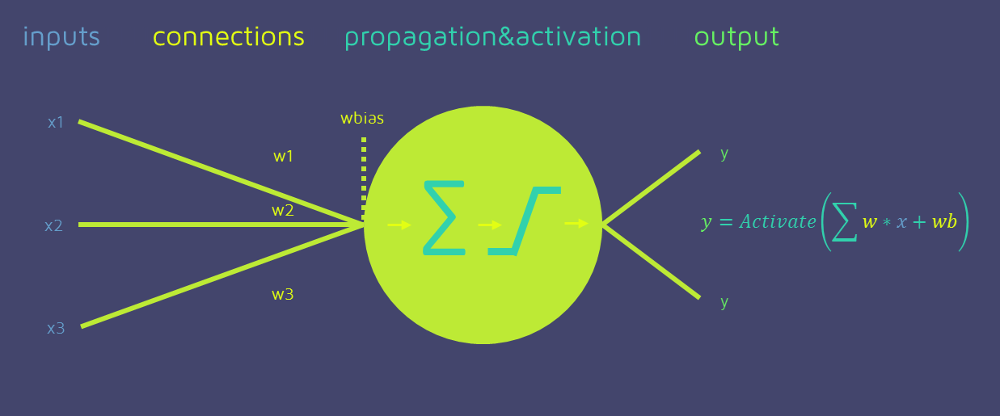
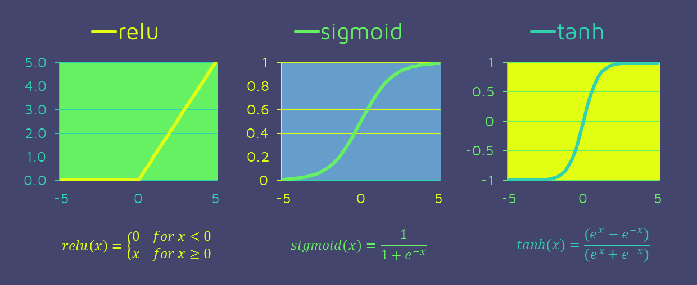
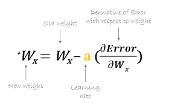
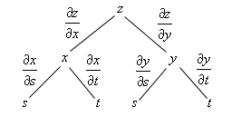

# Session 1

### Authors

* **Deepak Hazarika** 

5/2/2021 3:03:40 PM  

----------

### What is a neural network neuron?

 A neuron is basic unit of neural network , which combines the weighted input signals and bias.To provide non-linearity to the output , the result is passed through an activation function.

 This activation function can be anything which restricts the results between a range.Some of the common activation functions are

- relu
- sigmoid
- tanh

(image source- https://quantdare.com/from-the-neuron-to-the-net/)

### What is the use of the learning rate?

Learning rate (lr) is a hyper parameter which controls how much we are adjusting the model weights w.r.t model gradient.

- case 1 = if lr is small , the model will take a long time to reach global minimum
- case 2 - if lr is large , the model will overshoot the global minimum

The best option is to vary the learning rate as the training progresses i.e higher lr in the begining and progressively reducing lr as the training progresses

(image ref: https://towardsdatascience.com/understanding-learning-rates-and-how-it-improves-performance-in-deep-learning-d0d4059c1c10)

### How are weights initialized?

Traditionally the nodes in neural network are initialized to some random values.
There are specialized methods to initialize the weights based on the activation function used.  

#### Weight initialization fro Sigmoid and tanh
 
- Xavier Weight Initialization

The xavier initialization method is calculated as a random number with a uniform probability distribution (U) between the range -(1/sqrt(n)) and 1/sqrt(n), where n is the number of inputs to the node.

    weight = U [-(1/sqrt(n)), 1/sqrt(n)]

- Normalized Xavier Weight Initialization

The normalized xavier initialization method is calculated as a random number with a uniform probability distribution (U) between the range -(sqrt(6)/sqrt(n + m)) and sqrt(6)/sqrt(n + m), where n us the number of inputs to the node (e.g. number of nodes in the previous layer) and m is the number of outputs from the layer (e.g. number of nodes in the current layer).

    weight = U [-(sqrt(6)/sqrt(n + m)), sqrt(6)/sqrt(n + m)]

### What is "loss" in a neural network?

Loss is the deviation of predicted output vs actual output , there are different methods to calculate model loss.

- Mean square error

MSE(y, y_pred) = (y_pred -y)^2

- Smooth L1 loss

where 

- x - actual output
- y - predicted output

This loss prevents exploding gradient by taking absolute error when absolute difference of x and y is > 1

- Cross entropy loss

loss(y, y_pred) = - (sum of ( y*log(y_pred))

This loss gives a greater penalty when incorrect predictions are made with higher confidence.

### What is the "chain rule" in gradient flow?

This rule is used to back propagate in neural network for weight adjustment.

 

An illustration of chain rule

To calculate the partial derivative of error w.r.t any weight , we have to find the partial derivative along the chain to reach the target weight.

so in the diagram above , if we have to find partial derivative of z w.r.t s.

1. we will find the partial derivative of z w.r.t x which is the first step back from node z ,
2. then we find the partial derivative of x w.r.t s which is the second back step from node z.

The product of step 1 with step 2 above will give the partial derivative of z w.r.t s.