# Session 2

### Authors

* **Deepak Hazarika** 

5/9/2021 11:14:10 AM  

----------

## How does a neural network work?

This article is an explanation of forward propagation and back propagation in a neural network(NN).The sample NN has 

- 2 input node
- 2 output node with activation
- 1 hidden layer with 2 node with activation

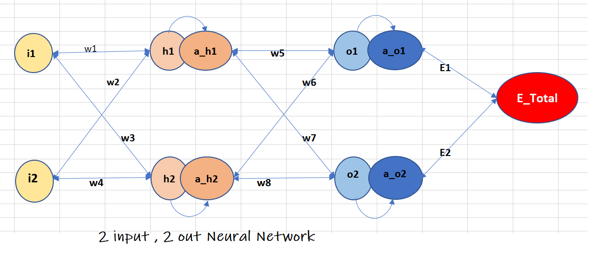

### Forward propagation

In the forward propagation input is processed by neurons at different layers to generate the predicted output.This output is compared with actual  output to calculate the model loss.

The forward propagation flow is explained with the help of equation 1 - 10.

Weighted inputs from node *i1* and *i2* are feed to the hidden layer neuron *h1* and *h2*,this is represented by equation 1 and 2.

Then *h1* and *h2* are passed through sigmoid activation function to make the output non linear.This is represented by equation 3 and 4. 

Weighted output of the activated hidden layer neuron i.e *a_h1* and *a_h2* are feed to output layer neuron *o1* and *o2* ,this is represented by equation 5 and 6.

*o1* and *o2* are then passed through sigmoid activation function to get the activated outputs *a_o1* and *a_o2*.These are represented by equation 7 and 8.

L2 loss is then calculated for each of the two outputs to get the model loss *E1* and *E2*.This is represented by equation 9 and 10.

The mathematical equations are shown below.

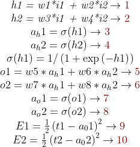 

As we can see from equation 1, 2, 5 and 6 , output is influenced by the weights.So to reduce the model loss as shown by equation 9 and 10 , we have to find a way to adjust the weights.This can be achieved by adjusting the weight w.r.t to the total error i.e by taking partial derivative of the error w.r.t *w_i* by keeping all other weights constant.The formula for adjusting the weight is given below.

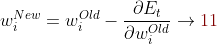

The above formula is the foundation for carrying out back propagation in neural network.We will use the chain rule to find the partial derivative of error w.r.t each weight.

#### What is chain rule?

Chain rule defines how to find the derivative of a composite function as shown below

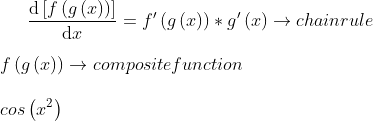

A function within a function is a *composite function* e.g *cos function* shown above is a composite function , where g(x) = x^2 and f(g(x)) = cos(x^2)

 
### Back propagation

In this case we will start the partial derivation of Error w.r.t *w_i* from right side to left most side of the network.
  
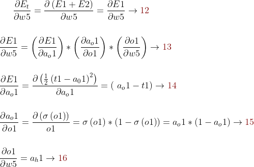 

In equation 12 we find the partial derivative of *E_total* w.r.t *weight 5*.Looking at the network diagram , we see 

- *E_total* is dependent on *a_o1* and 
- *a_o1* is dependent on *o1*.
- *o1* is dependent on *w5*.

So based on chain rule we get equation 13.We can breakup equation 13 into three parts and find the partial derivative for each part as given by equation 14 , 15 , 16.

Similarly we can find the partial derivative of *E_total* w.r.t 

- weight 6
- weight 7
- weight 8

The result is shown below

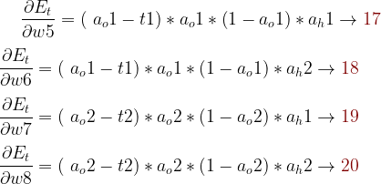 
        
#### Now we need to pause and think , how to find the partial derivative of *E_total* w.r.t 'w1'.There are two routes in the network to reach connection w1

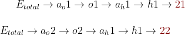  

Partial derivatives of the two routes are given below

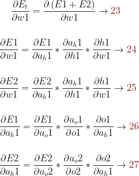

When we embed equation 26 in equation 24 we get the partial derivative w.r.t route shown by 21 , similarly when we embed equation 27 in equation 25 we get route shown by 22.To get the resultant partial derivative of *E_total* w.r.t 'w1' we have to add the result of equation 24 and 25.

Solving the above parts we get the following equations

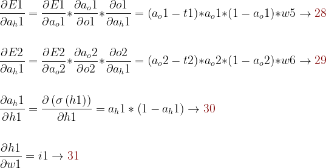

Putting equations 28 , 29 , 30 , 31 together we get the solution for equation 23

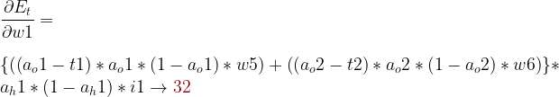

Similarly we can find the partial derivative of *E_total* w.r.t

- weight 2
- weight 3
- weight 4
 
#### After the gradient of E_total is found with respect to each weight, we can use equation 11 to update each weight.

## A working example

-------------------

The network shown in the beginning is used to test the above solution and generate a plot of L2 loss across different epoch for different learning rate.A range of learning rate 
 
- 0.1
- 0.2
- 0.5
- 0.8
- 1.0
- 2.0

was used to check the behavior of the model , the result is summarized below.

----------

### When learning rate is 0.1

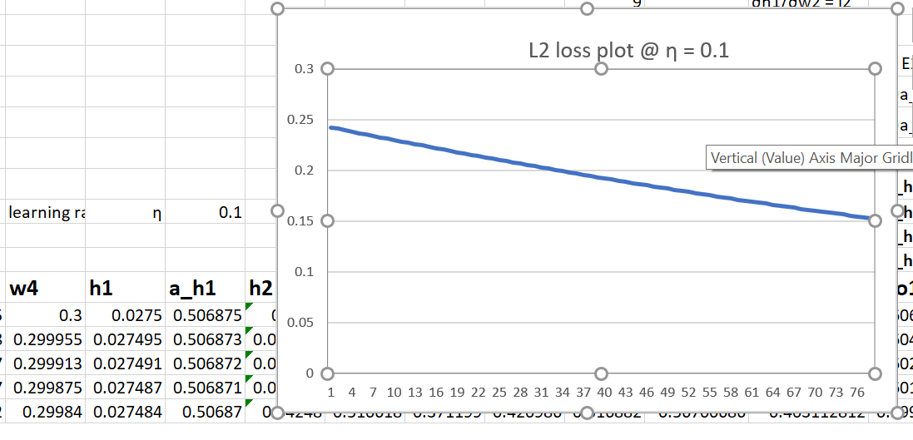

	The model loss is 0.15 after 76 epoch , the model will take longer to converge.

----------

### When learning rate is 0.2

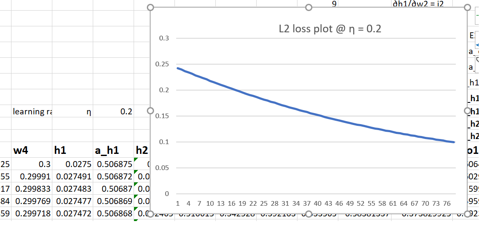

	The model loss is 0.1 after 76 epoch , the model will take longer to converge.

----------

### When learning rate is 0.5

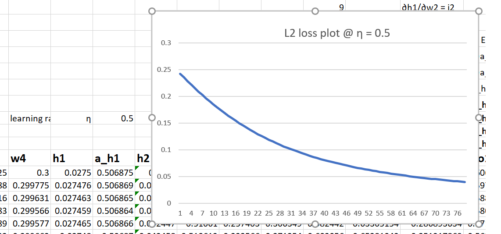

	The model is learning better and the loss is 0.05 after 76 epoch , the gradient is no longer linear.

----------

### When learning rate is 0.8

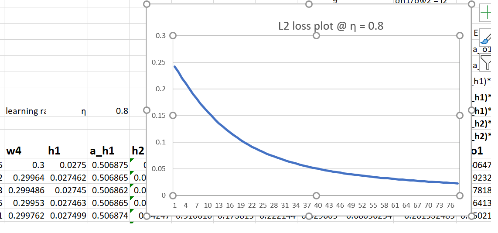

	The model is now learning faster and loss is around 0.025 after 76 epoch.

----------

### When learning rate is 1

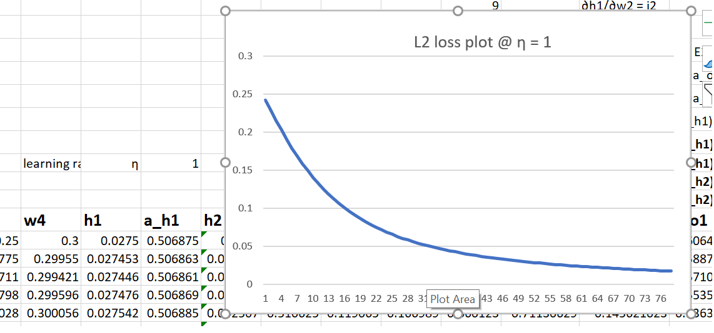

	The model behaves a little better than previous case and loss is 0.013 after 76 epoch.

----------

### When learning rate is 2
 

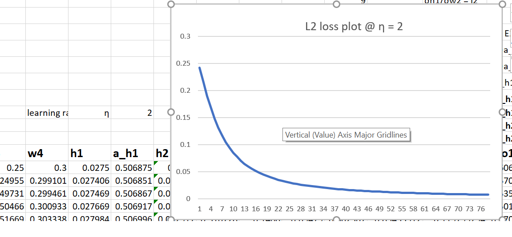

	The model is converging faster and error is close to 0 after 76 epoch.

