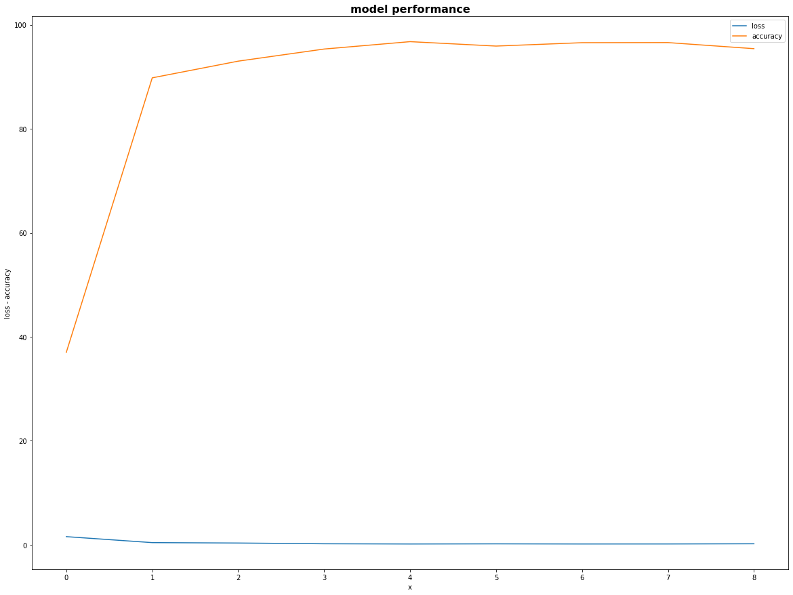
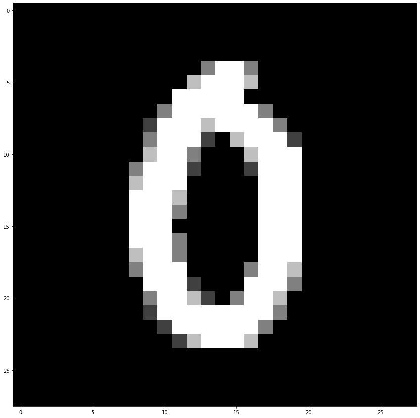

# Session 3

### Authors

* **Deepak Hazarika**
* **Parinita Bora**
* **Mohan Sai Srinivas Y**    

5/20/2021 3:19:35 PM 

----------

# Build a neural network to add an image of a number and a number 

## Abstract

An convolution neural network is is used to process an image input to get the predicted number label.This predicted label and an integer between 0 - 9 is fed to 4 linear layers to get a 1x20 vector output.The index of the largest value is then used as the predicted sum of the 2 numbers.The predicted sum is then matched with actual sum of the 2 numbers , to calculate the loss and adjust the model weights iteratively.After few epochs the loss will reduce and predicted sum will converge with actual sum.

## Data generation strategy 

### Dataset :

- mnist dataset for image of number 
	
	- 60000 train data images
	- 10000 test data images
	
- random int generator between 0 - 9

	- random integers are generated at run time when feeding data to the model

### Model design
 
Given the problem statement , the following approach is used to achieve the result

- Use 2D convolution , max pooling and relu activation function to process the image data and get the predicted number from the image

- Use fully connected layers to process the predicted number and input2 to get the predicted sum of two numbers.

#### How is the input data combined?

* Output of the convolution layer , which is a 1 x 10 vector is combined with one hot vector of input 2 to get a tensor of shape 1 x 20

### Model loss calculation

* The model returns the predicted sum of 2 numbers and we have the actual sum of 2 number.
* **Crossentropy** loss function is used to calculate the loss, why? , because this is a multiclassification problem - there are 19 classes , starting from 0 - 18.
* after calculating the loss , the model will back propagate to adjust the weights and minimize the loss iteratively.
* in the model tensor.cat is used to combine the 2 inputs , this helps in keeping the graph intact.So during back propagation, the error gradient w.r.t each weight can be calculated and the model will perform better.

## Model summary

The model summary is shown below:

| Layer |    calculation              | No of parameters |
| ------|:----------------------------|:-----------------|
| Conv1 | 3*3*32 + 32(bias)           | 320              |
| Conv2 | 3*3*32*64 + 64(bias)        | 18,496           |
| Conv3 | 3*3*64*128 +   128(bias)    | 73,856           |
| Conv4 | 3*3*128*256 +   256(bias)   | 295,168          |
| Conv5 | 3*3*256*512 +   512(bias)   | 1,180,160        |
| Conv6 | 3*3*512*1024 +   1024(bias) | 4,719,616        |
| Conv7 | 3*3*1024*10 +   10(bias)    | 92,170           |
| fc1   | 20*200 + 200(bias)          | 4200             |
| fc2   | 200*400 + 400(bias)         | 80400            |
| fc3   | 400*800 + 800(bias)         | 320800           |
| fc4   | 800*20 + 0(bias)            | 16000            |

* Max pooling is done after Conv2 , Conv 4. 
* relu activation is done after each convolution except Conv7
* Predicted image label and input 2 is fed to fc1
* Predicted sum of two numbers is extracted from fc4 layer

## Implementation 

* model vital staistics

  * Total params: 6,801,186
  
## Model performance

* The model was run for 9 epochs 

  * Test set: Average loss: 0.1926, Accuracy: 9541/10000 (95%)
  
A graph showing the plot of loss and accuracy across 9 epochs is shown below.

  
## Model test output for one record

A sample image is shown for reference:

model output for the above image and input2 

#### *Image label* = 0

#### *Input 2* = 6

#### *Predicted sum* = 6

#### *Actual sum* = 6

### Training logs 

* A dump of log is given below for reference

  0%|          | 0/469 [00:00<?, ?it/s]/usr/local/lib/python3.7/dist-packages/ipykernel_launcher.py:31: UserWarning: Implicit dimension choice for log_softmax has been deprecated. Change the call to include dim=X as an argument.
/usr/local/lib/python3.7/dist-packages/ipykernel_launcher.py:57: UserWarning: Implicit dimension choice for log_softmax has been deprecated. Change the call to include dim=X as an argument.
loss=1.3332964181900024 batch_id=468: 100%|??????????????????????????????| 469/469 [00:40<00:00, 11.49it/s]
  0%|          | 0/469 [00:00<?, ?it/s]

Test set: Average loss: 1.5624, Accuracy: 3700/10000 (37%)

loss=0.5507938861846924 batch_id=468: 100%|??????????????????????????????| 469/469 [00:41<00:00, 11.38it/s]
  0%|          | 0/469 [00:00<?, ?it/s]

Test set: Average loss: 0.4135, Accuracy: 8980/10000 (90%)

loss=0.26250407099723816 batch_id=468: 100%|??????????????????????????????| 469/469 [00:40<00:00, 11.46it/s]
  0%|          | 0/469 [00:00<?, ?it/s]

Test set: Average loss: 0.3356, Accuracy: 9301/10000 (93%)

loss=0.2011893391609192 batch_id=468: 100%|??????????????????????????????| 469/469 [00:41<00:00, 11.38it/s]
  0%|          | 0/469 [00:00<?, ?it/s]

Test set: Average loss: 0.1931, Accuracy: 9534/10000 (95%)

loss=0.21401084959506989 batch_id=468: 100%|??????????????????????????????| 469/469 [00:41<00:00, 11.37it/s]
  0%|          | 0/469 [00:00<?, ?it/s]

Test set: Average loss: 0.1484, Accuracy: 9676/10000 (97%)

loss=0.1360577493906021 batch_id=468: 100%|??????????????????????????????| 469/469 [00:40<00:00, 11.44it/s]
  0%|          | 0/469 [00:00<?, ?it/s]

Test set: Average loss: 0.1767, Accuracy: 9591/10000 (96%)

loss=0.1358906328678131 batch_id=468: 100%|??????????????????????????????| 469/469 [00:40<00:00, 11.49it/s]
  0%|          | 0/469 [00:00<?, ?it/s]

Test set: Average loss: 0.1497, Accuracy: 9656/10000 (97%)

loss=0.1544339507818222 batch_id=468: 100%|??????????????????????????????| 469/469 [00:40<00:00, 11.53it/s]
  0%|          | 0/469 [00:00<?, ?it/s]

Test set: Average loss: 0.1540, Accuracy: 9658/10000 (97%)

loss=0.1351614147424698 batch_id=468: 100%|??????????????????????????????| 469/469 [00:40<00:00, 11.50it/s]

Test set: Average loss: 0.1926, Accuracy: 9541/10000 (95%)

