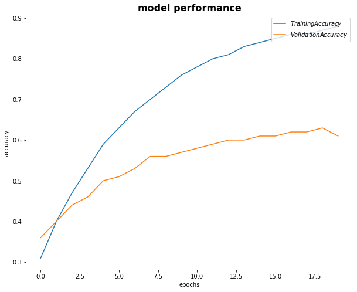
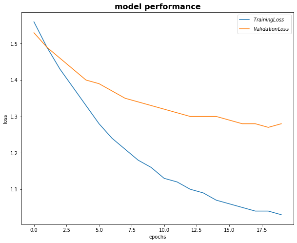
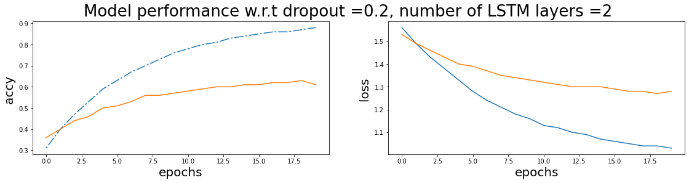
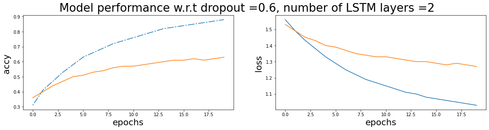

# Session 3

### Authors

* **Deepak Hazarika**
* **Parinita Bora**
* **Mohan Sai Srinivas Y**    

17:55:04 IST
Thursday, 3 June 2021 
----------

# Sentiment analysis of StanfordSentimentAnalysis Dataset

## Abstract

The StanfordSentimentAnalysis dataset is augmented by doing random swap, random deletion of words, translate the sentence to a random language and re-translate to english and substitute synonym in the sentence n number of times.This dataset is fed to a LSTM model with 2 layer to predict the label.
The validation accuracy hovers around 62% after 20 epochs.The model was fine tuned by choosing different dropout rates, however it did not have much effect on the performance.
A future project will be to tune the model using other hyper-parameters  like number of layers in the LSTM etc.

## Data augmentation strategy

### Dataset :

- StanfordSentimentAnalysis dataset of movie reviews along with the labels
	
	- 11286 reviews with labels

- There are 5 categories of label

| range of float value | integer label | Category |
| --- | --- | --- |
| 0 <= value <= 0.2 | **0** | Very Negative |
| 0.2 < value <= 0.4 | **1** | Negative |
| 0.4 < value <= 0.6 | **2** | Neutral |
| 0.6 < value <= 0.8 | **3** | Positive |
| 0.8 < value <= 1.0 | **4** | Very Positive |

### A Class was created to handle data augmentation 

#### Following API's are supported

1. **getLabelIndex(self , value)**

    Input : a float value
  
    Output : an integer label

2. **getSentences(self)**

    This method will load the datasetSentences file and extract 
    
    +  string id's

    +  review comments

    store this in a dataframe

3. **getPhraseIds(self):**

    This method will load the dictionary file and extract

    +  phrases 

    +  phrase ids

    store this in a dictionary

4.  **getSentimentLabels(self)**

    This method will load the sentiment_labels file and extract

    +  phrases ids 

    +  labels which are float value between 0 and 1 , including 0 and 1

    store this in a dictionary

5.  **getSentenceLabelsDF(self):**

    This method finds label for the review comment , the algorithm for the same is given below:

    +  go through the list of review comments

    +  check if the sentence exists as a phrase in the dictionary

      +  if yes then get the phrase id and find the label for the given phrase id in labels dictionary

    store the review comment and the label in a data frame object

6.  **getSentenceandLabels(self)**

    This is a wrapper function which call

    +  getSentimentLabels()

    +  getPhraseIds()
    
    +  getSentences()

    +  getSentenceLabelsDF()

    The result is stored in a sentence label data frame

7.  **getSpacyTokens(self , sentence):**

    This is a helper method to get spacy tokens of a sentence, a rule has been included to ignore apostrophe as a separate token.

    +  Input : Sentence

    +  Output - tokens

8.  **random_deletion(self , sentence, p=0.3)**

    This method randomly deletes words from a sentence based on a probability.If the probability is less then a threshold , then drop the word.

    +  Input : Sentence

    +  Output - modified sentence

9.  **random_swap(self , sentence, n=3):**

    This method randomly swaps n number of words in a sentence.

    +  Input : Sentence

    +  Output - modified sentence

10. **getReTranslatedSentence(self , sentence):**

    This method uses google translation package to translate the sentence to a random destination language, which is then retranslated to english.

    +  Input : Sentence

    +  Output - modified sentence

11. **removeStopWord(self, sentence):**

    This method uses spacy token attributes to check if it is a stop word

    +  If yes then drop the word

    +  Input : Sentence

    +  Output - modified sentence

12. **insertSynonymNTimes(self , input , numTimes):**

    This method is used to insert synonym for a word n number of times , this is a way to emphasise some words in the sentence.Wordnet library is used to get synonym for a word.The list of synonym is narrowed down based on domain.SInce these sentences are about movie , so the domain is set to celluloid etc.More about domain information can be found at domains - https://wndomains.fbk.eu/hierarchy.html

    +  Input : Sentence

    +  Output - modified sentence

13. **random_insertion(self , sentence, howmanytimes = 3): **

    This is a wrapper method which call the removestop word and insertSynonymNTimes.

    +  Input : Sentence

    +  Output - modified sentence

### Augmentation 

The original dataset has 11286 review comments , four data augmentation methods 

+  random swap
+  random deletion
+  random insertion
+  retranslate to english using google translate

are applied to increase the dataset size to 56430 records.The augmented dataset is then saved for use during model training/validation.

### Model design
 
The model has

| Layer | Input nodes | Output nodes |
| --- | --- | --- |
| Embedding | 30304 | 300 |
| 2 layers of LSTM  | 300 | 100 |
| Linear | 100 | 5 |

**9,333,305** trainable parameters

### Data split

The data was split into training and validation in the ratio of 85:15 using BucketIterator.

## Model performance

The model was run for 20 epochs , in the last epoch

+ Train Loss: 1.030 | Train Acc: 87.86%
	
+ Val. Loss: 1.284 |  Val. Acc: 61.50% 
  
A graph showing the plot of loss and accuracy across 20 epochs is shown below.

  

## Model test output for ten record

True label: very positive

Predicted label: negative

Input Sentence: **The to take the level performances a higher . movie**

---------------------------------

True label: positive

Predicted label: negative

Input Sentence: **The powerful success of Read My Lips with such provocative why - material , after only three films , director/co in writer Jacques Audiard , though little known in this country , belongs shows the very top rank of French filmmakers .**

---------------------------------

True label: very positive

Predicted label: positive

Input Sentence: **Children will like its fantasy and adventures , and adults should appreciate their humor .**

---------------------------------

True label: positive

Predicted label: negative

Input Sentence: **If like , guts and crazy beasts stalking with though you will enjoy this monster .**

---------------------------------

True label: negative

Predicted label: very negative

Input Sentence: **Entertains not so much because of its music or comic antics , but through the perverse pleasure of watching Disney scrape the bottom of its own cracker barrel .**

---------------------------------

True label: negative

Predicted label: very negative

Input Sentence: **I 'd be hard pressed to think of a film more cloyingly sappy than Evelyn this year .**

---------------------------------

True label: very positive

Predicted label: very positive

Input Sentence: **The case is a convincing and give anyone with conscience reason to pause .**

---------------------------------

### Further analysis of model performance for different dropout value - 0.2 , 0.4 , 0.6

A plot of loss and accuracy is shown below for reference

As evident from the graph , training accuracy hovered above 85% and validation accuracy hovered around 61% after 20 epochs for different dropout value.

### Future work

Try tuning other parameters like 

+ Number of LSTM layers

+ bidirectional = True

to check model performance
### Training logs 

* A dump of log is given below for reference

Train Loss: 1.563 | Train Acc: 30.83%
	 Val. Loss: 1.527 |  Val. Acc: 36.45% 

	Train Loss: 1.490 | Train Acc: 40.45%
	 Val. Loss: 1.488 |  Val. Acc: 40.28% 

	Train Loss: 1.432 | Train Acc: 46.69%
	 Val. Loss: 1.459 |  Val. Acc: 43.50% 

	Train Loss: 1.377 | Train Acc: 52.76%
	 Val. Loss: 1.431 |  Val. Acc: 46.30% 

	Train Loss: 1.325 | Train Acc: 58.56%
	 Val. Loss: 1.401 |  Val. Acc: 49.86% 

	Train Loss: 1.282 | Train Acc: 63.03%
	 Val. Loss: 1.386 |  Val. Acc: 51.20% 

	Train Loss: 1.245 | Train Acc: 66.94%
	 Val. Loss: 1.368 |  Val. Acc: 53.02% 

	Train Loss: 1.211 | Train Acc: 70.40%
	 Val. Loss: 1.349 |  Val. Acc: 55.54% 

	Train Loss: 1.181 | Train Acc: 73.39%
	 Val. Loss: 1.339 |  Val. Acc: 56.08% 

	Train Loss: 1.156 | Train Acc: 75.90%
	 Val. Loss: 1.328 |  Val. Acc: 57.44% 

	Train Loss: 1.135 | Train Acc: 77.94%
	 Val. Loss: 1.322 |  Val. Acc: 57.81% 

	Train Loss: 1.116 | Train Acc: 79.68%
	 Val. Loss: 1.314 |  Val. Acc: 58.77% 

	Train Loss: 1.101 | Train Acc: 81.17%
	 Val. Loss: 1.302 |  Val. Acc: 59.86% 

	Train Loss: 1.086 | Train Acc: 82.63%
	 Val. Loss: 1.300 |  Val. Acc: 60.06% 

	Train Loss: 1.074 | Train Acc: 83.63%
	 Val. Loss: 1.298 |  Val. Acc: 60.51% 

	Train Loss: 1.062 | Train Acc: 84.86%
	 Val. Loss: 1.289 |  Val. Acc: 61.37% 

	Train Loss: 1.052 | Train Acc: 85.84%
	 Val. Loss: 1.282 |  Val. Acc: 61.92% 

	Train Loss: 1.045 | Train Acc: 86.45%
	 Val. Loss: 1.280 |  Val. Acc: 61.96% 

	Train Loss: 1.038 | Train Acc: 87.11%
	 Val. Loss: 1.274 |  Val. Acc: 62.75% 

	Train Loss: 1.030 | Train Acc: 87.86%
	 Val. Loss: 1.284 |  Val. Acc: 61.50%

