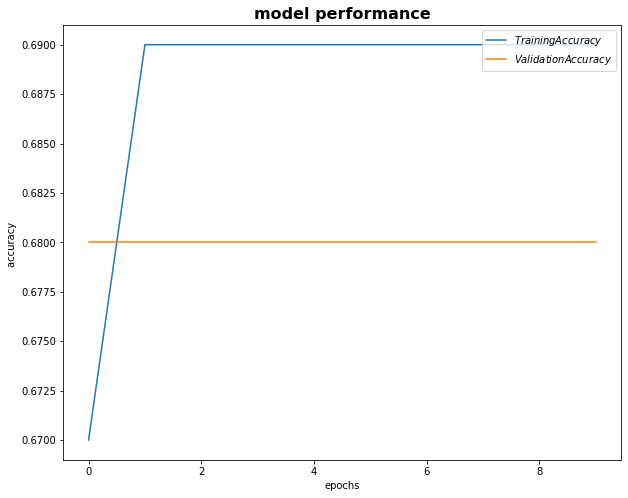
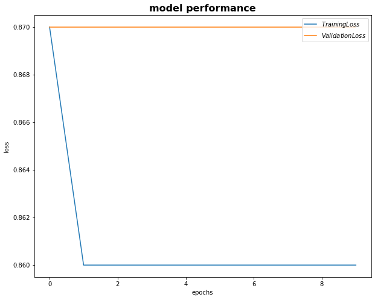

# Session 3

### Authors

* **Deepak Hazarika**
* **Parinita Bora**
* **Mohan Sai Srinivas Y**    

Wednesday, June 9, 2021 17:56:27
----------

# Design a LSTM model to meet the following requirement

1. Embedding layer
2. Encoder  

    a. which will take one word at a time and the last hidden state
    
    b. process them till end of the sentence.
    
    c. return a single vector
    
3. Decoder 

    a. take hidden state of one word from the encoder + last hidden state of the decoder 
    
    b. process them till end of the sentence.
    
    c. return last hidden state of the decoder
    
4. The final hidden state of the decoder is passed to a linear layer to predict the label    

## Abstract

The tweet dataset is trained using an encoder decoder model.Each word is fed to a lstm cell in the encoder , the hidden states are then combined to create a single vector.Then the hidden vector for each word from the encoder along with the last hidden state of the decoder is fed to the decoder.The final hidden state of the decoder is passed to a linear layer to get the class prediction.The model stagnated at a validation accuracy of 68.3%.Further work is required to understand this.

## Dataset :

tweet dataset
	
- There are 3 categories of label

| integer label | Category |
| --- | --- |
| **0** | Negative |
| **1** | Positive |
| **2** | Neutral |

### Model class for training and validation

The model has

1.   An embedding layer which stores the list of words seen in the dataset and has weights attached to each word.These weights are adjusted during backpropagation to enable the model to converge at global minimum.

2.   The model processes words in a sentence to encode the information ,

     a. the sentences in the batch are padded with 0 to match the longest sentence in the batch.Here **nn.utils.rnn.pad_sequence** is used to pad the batch of sentences.

     b. hidden state and cell state are initialized to 0 , before calling the encoder and decoder.

3.   **Encoder**

     a. The word of the sentence is processed in left to right order. Each word is fed to a LSTMCell method , the hidden state returned is passed along with the next word.The hidden state is also stored in an array in the same order i.e from left to right.

4.   **Decoder**

     a. The hidden states from step 1 are vertically stacked and then reshaped to - sequence length x batch size x  embedded dimension.
     
     b. The hidden state of each word from the encoder and the last hidden state of the decoder is fed to  LSTMCell in a loop.

5.   Output of the decoder is fed to a linear layer to return 3 class values.
 
### Model definition 

The model has

| Layer | Input nodes | Output nodes |
| --- | --- | --- |
| Embedding | 4651 | 100 |
| Encoder LSTMCell  | 100 | 100 |
| Decoder LSTMCell  | 100 | 100 |
| Linear | 100 | 3 |

**627,003** trainable parameters

### Data split

The data was split into training and validation in the ratio of 85:15 using BucketIterator.

## Model performance

The model was run for 10 epochs , in the last epoch

+ Train Loss: 0.860 | Train Acc: 69.12%

+ Val. Loss: 0.868 |  Val. Acc: 68.30% 
  
A graph showing the plot of loss and accuracy across 10 epochs is shown below.

  

## Model test output for a sample sentence

**An invalid explanation for why Nixon will let women on the army.**

Predicted label: Negative

### Hidden state output at each step of encoder for the above sentence

**encdr word  0**

encdr word  0 torch.Size([1, 100]) tensor([[-4.8662e-01,  6.3706e-01, -2.3105e-06, -1.1584e-02, -1.3072e-01,
          5.1925e-08, -1.3788e-03,  5.4984e-03,  6.1489e-01, -3.3821e-05,
         -4.7829e-02,  2.7177e-05, -1.8713e-02, -3.4484e-01, -7.6159e-01,
         -8.0147e-01, -4.8894e-05,  1.4386e-08, -7.6576e-01, -1.3272e-10,
          7.5572e-01,  7.6100e-01,  3.8140e-01, -7.1346e-04,  6.2823e-01,
         -8.8773e-03,  7.6295e-01,  1.0089e-01,  7.9785e-01,  2.3954e-04,
         -3.5603e-04,  4.3626e-03,  2.1475e-02,  4.6080e-01,  7.6430e-01,
          1.8736e-06,  2.4822e-03, -6.1532e-06, -7.6281e-01, -5.2347e-14,
         -3.9156e-01, -7.5140e-01, -7.6135e-01,  7.6736e-01,  9.3886e-02,
         -5.9123e-01,  4.7529e-13,  8.6582e-09,  4.4494e-15,  7.5955e-01,
          1.8324e-08, -3.2897e-05, -2.8584e-01, -1.8110e-01,  7.4716e-02,
          2.0123e-01, -7.6138e-01, -2.2701e-03, -7.6150e-01, -7.6167e-01,
          3.5948e-04,  7.6159e-01,  2.7592e-01,  5.4529e-04, -2.5882e-01,
          1.2001e-07,  7.9509e-01, -3.5427e-01, -2.0088e-07, -4.1490e-09,
          7.7779e-01, -1.0352e-02, -5.1115e-03, -6.9817e-01,  7.6100e-01,
         -4.6440e-07, -7.3621e-01,  1.0680e-06,  1.7522e-07,  1.8528e-01,
         -6.6370e-02, -7.6061e-01, -1.1819e-03,  2.0101e-08,  1.9665e-05,
          7.5804e-01, -7.1291e-01, -5.6710e-01, -5.0984e-01, -2.3041e-01,
         -4.4691e-09, -2.1432e-11,  1.9354e-10,  6.7645e-08,  4.5270e-01,
         -1.7139e-02, -4.4564e-02, -3.9502e-01, -8.1484e-01,  7.6157e-01]],
       device='cuda:0', grad_fn=<ThnnFusedLstmCellBackward>)

**encdr word  1**

encdr word  1 torch.Size([1, 100]) tensor([[-9.9048e-05,  2.1534e-01, -1.5423e-22, -9.5983e-01, -7.3368e-01,
          1.8974e-02, -2.5813e-10, -6.3648e-01,  6.1113e-01,  1.7693e-03,
          3.4066e-01,  6.0136e-01, -5.3428e-11, -1.3800e-01,  4.0219e-01,
         -4.3045e-02,  6.0837e-01,  1.5684e-06, -6.4876e-01, -1.7619e-03,
          3.9940e-04, -4.8389e-02,  3.2645e-01,  9.7786e-04,  7.5544e-01,
         -8.1538e-03,  9.4188e-01, -2.3486e-01,  9.7004e-01,  4.9138e-05,
         -3.6052e-04,  9.7039e-03,  3.6954e-01, -4.6336e-01,  5.7340e-01,
         -1.6517e-03,  3.5439e-07,  6.1244e-03, -7.7203e-09,  1.3540e-08,
         -3.2446e-01, -7.6612e-01,  6.3958e-05,  5.9971e-03,  2.2293e-11,
         -4.2367e-02, -4.2403e-03,  7.0274e-12, -3.1018e-02,  6.9593e-06,
          8.1664e-05, -6.5603e-09, -7.6151e-05,  7.5267e-01,  8.1407e-01,
          5.5092e-05, -8.7085e-02, -7.9000e-08, -8.6271e-01, -3.2130e-04,
          7.5875e-01,  4.4015e-07, -7.5628e-01,  6.4113e-05, -9.5818e-01,
         -3.3229e-05,  8.8632e-01,  5.5147e-05, -5.5455e-01,  1.8366e-13,
          5.8788e-01, -1.6765e-02, -7.3610e-01, -1.8388e-05, -7.6158e-01,
         -1.7695e-05, -6.9035e-10,  4.5136e-01, -2.9924e-07,  2.2592e-04,
         -4.1202e-01, -3.2669e-04,  2.3681e-02, -5.8276e-01,  1.6167e-12,
          6.2353e-04, -2.7906e-06,  7.5443e-01,  6.6001e-01,  6.3181e-02,
         -3.0066e-12, -5.4771e-08,  6.9817e-01,  6.1254e-01,  9.3909e-03,
         -1.1268e-06, -1.0648e-01, -3.6347e-01, -9.7276e-01,  7.4455e-01]],
       device='cuda:0', grad_fn=<ThnnFusedLstmCellBackward>)

**encdr word  2**

encdr word  2 torch.Size([1, 100]) tensor([[-7.5770e-01,  9.6368e-01,  3.1065e-13, -3.9180e-01, -1.1718e-01,
          8.3060e-01,  3.0345e-02, -1.7607e-03,  3.1000e-02, -3.9518e-12,
          7.1958e-01, -2.1399e-16, -7.6159e-01,  3.1311e-02,  8.0081e-04,
         -3.3064e-01,  8.5013e-04,  1.9094e-02,  9.9479e-02, -2.1498e-06,
          1.5397e-06,  4.8168e-01,  5.5890e-06,  1.1793e-04,  9.5048e-01,
         -2.6797e-06,  1.1308e-04, -1.1339e-05, -7.0117e-01, -8.7602e-06,
         -1.6719e-01,  3.4260e-01,  5.9358e-05, -3.0735e-09,  5.6075e-01,
         -7.8640e-05,  1.8344e-08, -7.4388e-01, -1.9168e-03,  4.0900e-13,
         -6.1223e-03, -1.3255e-01, -7.1338e-01,  8.9419e-01, -1.8991e-02,
         -1.4681e-01, -9.1470e-02, -7.2148e-01, -8.0155e-01,  9.8928e-01,
          1.0493e-09, -7.3158e-01, -2.6018e-01,  1.7114e-02,  8.1359e-01,
         -7.1246e-01, -3.8368e-01, -1.1906e-03, -9.8089e-01, -2.6829e-04,
          4.4216e-02,  4.9988e-01, -7.4691e-01,  7.6145e-01, -1.3356e-02,
         -4.0940e-01, -5.8719e-01,  4.8976e-01, -9.6591e-05,  4.6183e-03,
          6.6538e-01, -1.0294e-01, -1.0331e-07, -5.9957e-01, -9.3645e-09,
         -5.2879e-03,  7.6057e-01,  1.8786e-14, -6.7351e-01,  6.3417e-02,
          7.6120e-01, -7.9079e-05,  9.1852e-01, -6.2784e-04, -7.5745e-01,
          1.8308e-07, -1.1288e-08, -7.6049e-01,  1.8431e-05,  7.8540e-01,
         -7.6088e-01, -1.2072e-05,  2.1849e-02,  9.9386e-07, -1.4950e-04,
          2.0641e-01, -2.7337e-01, -5.9998e-04, -9.3327e-01,  1.4234e-01]],
       device='cuda:0', grad_fn=<ThnnFusedLstmCellBackward>)

**encdr word  3**

encdr word  3 torch.Size([1, 100]) tensor([[-7.3401e-01,  1.0741e-01,  1.9590e-01,  7.4544e-01,  8.3845e-02,
          3.1224e-02, -7.4854e-01, -6.5345e-01,  8.3973e-01, -8.5308e-09,
          5.1006e-01, -7.6096e-01,  6.2260e-01,  6.8157e-01,  8.0748e-01,
         -5.7925e-10,  6.9527e-04, -2.4773e-05,  4.2048e-07, -3.8141e-01,
          7.6738e-01,  6.2889e-02,  7.6159e-01,  4.2280e-04,  1.4175e-07,
          7.4705e-01,  9.9835e-06, -7.5989e-04, -9.6311e-01, -7.6075e-01,
         -4.3466e-08,  2.4722e-01,  9.7074e-07,  8.0300e-05,  7.6839e-01,
         -2.9552e-01,  1.2685e-04, -1.1565e-08, -7.6161e-01,  6.6010e-01,
         -7.5448e-01,  3.8997e-12, -9.5453e-01,  2.4639e-09, -1.6514e-05,
         -2.1837e-12, -5.3479e-01, -9.1062e-01, -1.4472e-01,  8.8001e-01,
          7.5419e-01, -2.1270e-10, -9.6355e-01,  2.5384e-01,  9.6505e-01,
         -1.4476e-06, -4.1727e-05, -1.3390e-04, -6.3979e-03, -1.0777e-03,
          1.2166e-12,  6.9879e-07,  1.2156e-09,  7.5397e-01, -7.2802e-01,
         -1.5541e-14,  3.3484e-02, -5.5157e-01, -2.6600e-02, -5.3635e-16,
         -1.1038e-03, -1.1693e-04, -1.0441e-09, -8.9211e-03,  4.2876e-01,
         -8.6980e-01, -5.7348e-11, -9.7551e-19, -4.0145e-05,  2.1423e-03,
          5.3690e-03, -7.6027e-01, -1.0918e-09,  1.8437e-05, -1.6925e-13,
          7.5113e-01, -7.0022e-09,  3.5033e-05,  1.2784e-02,  5.5744e-08,
          7.2861e-01, -7.6146e-01,  6.9248e-19,  7.5473e-01, -7.6150e-01,
         -6.2433e-01, -3.9689e-11, -1.6651e-01, -9.3805e-01, -7.8622e-10]],
       device='cuda:0', grad_fn=<ThnnFusedLstmCellBackward>)

**encdr word  4**

encdr word  4 torch.Size([1, 100]) tensor([[-2.5295e-09,  6.2296e-01,  1.3833e-05, -7.6159e-01, -1.1084e-06,
          7.4525e-01, -3.2327e-13, -8.9777e-09,  1.9745e-05,  7.9879e-05,
          9.8240e-04, -3.6472e-01, -8.8816e-04,  2.3009e-10, -7.6153e-01,
         -2.0971e-05, -2.2552e-03, -8.6473e-01, -7.6111e-01, -3.6621e-01,
          2.7550e-15,  7.5632e-01,  3.2883e-13,  7.6160e-01,  1.9866e-01,
          8.2119e-01,  9.6733e-01, -8.9212e-02, -1.3268e-01, -9.4542e-09,
         -5.0738e-01,  2.7892e-06, -5.6081e-01,  1.0728e-01,  7.6655e-03,
         -2.5244e-11,  9.1325e-18, -5.4684e-04, -8.0854e-04,  3.8028e-10,
         -1.6568e-02,  9.5674e-01,  3.3287e-07,  1.1755e-01, -9.4398e-01,
         -3.5099e-05, -1.2447e-04, -8.7439e-01,  7.2563e-05,  7.0890e-01,
         -2.1805e-09,  6.8952e-01, -1.9355e-05, -7.6159e-01, -5.0470e-01,
         -2.0139e-08,  4.7868e-01,  2.6402e-03, -9.9720e-01, -7.6109e-01,
          7.6171e-01,  7.3390e-01, -3.4351e-01,  1.7145e-10, -9.5829e-01,
          5.9255e-01, -5.4080e-01,  7.0279e-01, -7.5173e-05,  7.6159e-01,
         -5.6021e-04, -2.3583e-14, -4.3111e-05, -1.2703e-16,  7.6223e-01,
         -1.7080e-05, -4.4702e-02,  3.4213e-06, -7.5989e-01,  7.8721e-01,
          4.8412e-08, -2.1910e-08, -5.2366e-05, -7.5905e-01, -6.5571e-03,
          2.2809e-05,  7.6147e-01, -4.8711e-13,  7.1642e-01,  8.2457e-01,
          1.1570e-09, -1.2118e-07,  3.7971e-02,  5.9355e-07, -6.5497e-10,
          4.1470e-06, -8.3595e-01, -2.2687e-10, -7.4123e-01, -7.6123e-01]],
       device='cuda:0', grad_fn=<ThnnFusedLstmCellBackward>)

**encdr word  5**

encdr word  5 torch.Size([1, 100]) tensor([[-7.3259e-01, -1.8783e-05,  7.5495e-01, -1.6012e-04, -7.3609e-01,
          6.1726e-02, -7.5863e-01, -7.6488e-07,  8.4387e-01,  7.7976e-01,
         -7.3665e-01, -2.5455e-01,  3.7765e-03,  1.4605e-09, -1.0327e-13,
          2.9820e-10, -2.9673e-01, -3.1539e-01, -3.3362e-13, -1.0782e-01,
         -3.6037e-01,  5.8221e-06, -7.6018e-01,  1.4204e-04,  4.8550e-15,
          4.4003e-01,  8.1107e-16, -7.5563e-01, -2.0653e-06, -7.6159e-01,
         -2.5493e-01, -1.7108e-01, -4.5663e-01,  1.1583e-04,  3.4855e-10,
         -9.6393e-06, -5.3242e-01, -3.1749e-01, -5.3607e-01, -6.7662e-01,
         -9.8749e-07, -2.6909e-09, -4.2518e-01,  5.4324e-01, -9.9177e-01,
          7.1018e-01,  1.5991e-02,  7.5983e-01, -7.5618e-01, -1.6659e-06,
         -6.7936e-01,  9.6369e-01, -9.8811e-01, -1.5968e-05, -9.5023e-01,
         -2.8915e-02,  6.6773e-07, -7.1469e-01,  1.4307e-07, -1.7783e-08,
          9.8026e-02,  4.2414e-06, -4.0017e-11, -7.6159e-01, -7.9014e-03,
          1.0361e-07, -8.7786e-06,  7.4668e-11, -1.5892e-03, -7.6093e-01,
         -1.3057e-07, -9.7307e-01,  1.1495e-12,  4.9220e-01,  1.1259e-08,
          1.6773e-04, -7.9792e-07,  2.0024e-02, -3.3658e-13, -4.3179e-09,
          7.6133e-01,  6.6092e-02, -1.5275e-12, -2.5770e-12,  4.3816e-02,
          1.0647e-04,  1.4898e-19,  1.0326e-01, -7.5513e-01,  2.4866e-03,
         -7.6145e-01,  7.0410e-02, -4.3916e-12, -7.5841e-01,  7.0685e-01,
          8.5106e-01,  2.0136e-03,  7.6155e-01, -4.1386e-14, -1.4022e-04]],
       device='cuda:0', grad_fn=<ThnnFusedLstmCellBackward>)

**encdr word  6**

encdr word  6 torch.Size([1, 100]) tensor([[ 6.5245e-02,  2.5311e-12,  7.3215e-01, -5.9833e-02,  7.5884e-01,
         -7.6150e-01,  1.0501e-02,  6.9768e-05, -7.4681e-01,  4.1392e-02,
         -9.3342e-01,  9.6187e-11, -7.1687e-14,  3.5598e-18, -7.2330e-07,
          2.6461e-12,  6.0084e-01, -8.6135e-01,  1.0162e-02,  7.6159e-01,
         -9.5870e-01, -5.6013e-01, -8.3340e-01, -3.2620e-01, -1.0747e-01,
          1.9776e-07,  7.4085e-09, -3.0447e-09, -1.3626e-06, -1.1003e-01,
          7.4289e-01, -8.3864e-02, -9.1706e-02, -6.7879e-01,  1.0059e-02,
         -1.9642e-05, -9.2090e-01, -1.8658e-04,  7.5975e-01, -7.6312e-01,
         -2.3817e-05, -4.4273e-05,  3.7246e-07,  2.8215e-03,  1.8707e-01,
          5.5679e-03,  7.6732e-01,  1.0121e-03, -7.8839e-01, -7.7111e-01,
          7.6154e-01,  8.9275e-01, -9.1482e-01,  2.5648e-10,  7.5800e-01,
         -3.1823e-01, -9.0176e-04, -2.6810e-01,  6.0506e-16, -1.2457e-07,
         -2.2545e-03,  5.3017e-05, -9.6939e-09, -4.3699e-02, -5.6793e-01,
          1.3294e-02, -2.8698e-06, -4.2056e-01,  2.6812e-01, -3.9078e-01,
         -7.6120e-01, -2.8886e-02,  8.0517e-05,  6.7851e-01,  8.4159e-08,
          2.2375e-03, -3.2643e-06, -7.5419e-01,  1.6735e-01, -7.9041e-09,
          2.5335e-04,  7.8784e-01, -1.1153e-03, -4.1548e-07,  1.7243e-01,
         -4.4983e-04,  4.0227e-04,  1.8047e-01, -2.9939e-14,  9.8538e-12,
          1.5913e-02, -1.4827e-02, -3.3888e-08, -9.5402e-01,  7.0677e-01,
          8.5235e-01,  3.2905e-04, -1.2883e-04,  2.6524e-15, -2.4580e-03]],
       device='cuda:0', grad_fn=<ThnnFusedLstmCellBackward>)

**encdr word  7**

encdr word  7 torch.Size([1, 100]) tensor([[ 7.8772e-01,  3.2987e-27,  7.7469e-10,  1.1293e-21,  1.4744e-09,
         -4.9315e-13,  7.4678e-01,  1.6259e-13, -9.6388e-01, -7.4227e-01,
         -9.5717e-01,  6.7242e-01,  9.9841e-08,  4.4936e-01, -3.1182e-04,
          4.1416e-10,  9.3455e-01, -2.9022e-01,  4.7095e-20,  9.6403e-01,
         -9.9431e-01, -3.6007e-07, -9.7569e-01, -8.7115e-01, -3.1821e-14,
          9.4371e-16, -7.4983e-12, -2.3511e-03, -7.6159e-01, -8.0423e-01,
          9.6219e-01, -8.2999e-01,  7.4295e-01, -9.4890e-01,  2.4273e-28,
         -1.4899e-06, -9.8856e-01,  6.3927e-13,  9.6372e-01, -9.6431e-01,
          2.8020e-05, -2.5798e-21,  2.8823e-18, -1.0807e-30,  3.0251e-14,
          7.7684e-01,  9.6499e-01,  4.3101e-13, -9.6848e-01, -9.2043e-01,
          5.2200e-13, -7.5237e-01, -5.0801e-01,  5.7707e-25,  9.6343e-01,
          5.6340e-01, -2.6521e-20, -3.2873e-17,  1.6253e-33,  2.1613e-14,
         -5.7271e-16, -6.9706e-18,  1.6073e-06, -9.9095e-01,  7.6157e-01,
          5.3183e-15, -1.6901e-20, -8.3882e-01, -5.4120e-01, -8.5995e-01,
         -9.1881e-01, -8.4528e-01,  9.6992e-13,  9.4946e-01,  1.0642e-21,
          9.2782e-01,  5.1892e-33, -7.3080e-01,  2.6756e-26, -4.6774e-14,
         -5.6442e-01,  9.6842e-01, -6.2412e-24,  3.2739e-17,  8.2880e-01,
         -7.9181e-08,  1.7040e-31,  8.3034e-01, -9.5944e-01,  2.4079e-23,
          5.2648e-01, -7.7820e-01, -3.4819e-12, -8.7783e-01,  9.5454e-01,
          2.4772e-01,  1.1100e-15,  7.6154e-01,  5.9708e-13,  2.6232e-21]],
       device='cuda:0', grad_fn=<ThnnFusedLstmCellBackward>)

**encdr word  8**

encdr word  8 torch.Size([1, 100]) tensor([[ 8.7581e-01,  7.9293e-39,  1.7442e-07,  1.1949e-31,  3.4250e-08,
         -7.6037e-01,  9.6476e-01,  8.4608e-18, -9.9504e-01, -9.6075e-01,
         -3.7624e-05,  1.9252e-04,  6.7826e-13,  7.6158e-01, -1.8271e-04,
          2.5236e-30,  9.9088e-01,  6.0513e-01,  1.1210e-44,  9.9505e-01,
         -9.9923e-01, -1.1363e-07, -9.9667e-01, -9.8152e-01, -1.7183e-27,
          6.4520e-10, -1.1353e-16, -1.7479e-12, -7.6159e-01, -9.7106e-01,
          9.9441e-01, -9.7517e-01,  8.2200e-01, -9.9266e-01,  9.9617e-28,
         -6.3186e-12, -9.9849e-01,  9.8782e-16,  9.9501e-01, -9.9509e-01,
          9.4008e-01, -5.1715e-40,  1.7393e-25, -4.5578e-34,  2.6867e-18,
          9.5350e-01,  9.9519e-01,  1.1408e-03, -9.9567e-01, -9.8915e-01,
          5.1815e-19, -9.6257e-01,  4.1361e-01,  7.6519e-30,  9.9497e-01,
          9.2716e-01, -1.3254e-30, -2.1008e-18,  2.3725e-37,  2.1842e-29,
         -4.5967e-32, -4.5993e-38,  2.0683e-18, -9.9877e-01,  7.6159e-01,
          6.9632e-20, -1.2728e-23, -1.1924e-03,  3.7493e-01, -7.7972e-01,
         -9.9411e-01, -9.7765e-01,  5.8001e-25,  9.9198e-01,  8.3769e-23,
          9.8992e-01,  1.2828e-20, -9.3095e-01,  5.0526e-34, -3.2616e-17,
         -9.2715e-01,  9.9567e-01, -2.0533e-35,  7.0744e-25,  9.7498e-01,
         -8.9169e-12,  1.6336e-32,  9.7522e-01, -9.9490e-01, -6.2069e-30,
          7.0095e-01, -7.6236e-01, -4.9918e-14, -9.9902e-01,  9.9373e-01,
         -6.2715e-01,  7.5147e-24,  9.6402e-01,  3.8036e-26,  1.8465e-37]],
       device='cuda:0', grad_fn=<ThnnFusedLstmCellBackward>)

**encdr word  9**

encdr word  9 torch.Size([1, 100]) tensor([[ 9.8224e-01,  1.5872e-22,  2.4138e-04,  2.9604e-29,  2.4470e-12,
         -9.6314e-01,  9.7111e-01,  8.5013e-05, -7.6155e-01, -9.9460e-01,
         -4.4680e-13,  3.6104e-19,  8.7751e-09,  7.8729e-01,  2.4952e-02,
          1.0555e-28,  9.9876e-01, -7.4324e-01,  2.1018e-27,  8.5883e-01,
         -9.9973e-01, -3.5218e-04, -9.9490e-01, -7.6159e-01, -1.2518e-27,
          1.4023e-18, -3.1861e-03, -2.1279e-21, -2.0083e-03, -9.9603e-01,
          1.7827e-03, -9.9656e-01,  4.6109e-01, -9.9722e-01,  3.0402e-12,
         -7.4946e-01, -9.9980e-01,  2.4475e-21,  7.5995e-01, -9.9933e-01,
          9.5208e-01,  6.7035e-29,  4.0291e-01, -7.8609e-22,  1.3573e-13,
          5.9799e-10,  9.9935e-01,  1.9921e-05, -9.9282e-01, -9.8904e-01,
          5.1781e-03, -1.9352e-01,  8.9368e-01,  1.0346e-20,  9.9923e-01,
          9.8972e-01, -7.7500e-23, -3.1360e-22,  1.9399e-29,  1.3896e-16,
         -3.2234e-24, -6.5904e-12,  1.3203e-04, -9.9983e-01,  1.2987e-01,
          2.3766e-10, -1.5183e-22, -6.5573e-01,  8.3579e-05, -7.6159e-01,
         -8.6101e-01, -9.9695e-01,  1.2610e-04,  2.8800e-02,  2.0080e-11,
          9.9863e-01, -1.9465e-09, -6.0152e-09,  2.2920e-07, -5.9240e-05,
         -2.6199e-03,  9.9941e-01, -1.0870e-11,  1.1605e-27,  9.9657e-01,
         -1.5170e-03,  6.4486e-17,  9.9402e-01, -2.5824e-05, -1.0398e-09,
          5.2014e-21, -9.6384e-01, -7.8181e-14, -7.6160e-01,  9.9915e-01,
         -9.3939e-01,  5.8028e-12,  9.9505e-01,  1.5042e-23,  5.1500e-21]],
       device='cuda:0', grad_fn=<ThnnFusedLstmCellBackward>)

**encdr word  10**

encdr word  10 torch.Size([1, 100]) tensor([[ 9.8221e-01,  5.4895e-28,  8.2770e-20, -4.7545e-25,  2.8537e-18,
         -9.9499e-01,  9.6476e-01,  4.1496e-36, -4.9239e-04, -9.6074e-01,
         -4.0196e-07,  4.7540e-09,  2.4575e-06,  9.5954e-01,  2.2182e-02,
          1.2901e-24,  9.9983e-01, -5.9727e-02,  2.6369e-37,  9.7965e-01,
         -9.9996e-01, -1.9104e-15, -9.9994e-01, -9.6403e-01,  1.5307e-36,
         -7.6159e-01, -2.2680e-29, -7.3879e-01,  1.9707e-02, -9.9946e-01,
          9.9990e-01, -9.9954e-01,  9.5935e-01, -1.4552e-05,  1.1017e-21,
         -5.1645e-01, -9.9997e-01,  5.3401e-21,  9.6388e-01, -9.9990e-01,
          7.5344e-01,  4.2701e-32,  4.0936e-05, -1.0171e-30,  6.8595e-01,
          9.9354e-01,  9.9991e-01,  5.2596e-10, -9.9992e-01, -4.9474e-15,
          2.8662e-01,  4.9682e-01,  9.8492e-01,  1.3639e-16,  9.9983e-01,
          9.9861e-01,  7.0647e-12, -8.0130e-05,  3.7410e-15,  1.1775e-26,
          1.4954e-33, -7.5349e-19,  1.2756e-27, -9.9998e-01, -7.6159e-01,
          6.4648e-20, -5.6969e-19, -1.2513e-18,  9.8338e-01, -8.9029e-01,
         -4.8098e-01, -9.9958e-01,  4.1716e-17,  9.9880e-01, -1.7375e-05,
          9.9981e-01,  4.4234e-31, -6.9558e-01,  3.0575e-41, -1.7430e-27,
         -9.9861e-01,  9.9992e-01,  0.0000e+00,  4.5864e-15,  9.9950e-01,
         -4.2827e-29,  2.9759e-13,  9.9919e-01, -7.6159e-01,  4.5396e-10,
         -6.3519e-08, -9.9503e-01,  7.0203e-25, -9.6403e-01,  9.9915e-01,
         -9.9158e-01,  1.6859e-35,  9.9933e-01,  5.2249e-10,  1.7919e-29]],
       device='cuda:0', grad_fn=<ThnnFusedLstmCellBackward>)

**encdr word  11**

encdr word  11 torch.Size([1, 100]) tensor([[ 9.9757e-01, -2.8026e-45,  4.7674e-04,  0.0000e+00,  3.7449e-28,
         -1.5606e-12,  9.9488e-01,  5.5883e-39, -7.6180e-01, -9.9459e-01,
         -8.4343e-01,  1.9644e-06,  3.2589e-01,  7.6159e-01,  1.5596e-05,
          1.6846e-32,  9.9998e-01,  7.3533e-01,  0.0000e+00,  9.9722e-01,
         -9.9999e-01, -2.1623e-24, -9.9999e-01, -9.9505e-01, -0.0000e+00,
         -9.6391e-01, -0.0000e+00, -1.0715e-07,  2.1754e-02, -9.9993e-01,
          9.9999e-01, -9.9994e-01,  9.9440e-01, -9.9922e-01,  1.3340e-41,
         -9.9430e-01, -1.0000e+00,  8.9275e-41,  9.9503e-01, -9.9999e-01,
          2.0239e-06, -0.0000e+00,  1.3015e-02, -1.4864e-32,  3.9376e-03,
          9.9912e-01,  9.9999e-01,  1.1239e-03, -9.9999e-01, -8.6132e-14,
          3.7281e-07,  8.8993e-01,  9.9795e-01,  4.6802e-32,  9.9993e-01,
          9.9981e-01,  1.9663e-39, -1.6708e-04,  3.4644e-35,  0.0000e+00,
         -0.0000e+00, -1.2604e-28,  3.1119e-41, -1.0000e+00, -7.6157e-01,
          1.7997e-30, -1.1643e-30, -2.6501e-06,  9.9774e-01, -9.8435e-01,
         -7.9939e-01, -9.9994e-01,  3.0659e-40,  9.9984e-01, -3.5438e-17,
          9.9997e-01, -0.0000e+00, -8.2782e-01,  0.0000e+00, -9.1587e-36,
         -9.9981e-01,  9.9999e-01, -0.0000e+00,  6.9204e-39,  9.9993e-01,
         -6.1396e-40,  2.5311e-15,  9.9989e-01, -1.9220e-01, -6.4627e-13,
          1.7975e-04, -9.9933e-01, -0.0000e+00, -9.9505e-01,  9.9988e-01,
         -9.9886e-01,  0.0000e+00,  9.9991e-01,  1.8980e-36,  0.0000e+00]],
       device='cuda:0', grad_fn=<ThnnFusedLstmCellBackward>)

**encdr word  12**

encdr word  12 torch.Size([1, 100]) tensor([[ 9.9590e-01,  4.6788e-17,  2.0861e-01,  5.5033e-34, -3.8657e-26,
         -4.9482e-04,  9.9931e-01,  6.4970e-36, -9.6370e-01, -9.6070e-01,
         -9.7987e-01,  3.5742e-08,  3.9005e-01,  7.6159e-01,  2.0693e-02,
          5.4265e-10,  1.0932e-03, -6.4205e-02,  1.3058e-33,  7.6165e-01,
         -1.0000e+00,  1.0350e-26, -1.0000e+00, -9.7187e-01,  5.3713e-27,
          9.7847e-03, -1.9362e-32, -1.0908e-03,  1.7377e-04, -9.9999e-01,
          9.9999e-01, -9.9999e-01,  9.9917e-01, -5.8388e-01,  3.8175e-12,
         -9.9915e-01, -1.0000e+00,  2.3121e-16,  7.5899e-01, -1.0000e+00,
          9.4463e-14,  2.3328e-30,  5.1107e-03, -1.4200e-38,  3.1999e-01,
          9.9988e-01,  1.7037e-04,  9.1417e-08, -1.0000e+00, -4.8493e-15,
          4.2128e-04,  7.6481e-01,  9.8580e-01,  4.1557e-04,  9.9947e-01,
          9.9997e-01, -9.0746e-10, -9.5788e-01,  5.2540e-05,  4.3036e-37,
         -8.8926e-42, -1.3916e-09,  1.7205e-21, -1.7433e-01,  7.6159e-01,
          6.7732e-22, -4.1583e-34, -7.6333e-01,  9.9969e-01, -9.9785e-01,
         -2.1133e-08, -9.9999e-01,  1.3853e-31,  9.9998e-01,  7.6091e-01,
          1.0000e+00,  6.3021e-40, -7.6141e-01,  4.4441e-36, -2.2868e-34,
         -9.9861e-01,  1.0000e+00, -2.1027e-38,  3.1553e-20,  9.9999e-01,
         -2.5318e-19,  2.9070e-28,  9.9999e-01, -2.8570e-06,  7.5675e-01,
          1.3995e-19, -9.9991e-01,  1.3062e-34, -9.9933e-01,  9.9998e-01,
         -9.9878e-01,  0.0000e+00,  9.9999e-01, -1.4994e-16,  1.3560e-20]],
       device='cuda:0', grad_fn=<ThnnFusedLstmCellBackward>)

### Hidden state output at each step of decoder for the above sentence

**decdr word  0**

decd word  0 torch.Size([1, 100]) tensor([[-3.6031e-01,  4.8445e-01,  7.7625e-02, -6.9921e-01, -1.5235e-03,
         -1.5307e-02, -6.1183e-01, -3.8123e-02,  2.0617e-03, -1.2292e-01,
          4.0061e-01, -7.1071e-01, -6.8624e-01, -6.3626e-01,  1.3058e-04,
         -4.7891e-01,  9.2521e-03,  1.0836e-01,  3.5311e-02, -5.7127e-01,
         -4.1774e-03,  2.0433e-06, -6.7744e-01, -6.0004e-01,  6.0058e-01,
          6.9332e-01, -1.6969e-01, -3.3063e-01,  7.4279e-04,  6.5150e-01,
          1.4903e-02,  2.3776e-05,  5.3262e-02, -5.8165e-09,  3.2696e-02,
         -3.0257e-02,  7.1423e-01, -1.2135e-02,  8.8330e-01, -9.4835e-02,
         -3.5337e-04, -1.1819e-01,  1.6949e-02, -5.0366e-01,  7.3272e-01,
         -6.5101e-01, -4.7680e-01, -1.7737e-01,  1.1999e-05, -1.1393e-03,
          9.3343e-04,  1.5368e-01, -7.2636e-06, -1.2814e-01, -6.2276e-01,
          7.2567e-01,  3.0826e-02, -3.1342e-01, -2.0021e-03,  9.9870e-02,
          1.3965e-04, -1.2850e-02,  1.0473e-02,  2.5484e-02,  6.1063e-02,
         -2.3487e-02, -7.5787e-01,  2.1055e-01,  7.2558e-01,  3.1969e-03,
          5.8377e-01,  4.8165e-03,  2.8011e-03, -7.2560e-01, -7.3983e-01,
          7.2047e-01,  5.9624e-03, -5.7473e-01,  3.7880e-01, -3.2324e-03,
         -3.2616e-02,  4.5250e-02, -4.6198e-01, -9.3777e-02,  4.5991e-02,
          5.8253e-01,  2.7447e-02,  2.5690e-04, -6.7874e-01, -5.2857e-01,
         -2.9639e-02,  6.0913e-03, -2.5064e-02,  2.6159e-02, -6.4952e-01,
          2.4242e-01, -6.7675e-01, -1.6863e-02,  3.0699e-02, -3.6993e-02]],
       device='cuda:0', grad_fn=<ThnnFusedLstmCellBackward>)

**decdr word  1**

decd word  1 torch.Size([1, 100]) tensor([[-9.0495e-01,  8.6010e-01,  9.1158e-09,  6.3599e-14,  7.5515e-01,
          3.4396e-01,  1.5434e-01,  3.0718e-13, -7.3227e-01,  1.5832e-19,
         -2.7680e-12,  1.7286e-17, -3.7977e-01, -2.0130e-08,  4.3139e-03,
          3.0571e-01, -1.3992e-13, -4.3160e-01, -4.4834e-01,  3.7650e-01,
         -4.8431e-12,  7.6206e-01, -1.8408e-18,  3.3541e-15,  1.4608e-12,
          2.4893e-14,  6.3204e-01,  9.0334e-06,  7.6434e-01,  1.7760e-04,
         -7.4651e-02, -7.5788e-01, -7.3385e-01,  9.7397e-03, -7.3543e-01,
         -1.2607e-07,  4.6896e-05, -7.6975e-01,  1.4138e-05, -1.0130e-01,
          7.5717e-01,  1.7219e-08, -3.7644e-01, -3.8624e-08, -2.5689e-04,
         -1.0256e-09,  3.0738e-01, -2.2580e-03,  7.6235e-01,  7.5575e-01,
         -7.4845e-01, -1.8658e-09,  7.6067e-01, -7.6189e-07,  1.2200e-14,
         -8.0066e-02,  1.6874e-11,  4.9941e-05,  1.9251e-01,  3.8460e-10,
         -7.5294e-01,  7.4792e-01, -1.4752e-01, -7.3354e-01,  1.0396e-09,
         -7.7145e-01, -4.0962e-01,  7.6849e-01, -7.9279e-02,  2.4558e-07,
         -1.0448e-01, -1.3341e-01, -7.5931e-01, -2.3695e-01,  1.6855e-05,
          9.5907e-03, -2.1355e-14, -6.6134e-10, -7.5558e-01,  7.5665e-01,
          7.4433e-01, -2.1378e-08,  5.2583e-01, -7.6558e-04,  3.1058e-10,
         -4.6000e-02,  5.8255e-07,  7.0835e-01,  1.6227e-01, -5.3537e-05,
          7.3140e-01, -7.2552e-01,  1.3686e-01, -1.8743e-08,  1.2650e-17,
         -4.5539e-01, -5.2728e-12,  6.7547e-01,  7.2998e-15,  7.0529e-01]],
       device='cuda:0', grad_fn=<ThnnFusedLstmCellBackward>)

**decdr word  2**

decd word  2 torch.Size([1, 100]) tensor([[-9.8645e-01,  9.8698e-01, -1.0082e-22,  3.7121e-22,  9.6294e-01,
          9.0476e-01,  8.1960e-01,  8.0503e-24,  1.0370e-05,  8.9449e-26,
         -1.8377e-22,  2.2141e-23, -6.6075e-02,  3.2633e-28,  7.2720e-04,
          8.6560e-01, -7.8235e-32, -4.1509e-01, -9.0288e-01,  1.0528e-17,
         -2.2179e-27,  9.6411e-01,  6.8182e-33,  4.1889e-30, -1.7693e-27,
          2.4680e-12,  9.4078e-01,  5.2138e-29,  9.6449e-01, -3.4217e-19,
         -9.6840e-14, -9.6340e-01, -9.5930e-01,  9.0386e-08, -9.5957e-01,
         -3.5338e-23, -3.7322e-21, -9.6526e-01, -2.9370e-18,  6.9567e-01,
          9.6328e-01,  1.0116e-21, -7.3177e-15,  1.1565e-28, -3.6535e-02,
          2.0928e-29,  8.6620e-01,  4.9530e-01,  9.6415e-01,  9.6305e-01,
         -9.1791e-01, -1.7148e-33,  9.6387e-01,  2.2227e-03,  9.7073e-32,
         -7.9329e-01,  5.4103e-31,  6.8220e-22,  1.7307e-16, -2.1203e-32,
         -9.6281e-01,  9.6172e-01, -8.1933e-01, -9.5939e-01,  2.5829e-25,
         -9.6568e-01,  4.2945e-01,  7.6386e-01, -7.9299e-01,  3.6976e-20,
         -8.0305e-01, -1.2788e-09, -9.6367e-01, -7.9169e-15,  7.6929e-01,
          7.0574e-12, -4.7112e-19,  2.3068e-26, -7.7141e-01,  9.6321e-01,
          9.6111e-01, -3.8393e-12,  9.0337e-01,  3.5050e-10, -1.4687e-28,
         -3.6516e-11,  1.3488e-20,  9.5484e-01,  8.2390e-01,  5.3349e-21,
          9.5887e-01, -9.6067e-01,  5.7959e-07, -4.5730e-26,  5.4180e-31,
         -9.0372e-01,  2.7638e-26,  9.4891e-01, -9.4337e-10,  9.5478e-01]],
       device='cuda:0', grad_fn=<ThnnFusedLstmCellBackward>)

**decdr word  3**

decd word  3 torch.Size([1, 100]) tensor([[-9.9818e-01,  9.9823e-01, -2.6236e-24,  3.9847e-29,  9.9490e-01,
          9.8656e-01,  9.7352e-01,  3.8659e-17,  3.4092e-15,  6.3547e-26,
         -1.1395e-24,  1.1647e-29,  6.9663e-01,  2.3450e-30,  4.3726e-13,
          9.8069e-01, -5.1616e-30, -9.1531e-01, -9.8628e-01,  4.1523e-21,
         -3.4466e-25,  9.9507e-01, -2.0160e-30,  2.5479e-30, -8.1443e-28,
          1.4337e-01,  9.9177e-01,  2.1261e-29,  9.9512e-01, -2.6589e-24,
         -3.1899e-19, -8.9711e-01, -9.9439e-01,  7.9946e-22, -9.9443e-01,
         -1.0922e-26, -2.4436e-22, -7.5945e-01, -9.5872e-28,  9.5257e-01,
          9.9495e-01,  5.9821e-25, -4.6222e-23,  1.5457e-31, -7.6407e-01,
          9.1012e-31,  9.8078e-01,  9.1263e-01,  7.7089e-01,  9.9492e-01,
         -2.1639e-16, -3.1961e-31,  9.9503e-01,  9.2009e-01,  5.1361e-32,
         -9.6928e-01,  8.2907e-31,  8.3185e-23,  2.1246e-25, -2.2718e-32,
         -9.9488e-01,  9.9473e-01, -9.7348e-01, -9.9441e-01,  3.2133e-29,
         -9.9529e-01,  8.9751e-01,  7.6160e-01, -9.6923e-01,  1.2800e-22,
         -9.7086e-01,  1.6504e-22, -9.9500e-01, -3.0502e-26,  9.6532e-01,
         -9.3322e-24,  7.2983e-20,  1.2676e-25, -9.3685e-01,  9.9494e-01,
          9.9465e-01, -3.7707e-25,  9.8663e-01,  2.8585e-17, -3.9241e-28,
         -2.7287e-23,  4.8698e-22,  9.9377e-01,  9.7420e-01,  1.3033e-22,
          9.9433e-01, -9.9459e-01,  5.2620e-21, -3.1604e-23,  2.8593e-23,
         -9.8640e-01,  1.4333e-26,  9.9293e-01, -4.9550e-04,  9.9376e-01]],
       device='cuda:0', grad_fn=<ThnnFusedLstmCellBackward>)

**decdr word  4**

decd word  4 torch.Size([1, 100]) tensor([[-9.9975e-01,  9.9976e-01, -1.4013e-45,  4.1212e-42,  9.9931e-01,
          9.9817e-01,  9.9637e-01,  4.2952e-32,  2.4660e-14,  3.9113e-29,
         -3.3771e-43,  7.4269e-44,  9.5276e-01,  0.0000e+00,  9.4914e-08,
          9.9736e-01, -0.0000e+00, -9.8799e-01, -9.9813e-01,  1.8777e-43,
          7.8591e-39,  9.9933e-01, -0.0000e+00,  0.0000e+00, -3.6714e-43,
          2.8320e-08,  9.9888e-01,  0.0000e+00,  9.9934e-01, -1.9338e-43,
         -7.5050e-32, -9.8785e-01, -9.9924e-01,  3.4191e-22, -9.9924e-01,
         -6.0956e-43, -4.2039e-45, -9.2486e-01, -3.7123e-39,  9.9345e-01,
          9.9932e-01,  3.7879e-38, -8.0697e-35,  0.0000e+00, -7.6156e-01,
          0.0000e+00,  9.9738e-01,  9.8771e-01,  9.6558e-01,  9.9931e-01,
         -6.0350e-02, -0.0000e+00,  9.9933e-01,  1.2831e-02,  2.8026e-45,
         -9.9579e-01,  0.0000e+00,  2.8026e-43,  5.5410e-38, -0.0000e+00,
         -9.9931e-01,  9.9929e-01, -9.9637e-01, -9.9924e-01,  0.0000e+00,
         -9.9936e-01,  9.8549e-01,  7.6195e-01, -9.9578e-01,  1.1778e-40,
         -9.9601e-01, -3.2552e-25, -9.9932e-01, -8.3968e-30,  9.9523e-01,
         -5.2320e-38,  1.1629e-18,  3.5979e-40, -7.7478e-01,  9.9931e-01,
          9.9927e-01, -3.1965e-32,  9.9818e-01,  5.0471e-27, -0.0000e+00,
         -1.5570e-30,  7.3343e-40,  9.9915e-01,  9.9647e-01,  2.2421e-44,
          9.9923e-01, -9.9927e-01,  4.4681e-17, -0.0000e+00,  2.8846e-39,
         -9.9815e-01,  3.4633e-41,  9.9904e-01, -4.9974e-11,  9.9915e-01]],
       device='cuda:0', grad_fn=<ThnnFusedLstmCellBackward>)

**decdr word  5**

decd word  5 torch.Size([1, 100]) tensor([[-9.9997e-01,  9.9997e-01, -0.0000e+00,  1.7796e-43,  9.9991e-01,
          9.9975e-01,  9.9951e-01,  2.6510e-26,  1.6511e-21,  1.4988e-25,
         -2.7126e-40,  0.0000e+00,  9.9347e-01,  0.0000e+00,  1.3472e-15,
          9.9964e-01, -0.0000e+00, -9.9836e-01, -9.9975e-01,  4.1619e-43,
          1.4829e-33,  9.9991e-01, -1.4013e-45,  0.0000e+00, -0.0000e+00,
          2.2518e-01,  9.9985e-01,  0.0000e+00,  9.9991e-01, -1.2892e-42,
         -4.6670e-32, -9.9835e-01, -9.9990e-01,  1.6908e-30, -9.9990e-01,
         -3.9553e-39, -1.1241e-41, -7.6163e-01, -0.0000e+00,  9.9911e-01,
          9.9991e-01,  5.2774e-36, -5.3790e-34,  0.0000e+00, -7.6177e-01,
          0.0000e+00,  9.9964e-01,  9.9833e-01,  9.9366e-01,  9.9991e-01,
         -2.9642e-09, -0.0000e+00,  9.9991e-01,  8.5480e-01,  0.0000e+00,
         -9.9943e-01,  8.8282e-44,  3.2561e-38,  5.1868e-38, -0.0000e+00,
         -9.9991e-01,  9.9990e-01, -9.9951e-01, -9.9990e-01,  1.4013e-45,
         -9.9991e-01,  9.9802e-01,  7.6160e-01, -9.9943e-01,  9.5173e-40,
         -9.9946e-01,  8.1507e-26, -9.9991e-01, -1.5193e-30,  9.9935e-01,
         -2.5002e-41,  4.3863e-18,  8.4078e-45, -9.6617e-01,  9.9991e-01,
          9.9990e-01, -3.2322e-32,  9.9975e-01,  4.8073e-29, -2.3822e-44,
         -1.0289e-30,  1.3371e-37,  9.9989e-01,  9.9952e-01,  5.7453e-44,
          9.9990e-01, -9.9990e-01,  1.5110e-25, -3.0829e-44,  7.7589e-40,
         -9.9975e-01,  2.1762e-42,  9.9987e-01, -1.8637e-11,  9.9989e-01]],
       device='cuda:0', grad_fn=<ThnnFusedLstmCellBackward>)

**decdr word  6**

decd word  6 torch.Size([1, 100]) tensor([[-1.0000e+00,  1.0000e+00, -0.0000e+00,  0.0000e+00,  9.9999e-01,
          9.9997e-01,  9.9993e-01,  3.2087e-31,  7.8457e-19,  1.5315e-34,
         -2.8026e-45,  0.0000e+00,  9.9841e-01,  0.0000e+00,  2.0002e-12,
          9.9995e-01, -0.0000e+00, -9.9945e-01, -9.9997e-01,  0.0000e+00,
          1.1473e-37,  9.9999e-01, -9.8091e-44,  0.0000e+00, -0.0000e+00,
          2.4092e-05,  9.9998e-01,  0.0000e+00,  9.9999e-01, -0.0000e+00,
         -4.0397e-32, -9.9978e-01, -9.9999e-01,  5.5030e-27, -9.9999e-01,
         -0.0000e+00, -0.0000e+00, -7.6193e-01, -2.8026e-45,  9.9988e-01,
          9.9999e-01,  3.3040e-39, -9.3607e-43,  0.0000e+00, -7.6103e-01,
          0.0000e+00,  9.9995e-01,  9.9977e-01,  9.9911e-01,  9.9999e-01,
         -3.0024e-08, -0.0000e+00,  9.9999e-01,  5.0011e-02,  0.0000e+00,
         -9.9992e-01,  0.0000e+00,  0.0000e+00,  1.1297e-37, -0.0000e+00,
         -9.9999e-01,  9.9999e-01, -9.9993e-01, -9.9999e-01,  0.0000e+00,
         -9.9999e-01,  9.9973e-01,  7.6160e-01, -9.9992e-01,  0.0000e+00,
         -9.9993e-01, -1.1745e-25, -9.9999e-01, -2.2092e-30,  9.9991e-01,
         -0.0000e+00,  1.0243e-18,  0.0000e+00, -9.9535e-01,  9.9999e-01,
          9.9999e-01, -7.0714e-40,  9.9997e-01,  6.7468e-37, -0.0000e+00,
         -7.4248e-37,  1.7937e-43,  9.9998e-01,  9.9994e-01,  0.0000e+00,
          9.9999e-01, -9.9999e-01,  5.2714e-24, -0.0000e+00,  1.4013e-45,
         -9.9997e-01,  0.0000e+00,  9.9998e-01, -4.3023e-15,  9.9998e-01]],
       device='cuda:0', grad_fn=<ThnnFusedLstmCellBackward>)

**decdr word  7**

decd word  7 torch.Size([1, 100]) tensor([[-1.0000e+00,  1.0000e+00, -0.0000e+00,  0.0000e+00,  1.0000e+00,
          1.0000e+00,  9.9999e-01,  0.0000e+00,  2.8821e-15,  7.0469e-40,
         -0.0000e+00,  0.0000e+00,  9.9978e-01,  0.0000e+00,  1.4259e-07,
          9.9999e-01, -0.0000e+00, -7.9471e-01, -1.0000e+00,  0.0000e+00,
          0.0000e+00,  1.0000e+00,  0.0000e+00,  0.0000e+00, -0.0000e+00,
          4.0595e-18,  1.0000e+00,  0.0000e+00,  1.0000e+00, -0.0000e+00,
         -2.5386e-34, -9.9997e-01, -1.0000e+00,  2.8116e-26, -1.0000e+00,
         -0.0000e+00, -0.0000e+00, -9.6397e-01, -0.0000e+00,  9.9998e-01,
          1.0000e+00,  0.0000e+00, -0.0000e+00,  0.0000e+00, -6.3618e-01,
          0.0000e+00,  9.9999e-01,  9.9997e-01,  9.9988e-01,  1.0000e+00,
         -7.5771e-01, -0.0000e+00,  1.0000e+00,  9.6436e-08,  0.0000e+00,
         -9.9999e-01,  0.0000e+00,  0.0000e+00,  4.0077e-43, -0.0000e+00,
         -1.0000e+00,  1.0000e+00, -9.9999e-01, -1.0000e+00,  0.0000e+00,
         -1.0000e+00,  9.9996e-01,  7.6159e-01, -9.9999e-01,  0.0000e+00,
         -9.9999e-01, -4.2862e-22, -1.0000e+00, -1.9239e-39,  9.9999e-01,
         -0.0000e+00, -1.7970e-25,  0.0000e+00, -9.9937e-01,  1.0000e+00,
          1.0000e+00, -3.1311e-38,  9.7504e-01,  2.7408e-39, -0.0000e+00,
         -1.4013e-45,  0.0000e+00,  1.0000e+00,  9.9999e-01,  0.0000e+00,
          1.0000e+00, -1.0000e+00,  1.5194e-18, -0.0000e+00,  0.0000e+00,
         -1.0000e+00,  0.0000e+00,  1.0000e+00, -4.0790e-14,  1.0000e+00]],
       device='cuda:0', grad_fn=<ThnnFusedLstmCellBackward>)

**decdr word  8**

decd word  8 torch.Size([1, 100]) tensor([[-1.0000e+00,  1.0000e+00, -0.0000e+00,  0.0000e+00,  1.0000e+00,
          1.0000e+00,  1.0000e+00,  0.0000e+00,  9.3213e-15,  1.4153e-43,
         -0.0000e+00,  0.0000e+00,  9.9997e-01,  0.0000e+00,  2.7464e-04,
          1.0000e+00, -0.0000e+00, -7.6066e-01, -1.0000e+00,  0.0000e+00,
          0.0000e+00,  1.0000e+00,  0.0000e+00,  0.0000e+00, -0.0000e+00,
          8.6014e-24,  1.0000e+00,  0.0000e+00,  1.0000e+00, -0.0000e+00,
         -3.2344e-37, -1.0000e+00, -1.0000e+00,  1.4379e-25, -1.0000e+00,
         -0.0000e+00, -0.0000e+00, -9.9504e-01, -0.0000e+00,  1.0000e+00,
          1.0000e+00,  0.0000e+00, -0.0000e+00,  0.0000e+00, -8.1955e-02,
          0.0000e+00,  1.0000e+00,  1.0000e+00,  9.9998e-01,  1.0000e+00,
         -7.6190e-01, -0.0000e+00,  1.0000e+00,  5.6128e-12,  0.0000e+00,
         -1.0000e+00,  0.0000e+00,  0.0000e+00,  0.0000e+00, -0.0000e+00,
         -1.0000e+00,  1.0000e+00, -1.0000e+00, -1.0000e+00,  0.0000e+00,
         -1.0000e+00,  9.9999e-01,  7.6159e-01, -1.0000e+00,  0.0000e+00,
         -1.0000e+00, -1.1320e-19, -1.0000e+00, -3.1389e-42,  1.0000e+00,
         -0.0000e+00, -1.5605e-32,  0.0000e+00, -9.9991e-01,  1.0000e+00,
          1.0000e+00, -5.7666e-34,  4.8120e-02,  7.4893e-40, -0.0000e+00,
         -0.0000e+00,  0.0000e+00,  1.0000e+00,  1.0000e+00,  0.0000e+00,
          1.0000e+00, -1.0000e+00,  9.2366e-18, -0.0000e+00,  0.0000e+00,
         -1.0000e+00,  0.0000e+00,  1.0000e+00, -2.8986e-10,  1.0000e+00]],
       device='cuda:0', grad_fn=<ThnnFusedLstmCellBackward>)

**decdr word  9**

decd word  9 torch.Size([1, 100]) tensor([[-1.0000e+00,  1.0000e+00, -0.0000e+00,  0.0000e+00,  1.0000e+00,
          1.0000e+00,  1.0000e+00,  7.1466e-44,  2.0793e-12,  2.2449e-42,
         -0.0000e+00,  0.0000e+00,  1.0000e+00,  0.0000e+00,  7.8890e-05,
          1.0000e+00, -0.0000e+00, -7.6187e-01, -1.0000e+00,  0.0000e+00,
          0.0000e+00,  1.0000e+00,  0.0000e+00,  0.0000e+00, -0.0000e+00,
          1.1300e-24,  1.0000e+00,  0.0000e+00,  1.0000e+00, -0.0000e+00,
         -2.1702e-34, -1.0000e+00, -1.0000e+00,  3.1601e-24, -1.0000e+00,
         -0.0000e+00, -0.0000e+00, -9.9933e-01, -0.0000e+00,  1.0000e+00,
          1.0000e+00,  0.0000e+00, -0.0000e+00,  0.0000e+00, -2.2273e-02,
          0.0000e+00,  1.0000e+00,  1.0000e+00,  1.0000e+00,  1.0000e+00,
         -7.6110e-01, -0.0000e+00,  1.0000e+00,  1.5622e-11,  0.0000e+00,
         -1.0000e+00,  0.0000e+00,  0.0000e+00,  1.8217e-44, -0.0000e+00,
         -1.0000e+00,  1.0000e+00, -1.0000e+00, -1.0000e+00,  0.0000e+00,
         -1.0000e+00,  1.0000e+00,  7.6159e-01, -1.0000e+00,  0.0000e+00,
         -1.0000e+00, -6.0473e-16, -1.0000e+00, -5.8803e-41,  1.0000e+00,
         -0.0000e+00, -8.6116e-35,  0.0000e+00, -9.9999e-01,  1.0000e+00,
          1.0000e+00, -5.4265e-36,  9.9461e-01,  3.0051e-37, -0.0000e+00,
         -2.1019e-44,  0.0000e+00,  1.0000e+00,  1.0000e+00,  0.0000e+00,
          1.0000e+00, -1.0000e+00,  6.3237e-16, -0.0000e+00,  0.0000e+00,
         -1.0000e+00,  0.0000e+00,  1.0000e+00, -1.6720e-12,  1.0000e+00]],
       device='cuda:0', grad_fn=<ThnnFusedLstmCellBackward>)

**decdr word  10**

decd word  10 torch.Size([1, 100]) tensor([[-1.0000e+00,  1.0000e+00, -0.0000e+00,  0.0000e+00,  1.0000e+00,
          1.0000e+00,  1.0000e+00,  0.0000e+00,  9.5731e-07,  0.0000e+00,
         -0.0000e+00,  0.0000e+00,  1.0000e+00,  0.0000e+00,  7.0617e-01,
          1.0000e+00, -0.0000e+00, -7.6181e-01, -1.0000e+00,  5.6052e-45,
          0.0000e+00,  1.0000e+00,  0.0000e+00,  0.0000e+00, -0.0000e+00,
          1.9127e-28,  1.0000e+00,  0.0000e+00,  1.0000e+00, -0.0000e+00,
         -1.6920e-28, -1.0000e+00, -1.0000e+00,  8.1148e-17, -1.0000e+00,
         -0.0000e+00, -0.0000e+00, -9.9991e-01, -0.0000e+00,  1.0000e+00,
          1.0000e+00,  5.2128e-43, -2.5492e-39,  0.0000e+00, -2.3163e-05,
          0.0000e+00,  1.0000e+00,  1.0000e+00,  1.0000e+00,  1.0000e+00,
         -8.2811e-01, -0.0000e+00,  1.0000e+00,  1.2337e-15,  0.0000e+00,
         -1.0000e+00,  0.0000e+00,  0.0000e+00,  1.1896e-39, -0.0000e+00,
         -1.0000e+00,  1.0000e+00, -1.0000e+00, -1.0000e+00,  0.0000e+00,
         -1.0000e+00,  9.8181e-01,  7.6162e-01, -1.0000e+00,  0.0000e+00,
         -1.0000e+00, -5.2458e-15, -1.0000e+00, -4.1435e-37,  1.0000e+00,
         -0.0000e+00, -5.1466e-33,  0.0000e+00, -1.0000e+00,  1.0000e+00,
          1.0000e+00, -6.5130e-28,  8.0713e-03,  9.3719e-31, -0.0000e+00,
         -4.6814e-37,  0.0000e+00,  1.0000e+00,  1.0000e+00,  0.0000e+00,
          1.0000e+00, -1.0000e+00,  8.8470e-09, -0.0000e+00,  0.0000e+00,
         -1.0000e+00,  0.0000e+00,  1.0000e+00, -3.3523e-15,  1.0000e+00]],
       device='cuda:0', grad_fn=<ThnnFusedLstmCellBackward>)

**decdr word  11**

decd word  11 torch.Size([1, 100]) tensor([[-1.0000e+00,  1.0000e+00, -0.0000e+00,  0.0000e+00,  1.0000e+00,
          1.0000e+00,  1.0000e+00,  0.0000e+00,  1.1454e-06,  0.0000e+00,
         -0.0000e+00,  0.0000e+00,  1.0000e+00,  0.0000e+00,  9.5409e-01,
          1.0000e+00, -0.0000e+00, -7.6223e-01, -1.0000e+00,  2.8026e-45,
          0.0000e+00,  1.0000e+00,  0.0000e+00,  0.0000e+00, -0.0000e+00,
          8.6005e-30,  1.0000e+00,  0.0000e+00,  1.0000e+00, -0.0000e+00,
         -1.3095e-26, -1.0000e+00, -1.0000e+00,  7.4596e-14, -1.0000e+00,
         -1.1210e-44, -0.0000e+00, -9.9999e-01, -0.0000e+00,  1.0000e+00,
          1.0000e+00,  8.2677e-44, -9.0421e-38,  0.0000e+00, -1.5411e-08,
          0.0000e+00,  1.0000e+00,  1.0000e+00,  1.0000e+00,  1.0000e+00,
         -9.6557e-01, -0.0000e+00,  1.0000e+00,  3.4202e-20,  0.0000e+00,
         -1.0000e+00,  0.0000e+00,  0.0000e+00,  1.0024e-36, -0.0000e+00,
         -1.0000e+00,  1.0000e+00, -1.0000e+00, -1.0000e+00,  0.0000e+00,
         -1.0000e+00,  5.7079e-01,  7.6191e-01, -1.0000e+00,  0.0000e+00,
         -1.0000e+00, -2.8086e-16, -1.0000e+00, -7.8719e-38,  1.0000e+00,
         -0.0000e+00, -5.3734e-36,  0.0000e+00, -1.0000e+00,  1.0000e+00,
          1.0000e+00, -3.5284e-22,  2.7018e-06,  6.1701e-30, -0.0000e+00,
         -1.0277e-35,  0.0000e+00,  1.0000e+00,  1.0000e+00,  0.0000e+00,
          1.0000e+00, -1.0000e+00,  3.9310e-06, -0.0000e+00,  0.0000e+00,
         -1.0000e+00,  0.0000e+00,  1.0000e+00, -8.9199e-16,  1.0000e+00]],
       device='cuda:0', grad_fn=<ThnnFusedLstmCellBackward>)

**decdr word  12**

decd word  12 torch.Size([1, 100]) tensor([[-1.0000e+00,  1.0000e+00, -0.0000e+00,  0.0000e+00,  1.0000e+00,
          1.0000e+00,  1.0000e+00,  0.0000e+00, -3.7189e-04,  0.0000e+00,
         -1.6395e-43,  0.0000e+00,  1.0000e+00,  0.0000e+00,  9.9366e-01,
          1.0000e+00, -0.0000e+00, -7.6184e-01, -1.0000e+00,  1.5396e-38,
          0.0000e+00,  1.0000e+00,  0.0000e+00,  0.0000e+00, -0.0000e+00,
          1.8322e-31,  1.0000e+00,  0.0000e+00,  1.0000e+00, -0.0000e+00,
         -2.2836e-20, -1.0000e+00, -1.0000e+00,  6.5877e-10, -1.0000e+00,
         -8.0532e-40, -0.0000e+00, -1.0000e+00, -0.0000e+00,  1.0000e+00,
          1.0000e+00,  1.8443e-40, -5.9997e-31,  0.0000e+00, -3.4960e-12,
          0.0000e+00,  1.0000e+00,  1.0000e+00,  1.0000e+00,  1.0000e+00,
         -9.9527e-01, -0.0000e+00,  1.0000e+00,  1.4775e-26,  0.0000e+00,
         -1.0000e+00,  0.0000e+00,  2.8082e-42,  3.6228e-30, -0.0000e+00,
         -1.0000e+00,  1.0000e+00, -1.0000e+00, -1.0000e+00,  0.0000e+00,
         -1.0000e+00,  1.2620e-02,  7.8551e-01, -1.0000e+00,  0.0000e+00,
         -1.0000e+00, -3.4063e-17, -1.0000e+00, -6.6990e-41,  1.0000e+00,
         -2.5223e-44, -5.3166e-35,  0.0000e+00, -1.0000e+00,  1.0000e+00,
          1.0000e+00, -3.3087e-18,  2.4184e-08,  1.3146e-24, -0.0000e+00,
         -1.3940e-28,  1.5143e-40,  1.0000e+00,  1.0000e+00,  1.5414e-44,
          1.0000e+00, -1.0000e+00,  5.0912e-01, -0.0000e+00,  0.0000e+00,
         -1.0000e+00,  0.0000e+00,  1.0000e+00, -1.5477e-15,  1.0000e+00]],
       device='cuda:0', grad_fn=<ThnnFusedLstmCellBackward>)

Negative

### Future work

Investigate why the model is not learning after reaching a validation accuracy level of 68%.

### Training logs 

* A dump of log is given below for reference

	Train Loss: 0.872 | Train Acc: 67.01%
	 Val. Loss: 0.868 |  Val. Acc: 68.30% 

	Train Loss: 0.860 | Train Acc: 69.12%
	 Val. Loss: 0.868 |  Val. Acc: 68.30% 

	Train Loss: 0.860 | Train Acc: 69.12%
	 Val. Loss: 0.868 |  Val. Acc: 68.30% 

	Train Loss: 0.860 | Train Acc: 69.12%
	 Val. Loss: 0.868 |  Val. Acc: 68.30% 

	Train Loss: 0.860 | Train Acc: 69.12%
	 Val. Loss: 0.868 |  Val. Acc: 68.30% 

	Train Loss: 0.860 | Train Acc: 69.12%
	 Val. Loss: 0.868 |  Val. Acc: 68.30% 

	Train Loss: 0.860 | Train Acc: 69.12%
	 Val. Loss: 0.868 |  Val. Acc: 68.30% 

	Train Loss: 0.860 | Train Acc: 69.12%
	 Val. Loss: 0.868 |  Val. Acc: 68.30% 

	Train Loss: 0.860 | Train Acc: 69.12%
	 Val. Loss: 0.868 |  Val. Acc: 68.30% 

	Train Loss: 0.860 | Train Acc: 69.12%
	 Val. Loss: 0.868 |  Val. Acc: 68.30% 

