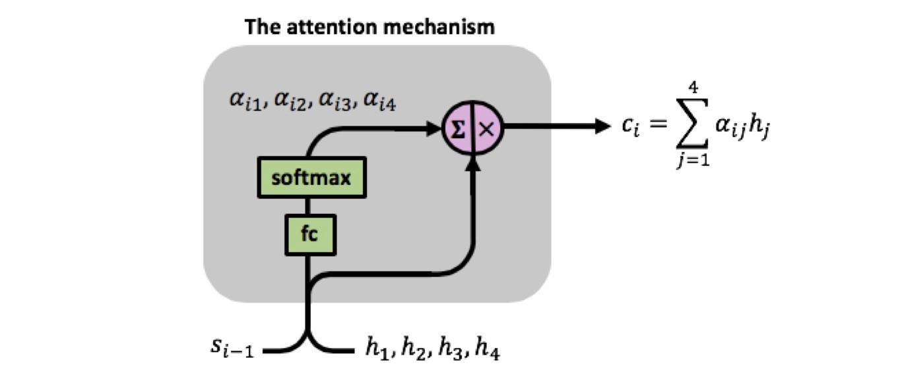
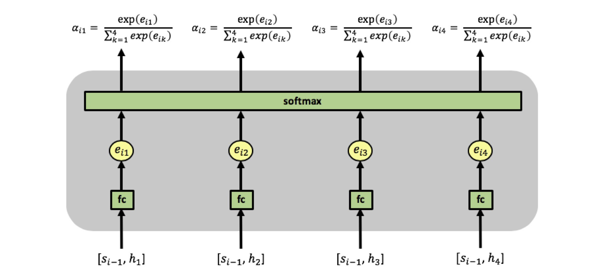
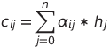

# Session 3

### Authors

* **Deepak Hazarika**
* **Parinita Bora**
* **Mohan Sai Srinivas Y**    

Wednesday, June 10, 2021 17:56:27
----------

# Design a LSTM model to meet the following requirement

1. Embedding layer
2. Encoder  

    a. which will take one word at a time and the last hidden state
    
    b. process them till end of the sentence.
    
    c. return a single vector
    
3. Decoder 

    a. take context vector of each word from the attention mechanism + last hidden state of the decoder 
    
    b. process them till end of the sentence.
    
    c. return last hidden state of the decoder
    
4. The final hidden state of the decoder is passed to a linear layer to predict the label    

## Abstract

The tweet dataset is trained using an encoder decoder model.Each word is fed to a lstm cell in the encoder , the hidden states are then combined to create a single vector.An attention mechanism pairs the last hidden state of the decoder with the hidden state of each word of the encoder.This is fed to a linear layer to get the weight of the word.Weights of all the words are passed through a softmax function to get the relative weight of the word.This weight vector is multiplied with the single vector generated by the encoder to get the context of the word w.r.t the sentence.This context vector along with the last hidden state of the decoder is fed to the decoder.The final hidden state of the decoder is passed to a linear layer to get the class prediction.The model stagnated at a validation accuracy of 68.3%.Further work is required to understand this.

## Dataset :

tweet dataset
	
- There are 3 categories of label

| integer label | Category |
| --- | --- |
| **0** | Negative |
| **1** | Positive |
| **2** | Neutral |

### Model class for training and validation

The model has

1.   An embedding layer which stores the list of words seen in the dataset and has weights attached to each word.These weights are adjusted during backpropagation to enable the model to converge at global minimum.

2.   The model processes words in a sentence to encode the information ,

     a. the sentences in the batch are padded with 0 to match the longest sentence in the batch.Here **nn.utils.rnn.pad_sequence** is used to pad the batch of sentences.

     b. hidden state and cell state are initialized to 0 , before calling the encoder and decoder.

<source - https://distill.pub/2016/augmented-rnns/>

3.   **Encoder**

     a. The word of the sentence is processed in left to right order. Each word along with the last hidden state is fed to a LSTMCell method. The hidden state is also stored in an array in the same order i.e from left to right.

<source - https://distill.pub/2016/augmented-rnns/>

4.   **Attention mechanism**

     a. The last hidden states of the decoder is paired with hidden state of each word from the encoder.
     
     b. Each pair is then fed to a linear layer to get the weight of the word.
     

<source - https://distill.pub/2016/augmented-rnns/>

     
  c. All the weights are then passed through a softmax function to get the relative weight of each word in the sentence.
     

     
  d. The relative weights are then multiplied with the single vector generated by the encoder to get the context of the word w.r.t the sentence.
     
5.   **Decoder**

     a. The context vector from the attention mechanism along with the last hidden state of the decoder is fed to  LSTMCell in a loop.

6.   The last hidden state of the decoder is fed to a linear layer to return 3 class values.
 
### Model definition 

The model has

| Layer | Input nodes | Output nodes |
| --- | --- | --- |
| Embedding | 4651 | 100 |
| Encoder LSTMCell  | 100 | 100 |
| Decoder LSTMCell  | 100 | 100 |
| Attention linear  | 200 | 1 |
| Linear | 100 | 3 |

**627,204** trainable parameters

### Data split

The data was split into training and validation in the ratio of 85:15 using BucketIterator.

## Model performance

The model was run for 10 epochs , in the last epoch

+ Train Loss: 0.860 | Train Acc: 69.12%

+ Val. Loss: 0.868 |  Val. Acc: 68.30% 
  
A graph showing the plot of loss and accuracy across 10 epochs is shown below.

  

## Model test output for a sample sentence

**An invalid explanation for why Nixon will let women on the army.**

Predicted label: Negative

### Hidden state output at each step of encoder for the above sentence

**encdr word  0**

encdr word  0 torch.Size([1, 100]) tensor([[-1.8710e-03, -8.0427e-01, -6.1747e-11, -3.7839e-02, -8.4277e-03,
         -1.7091e-02, -2.6354e-05, -2.4499e-04,  7.9232e-01, -6.6541e-03,
          8.2659e-11, -6.4073e-06, -9.3472e-02,  7.1891e-01, -7.6157e-01,
         -7.0244e-01, -2.9770e-07,  7.9476e-01, -8.6679e-01,  8.4065e-07,
          6.9593e-01,  7.6414e-01,  7.6146e-01,  1.5395e-03,  8.8270e-02,
         -6.6078e-07,  7.1764e-02, -7.4168e-01,  6.1294e-01, -6.5134e-01,
         -7.6126e-01,  6.9115e-03, -6.2946e-02,  5.2571e-01, -7.1021e-01,
         -6.6858e-02,  6.7826e-01,  2.6072e-03, -7.2935e-01, -5.3951e-05,
          7.3473e-08,  7.6043e-01, -7.0153e-01,  7.7333e-01, -6.5393e-01,
          8.9022e-04, -5.3442e-07, -6.2792e-02, -1.0654e-10,  7.4090e-01,
         -2.7676e-05,  6.9301e-01, -2.8549e-01, -7.3232e-01,  1.3171e-07,
         -6.9449e-01,  7.5401e-01, -3.7342e-11, -7.3943e-01, -1.9820e-02,
          1.0424e-03,  1.1207e-04, -4.6235e-22, -1.0200e-08,  7.9701e-01,
         -2.7369e-09, -1.8870e-01,  4.4296e-01, -8.5802e-01,  4.1583e-14,
          3.8245e-02,  7.7617e-01, -1.1807e-03, -7.1285e-01, -5.8152e-01,
         -3.4256e-02,  2.7184e-02,  2.6511e-10, -7.5964e-01,  1.2416e-04,
          6.4464e-01, -7.0735e-01, -7.0257e-03, -3.0702e-02, -9.9958e-14,
         -8.0186e-06, -1.2767e-04, -7.7026e-01,  7.2611e-01, -4.8855e-03,
         -4.9267e-07,  5.1638e-04,  2.7243e-18,  1.7389e-10, -3.3735e-06,
          1.9561e-01,  1.9770e-05, -7.5814e-01, -5.8209e-04,  7.6071e-01]],
       device='cuda:0', grad_fn=<ThnnFusedLstmCellBackward>)

**encdr word  1**

encdr word  1 torch.Size([1, 100]) tensor([[ 4.4919e-01, -1.3640e-03, -3.8265e-14, -6.5007e-01, -7.9563e-01,
         -4.4452e-09,  9.9040e-02, -7.7525e-03,  7.2631e-02,  1.8974e-01,
          4.7622e-16, -2.4541e-02,  2.9577e-20,  1.2247e-03, -2.7754e-03,
         -1.8687e-05,  5.4580e-04, -2.9173e-06, -1.7394e-01, -6.7809e-01,
          2.1590e-09, -5.0160e-02,  9.2056e-03,  7.5190e-01, -2.3817e-08,
         -2.9716e-03, -1.1448e-01, -2.7762e-01,  7.8472e-02, -1.4441e-02,
         -2.0839e-01,  7.4063e-01, -9.5916e-01,  1.1816e-04, -9.0861e-06,
         -7.3502e-09,  1.5688e-04,  3.0521e-02,  4.0552e-02,  2.3867e-03,
         -1.9014e-01,  5.6316e-02,  1.0260e-04,  1.7385e-08, -7.1152e-04,
          5.7004e-08, -2.4205e-01, -4.6986e-05,  2.6555e-01,  7.5456e-01,
         -3.5942e-12, -1.1207e-01,  3.9830e-01, -3.1992e-02,  5.0033e-03,
          6.9750e-06,  1.6633e-04, -1.2140e-02, -8.0994e-08, -7.3306e-01,
         -1.3585e-02, -1.3840e-08, -1.5726e-11, -1.6366e-05,  1.1722e-07,
         -4.0132e-11,  2.4935e-02,  4.7871e-01,  7.6105e-01,  3.1331e-04,
          8.4180e-01,  8.6210e-05,  6.4950e-04, -1.7245e-01, -1.6178e-01,
         -3.5726e-03, -5.0847e-01, -4.9250e-01, -1.2365e-03, -1.3442e-07,
          1.1578e-03, -2.2452e-09,  5.4949e-01, -3.2034e-07, -7.6159e-01,
         -7.3239e-05, -2.2099e-17, -1.0716e-04,  2.4072e-07, -4.6313e-10,
          3.1549e-14, -1.9295e-03,  1.2351e-14,  3.1879e-01, -1.0875e-03,
          3.1058e-03,  2.5394e-03, -2.7875e-01, -3.5399e-11, -7.9416e-02]],
       device='cuda:0', grad_fn=<ThnnFusedLstmCellBackward>)

**encdr word  2**

encdr word  2 torch.Size([1, 100]) tensor([[ 7.3750e-01, -7.9441e-01, -1.8194e-06,  2.1156e-01, -1.5686e-01,
          3.9432e-01,  4.5617e-06, -8.4207e-01,  4.0767e-07,  2.4453e-12,
          1.4174e-12, -3.9222e-09, -7.6152e-01, -3.1800e-02, -4.5048e-02,
         -9.7313e-02,  1.3900e-03,  4.1683e-01, -4.1216e-01, -1.2998e-10,
         -6.8561e-12,  7.5631e-01,  5.1152e-06,  1.3346e-08, -7.6159e-01,
         -9.0789e-08,  5.9417e-01, -2.3471e-01,  5.5605e-01, -9.1215e-03,
         -3.4759e-03,  2.3810e-11, -9.5820e-15, -4.6662e-01,  3.2495e-01,
         -2.7262e-06, -4.7297e-13, -6.8804e-01,  1.7135e-06,  1.8321e-10,
         -2.0266e-01, -7.1664e-01, -1.1788e-02,  8.7965e-01, -3.1399e-11,
         -9.5058e-12, -1.8245e-03, -4.6086e-01,  5.9536e-12,  9.7495e-01,
         -3.0439e-04, -1.1221e-01, -1.8989e-04, -4.4031e-05,  1.8603e-05,
         -7.4621e-04, -4.8925e-03, -2.9671e-04, -9.6023e-01, -8.5472e-01,
         -5.3781e-01, -8.4721e-03, -1.3943e-14,  7.5913e-01, -5.1087e-13,
          1.5875e-01, -5.9026e-01,  6.6487e-12,  1.6062e-02,  1.6610e-03,
          7.8022e-01,  5.7327e-04,  4.7067e-02,  5.8404e-06, -3.4405e-07,
         -1.2937e-08, -3.6771e-01, -2.1246e-07,  1.2093e-04,  7.5392e-01,
          5.4536e-02, -5.4018e-02,  9.2431e-01, -3.8162e-03,  2.8819e-02,
          2.6540e-01, -6.6465e-09, -6.1361e-01,  9.9032e-01, -2.4998e-06,
         -7.3873e-08, -4.7378e-03,  3.7981e-11,  1.0273e-08,  7.5985e-01,
         -7.3371e-01,  7.4275e-01, -3.6588e-02,  7.0699e-01,  8.6286e-02]],
       device='cuda:0', grad_fn=<ThnnFusedLstmCellBackward>)

**encdr word  3**

encdr word  3 torch.Size([1, 100]) tensor([[ 6.7957e-01,  1.3282e-02,  2.6443e-01, -2.2496e-03, -1.9697e-02,
         -6.9500e-03,  6.1831e-01, -4.0332e-18, -7.6150e-01,  1.1014e-05,
         -3.1232e-01, -1.4010e-02, -3.1855e-02, -5.8333e-01, -6.9389e-04,
          7.6093e-01, -1.4293e-15, -4.4500e-01,  2.9193e-12,  7.5732e-01,
          7.6158e-01, -7.2006e-04, -1.3679e-02,  1.5109e-01,  2.1149e-04,
          7.6145e-01,  9.9658e-24, -5.5781e-01, -6.6678e-01, -7.5870e-01,
         -9.2087e-01,  6.3124e-07, -6.6880e-01, -5.3424e-06,  5.6333e-16,
         -4.5410e-03, -6.7126e-01, -5.4482e-17,  8.6506e-01, -7.6136e-01,
         -5.9897e-32,  1.4264e-18,  7.5769e-01, -4.5648e-07,  7.6159e-01,
          7.6123e-01,  6.1327e-01, -2.3076e-01,  7.6139e-01, -2.5450e-04,
          7.6150e-01, -2.5656e-02,  7.5869e-01,  6.7820e-10,  7.6163e-01,
         -9.5713e-01, -5.1999e-05, -1.1597e-08, -9.9449e-01, -8.4959e-01,
         -3.3957e-08, -8.7787e-01, -7.6159e-01, -7.5912e-01,  2.7493e-01,
          1.9843e-10,  1.5020e-01, -6.7671e-04, -1.6809e-11, -4.2961e-05,
         -6.7947e-01, -2.5123e-07,  9.7678e-06,  2.2129e-06,  4.3324e-07,
          7.2819e-01, -1.8472e-33, -2.8258e-21, -7.3335e-01,  2.7260e-26,
         -7.6091e-01, -8.2732e-01, -2.9146e-14, -2.7030e-07,  1.5516e-07,
         -2.9181e-05, -1.5851e-19,  2.6194e-01,  1.4129e-05,  6.4406e-01,
          7.6022e-01, -7.6847e-01, -6.9955e-07, -7.6127e-01,  3.5327e-05,
         -9.6402e-01,  1.0746e-05, -7.7134e-01, -5.1309e-05,  5.2947e-14]],
       device='cuda:0', grad_fn=<ThnnFusedLstmCellBackward>)

**encdr word  4**

encdr word  4 torch.Size([1, 100]) tensor([[ 6.6287e-11,  9.5362e-05, -1.5209e-05, -9.5474e-19,  9.2174e-04,
         -5.8929e-01, -7.6111e-01,  3.0600e-29,  2.1189e-04,  7.5573e-01,
         -3.1230e-01, -6.8934e-05, -7.0263e-01, -7.6162e-01, -3.8863e-09,
          7.0212e-01, -6.6286e-10,  5.0818e-01, -1.0095e-16,  7.5732e-01,
          1.2566e-06,  8.2254e-11,  7.6159e-01,  7.7342e-01,  5.0416e-29,
          2.5234e-01,  9.0951e-28, -3.8199e-14,  1.9252e-01, -1.5037e-08,
         -1.1904e-01, -1.7865e-02, -9.4769e-01,  2.2392e-17, -8.8497e-21,
          7.5968e-01,  2.9163e-04, -2.0700e-19,  3.0324e-01,  3.2842e-05,
         -7.6159e-01,  1.7740e-04, -9.2386e-03, -3.5783e-02, -1.9312e-05,
         -3.3559e-03,  9.3270e-01, -7.6161e-01,  9.6399e-01,  7.5971e-01,
          4.6622e-02, -3.0035e-12, -6.8786e-03, -1.7006e-04, -2.6000e-01,
         -7.5105e-01,  3.3078e-04, -4.1149e-03, -1.9194e-02, -5.0365e-09,
          5.5846e-09, -7.7192e-01, -3.1461e-02, -4.1584e-20,  5.2222e-02,
         -4.2058e-07,  5.0141e-07, -1.7266e-04,  6.3796e-01, -6.2466e-01,
         -1.9403e-16,  7.5916e-01, -1.2187e-02, -7.6155e-01,  7.4815e-01,
          7.2473e-01, -3.9613e-05, -7.6159e-01,  7.6159e-01,  3.9456e-20,
          6.4677e-01, -1.3675e-01, -1.0321e-26, -7.4150e-01,  2.1579e-12,
         -1.2275e-22, -7.3408e-01, -6.9047e-01, -7.5911e-01,  7.6152e-01,
          1.2092e-01, -4.4404e-04, -7.6159e-01,  7.7039e-04, -6.3171e-01,
         -7.6153e-01,  2.2033e-10, -2.4251e-02, -5.6090e-01, -1.9615e-09]],
       device='cuda:0', grad_fn=<ThnnFusedLstmCellBackward>)

**encdr word  5**

encdr word  5 torch.Size([1, 100]) tensor([[ 5.9980e-09,  7.9941e-01,  4.0634e-01,  6.8873e-01,  7.6197e-01,
         -3.2066e-02, -7.5378e-01,  1.2219e-02, -2.5944e-01,  1.0340e-10,
         -3.7411e-03, -7.6754e-01, -3.3059e-15, -4.6459e-01,  2.2059e-01,
         -7.5748e-01,  7.3148e-01, -4.0084e-01,  4.7070e-06,  6.8948e-03,
         -5.0297e-11, -7.1713e-01,  6.3963e-12, -3.7841e-01, -1.9066e-03,
          8.4851e-01, -6.9261e-01,  7.4594e-01,  2.2130e-03, -6.4051e-04,
         -4.4392e-17, -3.0323e-06,  9.8235e-14,  6.6511e-10,  7.1866e-01,
          4.7288e-22, -3.3359e-08,  7.5773e-01,  7.0085e-13, -7.5757e-01,
         -7.6145e-01, -1.6783e-01,  1.0961e-01, -7.6163e-01, -2.0335e-13,
          4.6018e-01,  8.5462e-01,  2.5618e-03, -5.0555e-01, -7.6151e-01,
          7.6397e-01, -7.4599e-01,  2.5918e-03,  1.3156e-06,  5.5660e-08,
         -7.7602e-02, -8.8822e-02,  7.6037e-05,  7.4188e-01, -3.6506e-01,
         -7.6148e-01,  4.1366e-01, -4.2641e-08, -7.6159e-01,  2.9654e-08,
         -2.5193e-01,  4.8633e-02, -2.5041e-18, -2.0362e-05, -3.7247e-01,
          9.7037e-05, -1.5445e-07,  1.7906e-01,  1.4757e-10,  7.5933e-01,
          2.0081e-07, -1.3774e-05, -3.5020e-10, -9.5545e-18,  7.6102e-01,
         -2.0274e-01, -7.0266e-01, -7.5393e-01, -9.4711e-01, -2.6776e-02,
         -7.4680e-01, -3.4732e-05,  1.2982e-07, -5.6420e-03, -1.0155e-07,
         -1.3658e-01, -7.6597e-01, -2.8959e-02, -7.6106e-01,  3.7770e-03,
         -1.8788e-03,  7.6165e-01, -4.1565e-14, -7.6467e-01,  7.6096e-01]],
       device='cuda:0', grad_fn=<ThnnFusedLstmCellBackward>)

**encdr word  6**

encdr word  6 torch.Size([1, 100]) tensor([[ 1.2493e-06,  9.4941e-01,  9.0397e-01,  9.0898e-04,  7.6386e-01,
         -2.3822e-03, -5.9617e-01,  7.6672e-01, -1.6944e-03, -3.2545e-08,
         -7.6334e-01,  2.1330e-07,  6.6335e-18, -1.1008e-02,  2.3821e-03,
         -3.6441e-06,  2.2229e-01, -7.6147e-01,  9.6007e-01,  2.5790e-01,
         -7.5980e-01, -3.0986e-01, -3.3329e-06, -2.6158e-07, -7.6226e-01,
          8.4527e-01, -9.5165e-01,  7.5542e-01,  8.3321e-05,  6.7346e-01,
         -3.2407e-13, -5.6766e-08,  3.6428e-08,  9.5911e-09,  2.4399e-05,
         -5.9830e-17, -5.0385e-04,  9.6338e-01,  7.6069e-01, -1.0453e-05,
          3.5871e-01, -7.1526e-01,  1.1898e-04, -2.1504e-03,  1.4422e-14,
          7.9104e-06,  3.1819e-08,  5.0196e-23, -7.6224e-01, -9.6377e-01,
          7.6287e-01, -8.3918e-01,  1.2820e-01,  1.6965e-01,  1.7065e-07,
         -1.4752e-05, -6.7316e-01, -1.5707e-02,  3.7381e-07, -9.0866e-04,
         -9.6248e-01, -2.6127e-05, -3.3771e-01, -8.1401e-06, -7.5785e-05,
          5.6183e-04,  3.5498e-02,  1.0396e-08, -3.1119e-08, -7.9404e-01,
         -7.6130e-01, -2.4450e-10,  1.5925e-01,  9.6010e-05,  9.2556e-01,
          2.3269e-06, -8.8795e-05,  7.3860e-01, -1.0600e-21,  2.3130e-02,
         -2.8455e-12, -3.1157e-04, -9.6274e-01, -9.3862e-01, -3.7736e-06,
         -9.6388e-01, -2.7418e-06,  3.6750e-07, -4.1439e-03, -9.6659e-05,
          4.2776e-04, -1.0319e-15,  1.5079e-01, -1.0553e-03,  1.2980e-04,
         -3.6853e-11,  4.1908e-05, -1.0720e-11, -9.5090e-01,  2.2810e-02]],
       device='cuda:0', grad_fn=<ThnnFusedLstmCellBackward>)

**encdr word  7**

encdr word  7 torch.Size([1, 100]) tensor([[ 2.1228e-07,  1.8255e-05,  1.2403e-03,  8.4726e-04,  6.9375e-01,
         -1.7444e-10,  1.6749e-01,  9.0284e-01, -6.9663e-05, -2.1726e-01,
         -5.3572e-01,  4.9643e-02,  1.0766e-10, -3.2503e-02,  6.9127e-08,
          3.5291e-06,  9.9446e-01, -1.1292e-15,  1.1328e-03,  9.5942e-01,
         -2.9589e-03, -9.7121e-01, -2.3488e-04, -7.5368e-01, -2.1573e-07,
          3.4684e-01, -9.8909e-01,  7.0906e-04, -2.9299e-01,  1.3754e-04,
          8.7649e-04, -7.5107e-01,  1.8109e-05, -7.6092e-01,  9.2795e-12,
         -5.0234e-15, -9.3373e-01,  9.9496e-01,  2.9680e-11, -9.5992e-01,
          7.1384e-01, -1.6724e-02,  1.9527e-03, -2.3951e-10,  6.3716e-19,
          7.4176e-02,  7.5201e-01,  1.2798e-21, -8.1792e-01, -9.9497e-01,
          2.5954e-06, -7.9819e-01,  7.7138e-01,  2.2584e-01,  5.0064e-05,
          4.6959e-01, -7.5241e-09, -2.2605e-09,  2.4359e-14,  3.0771e-02,
         -9.9391e-01, -7.1339e-01, -8.4408e-01, -2.1710e-01, -9.8829e-08,
          1.0160e-07, -2.5297e-04,  3.3536e-05,  7.5474e-01, -9.5811e-01,
         -9.5161e-01, -1.5349e-10,  7.6157e-01,  5.5606e-05,  1.4655e-16,
          1.7248e-01, -7.6281e-01, -2.8639e-02,  3.0254e-21, -5.1376e-09,
         -4.1943e-06, -2.3039e-01, -9.9083e-01, -9.3117e-01, -1.9358e-08,
         -9.5061e-01, -8.7907e-19,  3.7431e-01, -8.3931e-11, -9.6195e-14,
          6.9053e-01, -6.2646e-01, -8.7766e-14, -3.8785e-06,  5.0601e-08,
         -3.8648e-05,  8.5808e-03,  5.1045e-11, -4.5540e-01,  1.9807e-03]],
       device='cuda:0', grad_fn=<ThnnFusedLstmCellBackward>)

**encdr word  8**

encdr word  8 torch.Size([1, 100]) tensor([[ 4.9234e-04,  0.0000e+00,  7.6161e-01,  7.0551e-15,  7.6170e-01,
         -9.5663e-01,  8.3233e-01,  9.9429e-01, -3.5914e-01, -8.3988e-01,
         -2.2928e-05,  6.2369e-22,  0.0000e+00, -3.6954e-21,  7.5351e-01,
          1.1548e-36,  9.9925e-01, -0.0000e+00,  0.0000e+00,  9.9441e-01,
         -9.1085e-01, -2.3802e-10, -6.7047e-01, -7.5939e-01, -1.1528e-26,
          1.9762e-05, -7.4220e-03,  7.6159e-01, -9.6348e-01,  1.5781e-28,
          2.0233e-11, -9.6225e-01,  2.4868e-13, -9.6403e-01,  0.0000e+00,
         -1.0390e-19, -9.9171e-01,  7.6159e-01,  3.6663e-02, -9.9450e-01,
          7.6131e-01, -7.3667e-31,  0.0000e+00, -0.0000e+00,  0.0000e+00,
          7.6607e-01,  9.6390e-01,  7.0065e-45, -9.7329e-01, -9.9932e-01,
          9.6307e-34, -9.6351e-01,  9.6567e-01,  2.1700e-25,  9.6400e-01,
          9.0686e-01, -0.0000e+00, -0.0000e+00,  0.0000e+00,  0.0000e+00,
         -4.7727e-01, -1.5689e-31, -9.7737e-01, -9.6408e-01, -1.8616e-40,
          2.7515e-13, -0.0000e+00,  7.9319e-05,  7.6159e-01, -9.9423e-01,
         -9.9331e-01, -4.3105e-14,  2.4202e-19,  1.7479e-05,  1.9669e-23,
          8.3928e-01, -9.6463e-01, -7.6159e-01,  7.7889e-40, -8.8060e-22,
         -2.5254e-29,  5.3716e-01, -9.9923e-01,  4.3704e-01, -1.8272e-33,
         -9.9932e-01,  8.3039e-35,  1.1585e-14, -1.0132e-08, -0.0000e+00,
          9.5146e-01, -7.6159e-01, -6.5191e-03, -7.6236e-01,  6.4405e-01,
         -1.2790e-16,  4.2391e-11,  5.1859e-10,  1.5824e-01,  5.0026e-43]],
       device='cuda:0', grad_fn=<ThnnFusedLstmCellBackward>)

**encdr word  9**

encdr word  9 torch.Size([1, 100]) tensor([[ 7.6477e-01,  7.5993e-01,  5.9095e-03,  2.8204e-04,  6.2366e-05,
         -9.9386e-01,  6.2494e-10,  3.2125e-02, -1.5831e-01, -6.5487e-01,
         -2.8663e-01,  4.4130e-29,  2.0942e-03, -7.6412e-01,  6.8161e-05,
          7.6139e-01,  9.9990e-01, -1.8104e-26,  5.1380e-02,  1.7247e-03,
         -2.1640e-02, -2.2828e-08, -2.8923e-01, -7.6159e-01, -5.1044e-19,
          4.3363e-12, -7.6280e-01,  9.6402e-01, -9.9489e-01,  2.1007e-03,
          6.8787e-03, -5.9561e-05,  7.6159e-01, -9.6655e-01,  4.9028e-09,
         -7.0198e-01, -9.9887e-01,  7.6158e-01,  1.5247e-12, -8.9210e-01,
          2.3534e-02, -2.7494e-03,  1.6696e-12, -3.5817e-18,  1.0648e-14,
          5.5433e-09,  9.9479e-01,  8.5768e-03, -5.6302e-01, -5.4655e-02,
          5.8908e-01, -2.7064e-02,  8.6630e-01,  7.6159e-01,  9.0424e-01,
          9.6168e-01, -9.3724e-10, -7.9700e-07,  1.0237e-06,  7.5453e-01,
         -1.0425e-01, -6.5461e-01, -9.9678e-01, -9.9504e-01, -7.5334e-12,
          9.5748e-11, -7.6146e-01, -1.1788e-22,  8.5313e-01, -3.7303e-01,
         -9.9327e-01, -6.6927e-01,  4.5087e-01,  7.6142e-01,  7.6159e-01,
          2.6397e-04, -2.6727e-07, -9.6315e-01, -1.7741e-06, -5.5042e-11,
         -5.0392e-01,  8.0990e-01, -1.3828e-03,  4.8792e-09, -4.4468e-10,
         -2.2872e-02,  7.5360e-01,  7.6159e-01, -4.3304e-10,  3.0645e-04,
          7.4184e-01, -7.6540e-10, -7.8502e-09, -7.5513e-01,  1.1360e-04,
         -4.2047e-02,  1.1333e-09,  7.4752e-01,  1.8939e-07,  4.1450e-02]],
       device='cuda:0', grad_fn=<ThnnFusedLstmCellBackward>)

**encdr word  10**

encdr word  10 torch.Size([1, 100]) tensor([[ 4.7378e-06,  6.2285e-02, -1.0811e-05,  9.2338e-05,  5.2997e-05,
         -1.3214e-01,  1.8732e-01,  3.9513e-21, -3.4950e-01, -4.6426e-02,
         -7.4503e-01, -1.3583e-01, -2.1294e-08, -3.4815e-03, -2.6036e-03,
         -7.3991e-01, -6.0509e-06,  5.5169e-04, -6.3525e-15,  6.0846e-01,
          4.1312e-01,  1.9645e-20, -9.3258e-01,  1.3179e-03,  2.0099e-23,
         -7.5973e-01,  4.1700e-03,  6.7763e-07, -9.6316e-01, -3.6858e-01,
         -3.2273e-06, -8.5493e-01, -5.4836e-06, -6.5773e-02, -2.6171e-07,
          1.1798e-01, -9.9946e-01, -2.3013e-11,  1.2694e-06, -9.9450e-01,
         -7.3350e-11,  9.7987e-06,  7.9636e-04,  4.7501e-01, -7.6159e-01,
         -4.1684e-01,  9.6228e-01, -7.4918e-01, -9.7138e-01,  2.0240e-01,
          2.4517e-01,  4.0570e-10,  5.1985e-01, -4.4894e-01,  4.5820e-01,
          7.4776e-01, -1.3913e-05,  7.3641e-01, -7.6137e-01,  7.7204e-08,
          9.1128e-15, -3.7469e-12,  4.3224e-11,  9.5523e-02,  8.9942e-02,
         -9.8767e-22, -7.2040e-01, -3.2630e-19,  9.7823e-01, -1.2408e-11,
         -8.8321e-01, -3.6399e-19,  5.4974e-01,  8.2254e-06,  7.5205e-01,
         -7.3182e-01, -2.6943e-10, -7.5974e-01,  7.6102e-01,  1.3726e-22,
          3.2979e-01, -2.1833e-01, -1.8239e-23, -4.1946e-07,  7.6144e-01,
         -9.6328e-08, -7.2221e-12,  2.6660e-03,  2.2115e-02,  9.6148e-01,
          1.7821e-04, -7.8081e-05, -7.3165e-01,  1.5196e-02, -4.4962e-01,
          7.4335e-01, -4.1291e-05,  1.5979e-01, -4.4733e-28, -2.5489e-01]],
       device='cuda:0', grad_fn=<ThnnFusedLstmCellBackward>)

**encdr word 11**

encdr word  11 torch.Size([1, 100]) tensor([[ 7.6358e-01,  1.5002e-28, -2.6161e-02,  1.5777e-24,  3.6001e-09,
         -1.7386e-10,  8.3264e-01,  5.1824e-07, -8.7752e-01, -6.1861e-01,
         -3.5728e-05, -3.1571e-05,  1.6228e-06, -2.6992e-09, -1.3888e-15,
          3.0563e-18,  7.1228e-01, -8.9920e-19,  1.9389e-31,  9.9924e-01,
          9.0087e-01, -1.5506e-13, -9.9428e-01, -7.6104e-01, -7.7975e-30,
         -2.0662e-06, -2.5011e-10,  9.3850e-07, -9.9491e-01,  8.5834e-11,
          7.4030e-01, -9.7905e-01,  7.6159e-01, -8.6157e-01,  1.9642e-28,
         -7.0706e-01, -9.9993e-01,  1.8411e-16,  7.6161e-01, -9.9925e-01,
          7.5949e-01, -6.4326e-29,  1.1905e-15, -4.3387e-22,  7.3208e-01,
          5.0043e-01,  9.9481e-01,  8.2282e-04, -9.9627e-01,  8.2539e-03,
          1.1745e-12, -4.6382e-15,  9.1800e-01, -7.2208e-11,  9.0400e-01,
          9.6166e-01, -4.0690e-28, -6.6614e-04,  1.2268e-19,  5.1034e-14,
         -5.0073e-24, -7.7418e-03,  1.8236e-03, -7.1833e-01,  1.3478e-06,
          6.3507e-15, -1.9150e-19, -7.6159e-01,  9.9697e-01, -9.0452e-01,
         -8.9670e-01, -7.4868e-01,  1.9380e-09,  7.6159e-01,  2.1740e-13,
          6.7255e-02, -4.1324e-14, -9.6371e-01,  8.1717e-02, -1.0718e-16,
         -5.7664e-01, -2.1784e-01, -1.0455e-23,  2.0214e-05, -1.9442e-10,
         -1.8876e-24,  7.2900e-11,  7.6263e-01, -2.7444e-01,  4.3647e-08,
         -8.7560e-04, -7.6163e-01,  6.1253e-01, -7.5514e-01,  4.7443e-01,
          9.3517e-01, -1.5730e-14,  8.2142e-01,  3.9941e-15,  5.2004e-22]],
       device='cuda:0', grad_fn=<ThnnFusedLstmCellBackward>)

**encdr word  12**

encdr word  12 torch.Size([1, 100]) tensor([[ 9.1971e-01,  2.1970e-11,  7.6159e-01,  1.0273e-26,  1.5581e-19,
         -6.3786e-04,  9.7558e-01,  1.0417e-22, -9.8250e-01, -9.3547e-01,
         -1.1735e-05, -3.2746e-23,  9.3184e-01,  6.3939e-07,  4.8740e-05,
          3.6648e-03, -1.0812e-01, -2.0001e-08,  1.2247e-19,  6.6258e-01,
          4.4368e-01, -8.9546e-10, -2.7539e-01, -7.6159e-01, -1.4089e-19,
          1.5432e-03, -4.1860e-11,  7.0838e-01, -9.6299e-01, -1.0093e-05,
          3.3137e-01, -9.9709e-01,  9.6402e-01, -8.4615e-01,  1.3913e-10,
         -7.6160e-01, -9.9999e-01,  5.9265e-10,  9.4868e-01, -9.9990e-01,
          4.6906e-20,  2.4371e-12,  5.5701e-16, -5.1848e-44,  5.9729e-01,
          9.0873e-01,  8.1214e-06,  1.2613e-04, -9.9950e-01,  8.5818e-19,
          5.6260e-02, -1.6251e-16,  9.8849e-01,  7.6159e-01,  9.8645e-01,
          9.9472e-01, -1.6823e-03, -7.6159e-01,  7.6145e-01,  1.7297e-15,
         -6.7718e-21, -6.6359e-03, -7.6150e-01, -9.5650e-01, -7.6159e-01,
          3.4115e-17, -6.5659e-06, -1.7673e-01,  9.9960e-01, -9.0157e-01,
         -3.9262e-07, -1.1240e-02,  4.7270e-29,  9.6403e-01,  7.6160e-01,
          7.8846e-01, -1.1716e-17, -7.6158e-01, -6.7445e-03, -4.2374e-13,
         -9.2986e-01,  6.5191e-01, -3.6872e-22,  7.6154e-01, -4.1422e-41,
         -2.0702e-22,  4.4698e-21,  9.6420e-01, -1.4401e-12,  5.2841e-01,
          3.3062e-11, -4.9831e-02,  6.2883e-01, -9.6294e-01,  8.5877e-01,
          9.8988e-01, -2.1695e-04,  9.7374e-01,  3.0410e-04,  3.8816e-08]],
       device='cuda:0', grad_fn=<ThnnFusedLstmCellBackward>)

### Hidden state output at each step of encoder for the above sentence

**decd word  0**

decd word  0 torch.Size([1, 100]) tensor([[-7.6236e-01,  5.9335e-01, -0.0000e+00,  0.0000e+00,  0.0000e+00,
          7.9389e-01,  0.0000e+00,  0.0000e+00,  0.0000e+00,  0.0000e+00,
         -6.5270e-01,  0.0000e+00,  4.1753e-27,  0.0000e+00,  0.0000e+00,
          0.0000e+00,  0.0000e+00, -6.7392e-34, -8.2695e-01,  0.0000e+00,
          0.0000e+00,  1.3788e-29,  7.1248e-01,  9.3335e-28, -0.0000e+00,
          7.1901e-01,  8.2039e-01,  8.3028e-01,  0.0000e+00,  0.0000e+00,
         -0.0000e+00, -8.1641e-01, -6.4364e-01,  0.0000e+00, -0.0000e+00,
         -8.1782e-01,  0.0000e+00, -7.1628e-01, -7.3034e-01,  0.0000e+00,
          8.1401e-01,  5.9979e-02, -0.0000e+00,  0.0000e+00, -7.0680e-01,
          0.0000e+00,  7.4117e-01,  8.3946e-01,  2.4540e-33,  7.1385e-01,
         -7.7255e-01, -0.0000e+00,  8.3581e-01, -3.9675e-33,  0.0000e+00,
         -7.9821e-01,  0.0000e+00,  0.0000e+00,  7.3083e-01,  0.0000e+00,
         -6.5694e-01,  2.2421e-44, -0.0000e+00, -7.9935e-01,  0.0000e+00,
         -8.0656e-01,  7.8981e-01,  0.0000e+00,  0.0000e+00,  0.0000e+00,
         -7.7822e-01,  2.3191e-25, -0.0000e+00, -0.0000e+00,  7.6702e-01,
         -7.6160e-01,  3.1937e-34,  0.0000e+00, -7.8599e-01,  7.9865e-01,
          7.9916e-01, -0.0000e+00,  0.0000e+00,  8.1559e-01, -0.0000e+00,
         -0.0000e+00,  0.0000e+00,  6.6845e-01,  6.1993e-01,  0.0000e+00,
          7.6435e-01, -0.0000e+00,  7.7706e-01, -0.0000e+00,  1.4679e-16,
         -7.4899e-01,  7.1630e-01,  7.6568e-01,  2.3327e-35,  7.4438e-01]],
       device='cuda:0', grad_fn=<ThnnFusedLstmCellBackward>)

**decd word  1**

decd word  1 torch.Size([1, 100]) tensor([[-9.6416e-01,  9.3323e-01, -0.0000e+00,  0.0000e+00,  0.0000e+00,
          9.6938e-01,  0.0000e+00,  0.0000e+00,  0.0000e+00,  0.0000e+00,
         -9.4469e-01,  0.0000e+00,  8.1275e-44,  0.0000e+00,  0.0000e+00,
          0.0000e+00,  0.0000e+00, -0.0000e+00, -9.7469e-01,  0.0000e+00,
          0.0000e+00,  1.7691e-41,  9.5557e-01,  4.6596e-37, -0.0000e+00,
          9.5671e-01,  9.7365e-01,  9.7521e-01,  0.0000e+00,  0.0000e+00,
         -0.0000e+00, -9.7301e-01, -9.4299e-01,  0.0000e+00, -0.0000e+00,
         -9.7324e-01,  0.0000e+00, -9.5623e-01, -9.5869e-01,  0.0000e+00,
          9.7263e-01,  6.0000e-02, -0.0000e+00,  0.0000e+00, -9.5456e-01,
          0.0000e+00,  9.6056e-01,  9.7665e-01,  0.0000e+00,  9.5581e-01,
         -9.6586e-01, -0.0000e+00,  9.7608e-01,  0.0000e+00,  0.0000e+00,
         -9.7008e-01,  0.0000e+00,  0.0000e+00,  9.5877e-01,  0.0000e+00,
         -9.4549e-01,  0.0000e+00, -0.0000e+00, -9.7027e-01,  0.0000e+00,
         -9.7001e-01,  9.6871e-01,  0.0000e+00,  0.0000e+00,  0.0000e+00,
         -9.6680e-01,  1.0650e-43, -0.0000e+00, -0.0000e+00,  9.6494e-01,
         -7.6160e-01,  2.9141e-37,  0.0000e+00, -9.6808e-01,  9.7015e-01,
          9.7023e-01, -0.0000e+00,  0.0000e+00,  9.7288e-01, -0.0000e+00,
         -0.0000e+00,  0.0000e+00,  9.4762e-01,  9.3845e-01,  0.0000e+00,
          9.6449e-01, -0.0000e+00,  9.6661e-01, -0.0000e+00,  1.0070e-30,
         -9.6189e-01,  9.5624e-01,  9.6471e-01,  9.0136e-40,  9.6111e-01]],
       device='cuda:0', grad_fn=<ThnnFusedLstmCellBackward>)

**decd word  2**

decd word  2 torch.Size([1, 100]) tensor([[-9.9507e-01,  9.9069e-01, -0.0000e+00,  0.0000e+00,  0.0000e+00,
          9.9580e-01,  0.0000e+00,  0.0000e+00,  0.0000e+00,  0.0000e+00,
         -9.9233e-01,  0.0000e+00,  0.0000e+00,  0.0000e+00,  0.0000e+00,
          0.0000e+00,  0.0000e+00, -0.0000e+00, -9.9654e-01,  0.0000e+00,
          0.0000e+00,  2.8026e-45,  9.9387e-01,  1.0250e-38, -0.0000e+00,
          9.9403e-01,  9.9639e-01,  9.9661e-01,  0.0000e+00,  0.0000e+00,
         -0.0000e+00, -9.9630e-01, -9.9209e-01,  0.0000e+00, -0.0000e+00,
         -9.9634e-01,  0.0000e+00, -9.9396e-01, -9.9431e-01,  0.0000e+00,
          9.9625e-01,  6.0000e-02, -0.0000e+00,  0.0000e+00, -9.9373e-01,
          0.0000e+00,  9.9457e-01,  9.9681e-01,  0.0000e+00,  9.9390e-01,
         -9.9531e-01, -0.0000e+00,  9.9673e-01,  0.0000e+00,  0.0000e+00,
         -9.9590e-01,  0.0000e+00,  0.0000e+00,  9.9432e-01,  0.0000e+00,
         -9.9244e-01,  0.0000e+00, -0.0000e+00, -9.9592e-01,  0.0000e+00,
         -9.9479e-01,  9.9571e-01,  0.0000e+00,  0.0000e+00,  0.0000e+00,
         -9.9544e-01,  0.0000e+00, -0.0000e+00, -0.0000e+00,  9.9518e-01,
         -7.6159e-01,  8.9384e-38,  0.0000e+00, -9.9562e-01,  9.9591e-01,
          9.9592e-01, -0.0000e+00,  0.0000e+00,  9.9629e-01, -0.0000e+00,
         -0.0000e+00,  0.0000e+00,  9.9275e-01,  9.9144e-01,  0.0000e+00,
          9.9512e-01, -0.0000e+00,  9.9542e-01, -0.0000e+00,  7.9109e-41,
         -9.9476e-01,  9.9396e-01,  9.9515e-01,  6.4446e-42,  9.9465e-01]],
       device='cuda:0', grad_fn=<ThnnFusedLstmCellBackward>)

**decd word  3**

decd word  3 torch.Size([1, 100]) tensor([[-9.9933e-01,  9.9874e-01, -0.0000e+00,  0.0000e+00,  0.0000e+00,
          9.9943e-01,  0.0000e+00,  0.0000e+00,  0.0000e+00,  0.0000e+00,
         -9.9896e-01,  0.0000e+00,  0.0000e+00,  0.0000e+00,  0.0000e+00,
          0.0000e+00,  0.0000e+00, -0.0000e+00, -9.9953e-01,  0.0000e+00,
          0.0000e+00,  0.0000e+00,  9.9917e-01,  5.7902e-39, -0.0000e+00,
          9.9919e-01,  9.9951e-01,  9.9954e-01,  0.0000e+00,  0.0000e+00,
         -0.0000e+00, -9.9950e-01, -9.9893e-01,  0.0000e+00, -0.0000e+00,
         -9.9950e-01,  0.0000e+00, -9.9918e-01, -9.9923e-01,  0.0000e+00,
          9.9949e-01,  6.0000e-02, -0.0000e+00,  0.0000e+00, -9.9915e-01,
          0.0000e+00,  9.9926e-01,  9.9957e-01,  0.0000e+00,  9.9917e-01,
         -9.9936e-01, -0.0000e+00,  9.9956e-01,  0.0000e+00,  0.0000e+00,
         -9.9944e-01,  0.0000e+00,  0.0000e+00,  9.9923e-01,  0.0000e+00,
         -9.9897e-01,  0.0000e+00, -0.0000e+00, -9.9945e-01,  0.0000e+00,
         -9.9869e-01,  9.9942e-01,  0.0000e+00,  0.0000e+00,  0.0000e+00,
         -9.9938e-01,  0.0000e+00, -0.0000e+00, -0.0000e+00,  9.9935e-01,
         -7.6159e-01,  7.4057e-38,  0.0000e+00, -9.9941e-01,  9.9945e-01,
          9.9945e-01, -0.0000e+00,  0.0000e+00,  9.9950e-01, -0.0000e+00,
         -0.0000e+00,  0.0000e+00,  9.9902e-01,  9.9884e-01,  0.0000e+00,
          9.9934e-01, -0.0000e+00,  9.9938e-01, -0.0000e+00,  0.0000e+00,
         -9.9929e-01,  9.9918e-01,  9.9934e-01,  2.9848e-42,  9.9927e-01]],
       device='cuda:0', grad_fn=<ThnnFusedLstmCellBackward>)

**decd word  4**

decd word  4 torch.Size([1, 100]) tensor([[-9.9991e-01,  9.9983e-01, -0.0000e+00,  0.0000e+00,  0.0000e+00,
          9.9992e-01,  0.0000e+00,  0.0000e+00,  0.0000e+00,  0.0000e+00,
         -9.9986e-01,  0.0000e+00,  0.0000e+00,  0.0000e+00,  0.0000e+00,
          0.0000e+00,  0.0000e+00, -0.0000e+00, -9.9994e-01,  0.0000e+00,
          0.0000e+00,  0.0000e+00,  9.9989e-01,  5.3474e-39, -0.0000e+00,
          9.9989e-01,  9.9993e-01,  9.9994e-01,  0.0000e+00,  0.0000e+00,
         -0.0000e+00, -9.9993e-01, -9.9985e-01,  0.0000e+00, -0.0000e+00,
         -9.9993e-01,  0.0000e+00, -9.9989e-01, -9.9990e-01,  0.0000e+00,
          9.9993e-01,  6.0000e-02, -0.0000e+00,  0.0000e+00, -9.9988e-01,
          0.0000e+00,  9.9990e-01,  9.9994e-01,  0.0000e+00,  9.9989e-01,
         -9.9991e-01, -0.0000e+00,  9.9994e-01,  0.0000e+00,  0.0000e+00,
         -9.9992e-01,  0.0000e+00,  0.0000e+00,  9.9990e-01,  0.0000e+00,
         -9.9986e-01,  0.0000e+00, -0.0000e+00, -9.9993e-01,  0.0000e+00,
         -9.9932e-01,  9.9992e-01,  0.0000e+00,  0.0000e+00,  0.0000e+00,
         -9.9992e-01,  0.0000e+00, -0.0000e+00, -0.0000e+00,  9.9991e-01,
         -7.6159e-01,  7.2107e-38,  0.0000e+00, -9.9992e-01,  9.9992e-01,
          9.9993e-01, -0.0000e+00,  0.0000e+00,  9.9993e-01, -0.0000e+00,
         -0.0000e+00,  0.0000e+00,  9.9987e-01,  9.9984e-01,  0.0000e+00,
          9.9991e-01, -0.0000e+00,  9.9992e-01, -0.0000e+00,  0.0000e+00,
         -9.9990e-01,  9.9989e-01,  9.9991e-01,  2.6807e-42,  9.9990e-01]],
       device='cuda:0', grad_fn=<ThnnFusedLstmCellBackward>)

**decd word  5**

decd word  5 torch.Size([1, 100]) tensor([[-9.9999e-01,  9.9998e-01, -0.0000e+00,  0.0000e+00,  0.0000e+00,
          9.9999e-01,  0.0000e+00,  0.0000e+00,  0.0000e+00,  0.0000e+00,
         -9.9998e-01,  0.0000e+00,  0.0000e+00,  0.0000e+00,  0.0000e+00,
          0.0000e+00,  0.0000e+00, -0.0000e+00, -9.9999e-01,  0.0000e+00,
          0.0000e+00,  0.0000e+00,  9.9998e-01,  5.2887e-39, -0.0000e+00,
          9.9999e-01,  9.9999e-01,  9.9999e-01,  0.0000e+00,  0.0000e+00,
         -0.0000e+00, -9.9999e-01, -9.9998e-01,  0.0000e+00, -0.0000e+00,
         -9.9999e-01,  0.0000e+00, -9.9998e-01, -9.9999e-01,  0.0000e+00,
          9.9999e-01,  6.0000e-02, -0.0000e+00,  0.0000e+00, -9.9998e-01,
          0.0000e+00,  9.9999e-01,  9.9999e-01,  0.0000e+00,  9.9998e-01,
         -9.9999e-01, -0.0000e+00,  9.9999e-01,  0.0000e+00,  0.0000e+00,
         -9.9999e-01,  0.0000e+00,  0.0000e+00,  9.9999e-01,  0.0000e+00,
         -9.9998e-01,  0.0000e+00, -0.0000e+00, -9.9999e-01,  0.0000e+00,
         -9.9943e-01,  9.9999e-01,  0.0000e+00,  0.0000e+00,  0.0000e+00,
         -9.9999e-01,  0.0000e+00, -0.0000e+00, -0.0000e+00,  9.9999e-01,
         -7.6159e-01,  7.1837e-38,  0.0000e+00, -9.9999e-01,  9.9999e-01,
          9.9999e-01, -0.0000e+00,  0.0000e+00,  9.9999e-01, -0.0000e+00,
         -0.0000e+00,  0.0000e+00,  9.9998e-01,  9.9998e-01,  0.0000e+00,
          9.9999e-01, -0.0000e+00,  9.9999e-01, -0.0000e+00,  0.0000e+00,
         -9.9999e-01,  9.9998e-01,  9.9999e-01,  2.6400e-42,  9.9999e-01]],
       device='cuda:0', grad_fn=<ThnnFusedLstmCellBackward>)

**decd word  6**

decd word  6 torch.Size([1, 100]) tensor([[-1.0000e+00,  1.0000e+00, -0.0000e+00,  0.0000e+00,  0.0000e+00,
          1.0000e+00,  0.0000e+00,  0.0000e+00,  0.0000e+00,  0.0000e+00,
         -1.0000e+00,  0.0000e+00,  0.0000e+00,  0.0000e+00,  0.0000e+00,
          0.0000e+00,  0.0000e+00, -0.0000e+00, -1.0000e+00,  0.0000e+00,
          0.0000e+00,  0.0000e+00,  1.0000e+00,  5.2805e-39, -0.0000e+00,
          1.0000e+00,  1.0000e+00,  1.0000e+00,  0.0000e+00,  0.0000e+00,
         -0.0000e+00, -1.0000e+00, -1.0000e+00,  0.0000e+00, -0.0000e+00,
         -1.0000e+00,  0.0000e+00, -1.0000e+00, -1.0000e+00,  0.0000e+00,
          1.0000e+00,  6.0000e-02, -0.0000e+00,  0.0000e+00, -1.0000e+00,
          0.0000e+00,  1.0000e+00,  1.0000e+00,  0.0000e+00,  1.0000e+00,
         -1.0000e+00, -0.0000e+00,  1.0000e+00,  0.0000e+00,  0.0000e+00,
         -1.0000e+00,  0.0000e+00,  0.0000e+00,  1.0000e+00,  0.0000e+00,
         -1.0000e+00,  0.0000e+00, -0.0000e+00, -1.0000e+00,  0.0000e+00,
         -9.9944e-01,  1.0000e+00,  0.0000e+00,  0.0000e+00,  0.0000e+00,
         -1.0000e+00,  0.0000e+00, -0.0000e+00, -0.0000e+00,  1.0000e+00,
         -7.6159e-01,  7.1798e-38,  0.0000e+00, -1.0000e+00,  1.0000e+00,
          1.0000e+00, -0.0000e+00,  0.0000e+00,  1.0000e+00, -0.0000e+00,
         -0.0000e+00,  0.0000e+00,  1.0000e+00,  1.0000e+00,  0.0000e+00,
          1.0000e+00, -0.0000e+00,  1.0000e+00, -0.0000e+00,  0.0000e+00,
         -1.0000e+00,  1.0000e+00,  1.0000e+00,  2.6358e-42,  1.0000e+00]],
       device='cuda:0', grad_fn=<ThnnFusedLstmCellBackward>)

**decd word  7**

decd word  7 torch.Size([1, 100]) tensor([[-1.0000e+00,  1.0000e+00, -0.0000e+00,  0.0000e+00,  0.0000e+00,
          1.0000e+00,  0.0000e+00,  0.0000e+00,  0.0000e+00,  0.0000e+00,
         -1.0000e+00,  0.0000e+00,  0.0000e+00,  0.0000e+00,  0.0000e+00,
          0.0000e+00,  0.0000e+00, -0.0000e+00, -1.0000e+00,  0.0000e+00,
          0.0000e+00,  0.0000e+00,  1.0000e+00,  5.2794e-39, -0.0000e+00,
          1.0000e+00,  1.0000e+00,  1.0000e+00,  0.0000e+00,  0.0000e+00,
         -0.0000e+00, -1.0000e+00, -1.0000e+00,  0.0000e+00, -0.0000e+00,
         -1.0000e+00,  0.0000e+00, -1.0000e+00, -1.0000e+00,  0.0000e+00,
          1.0000e+00,  6.0000e-02, -0.0000e+00,  0.0000e+00, -1.0000e+00,
          0.0000e+00,  1.0000e+00,  1.0000e+00,  0.0000e+00,  1.0000e+00,
         -1.0000e+00, -0.0000e+00,  1.0000e+00,  0.0000e+00,  0.0000e+00,
         -1.0000e+00,  0.0000e+00,  0.0000e+00,  1.0000e+00,  0.0000e+00,
         -1.0000e+00,  0.0000e+00, -0.0000e+00, -1.0000e+00,  0.0000e+00,
         -9.9945e-01,  1.0000e+00,  0.0000e+00,  0.0000e+00,  0.0000e+00,
         -1.0000e+00,  0.0000e+00, -0.0000e+00, -0.0000e+00,  1.0000e+00,
         -7.6159e-01,  7.1793e-38,  0.0000e+00, -1.0000e+00,  1.0000e+00,
          1.0000e+00, -0.0000e+00,  0.0000e+00,  1.0000e+00, -0.0000e+00,
         -0.0000e+00,  0.0000e+00,  1.0000e+00,  1.0000e+00,  0.0000e+00,
          1.0000e+00, -0.0000e+00,  1.0000e+00, -0.0000e+00,  0.0000e+00,
         -1.0000e+00,  1.0000e+00,  1.0000e+00,  2.6344e-42,  1.0000e+00]],
       device='cuda:0', grad_fn=<ThnnFusedLstmCellBackward>)

**decd word  8**

decd word  8 torch.Size([1, 100]) tensor([[-1.0000e+00,  1.0000e+00, -0.0000e+00,  0.0000e+00,  0.0000e+00,
          1.0000e+00,  0.0000e+00,  0.0000e+00,  0.0000e+00,  0.0000e+00,
         -1.0000e+00,  0.0000e+00,  0.0000e+00,  0.0000e+00,  0.0000e+00,
          0.0000e+00,  0.0000e+00, -0.0000e+00, -1.0000e+00,  0.0000e+00,
          0.0000e+00,  0.0000e+00,  1.0000e+00,  5.2792e-39, -0.0000e+00,
          1.0000e+00,  1.0000e+00,  1.0000e+00,  0.0000e+00,  0.0000e+00,
         -0.0000e+00, -1.0000e+00, -1.0000e+00,  0.0000e+00, -0.0000e+00,
         -1.0000e+00,  0.0000e+00, -1.0000e+00, -1.0000e+00,  0.0000e+00,
          1.0000e+00,  6.0000e-02, -0.0000e+00,  0.0000e+00, -1.0000e+00,
          0.0000e+00,  1.0000e+00,  1.0000e+00,  0.0000e+00,  1.0000e+00,
         -1.0000e+00, -0.0000e+00,  1.0000e+00,  0.0000e+00,  0.0000e+00,
         -1.0000e+00,  0.0000e+00,  0.0000e+00,  1.0000e+00,  0.0000e+00,
         -1.0000e+00,  0.0000e+00, -0.0000e+00, -1.0000e+00,  0.0000e+00,
         -9.9945e-01,  1.0000e+00,  0.0000e+00,  0.0000e+00,  0.0000e+00,
         -1.0000e+00,  0.0000e+00, -0.0000e+00, -0.0000e+00,  1.0000e+00,
         -7.6159e-01,  7.1791e-38,  0.0000e+00, -1.0000e+00,  1.0000e+00,
          1.0000e+00, -0.0000e+00,  0.0000e+00,  1.0000e+00, -0.0000e+00,
         -0.0000e+00,  0.0000e+00,  1.0000e+00,  1.0000e+00,  0.0000e+00,
          1.0000e+00, -0.0000e+00,  1.0000e+00, -0.0000e+00,  0.0000e+00,
         -1.0000e+00,  1.0000e+00,  1.0000e+00,  2.6344e-42,  1.0000e+00]],
       device='cuda:0', grad_fn=<ThnnFusedLstmCellBackward>)

**decd word  9**

decd word  9 torch.Size([1, 100]) tensor([[-1.0000e+00,  1.0000e+00, -0.0000e+00,  0.0000e+00,  0.0000e+00,
          1.0000e+00,  0.0000e+00,  0.0000e+00,  0.0000e+00,  0.0000e+00,
         -1.0000e+00,  0.0000e+00,  0.0000e+00,  0.0000e+00,  0.0000e+00,
          0.0000e+00,  0.0000e+00, -0.0000e+00, -1.0000e+00,  0.0000e+00,
          0.0000e+00,  0.0000e+00,  1.0000e+00,  5.2792e-39, -0.0000e+00,
          1.0000e+00,  1.0000e+00,  1.0000e+00,  0.0000e+00,  0.0000e+00,
         -0.0000e+00, -1.0000e+00, -1.0000e+00,  0.0000e+00, -0.0000e+00,
         -1.0000e+00,  0.0000e+00, -1.0000e+00, -1.0000e+00,  0.0000e+00,
          1.0000e+00,  6.0000e-02, -0.0000e+00,  0.0000e+00, -1.0000e+00,
          0.0000e+00,  1.0000e+00,  1.0000e+00,  0.0000e+00,  1.0000e+00,
         -1.0000e+00, -0.0000e+00,  1.0000e+00,  0.0000e+00,  0.0000e+00,
         -1.0000e+00,  0.0000e+00,  0.0000e+00,  1.0000e+00,  0.0000e+00,
         -1.0000e+00,  0.0000e+00, -0.0000e+00, -1.0000e+00,  0.0000e+00,
         -9.9945e-01,  1.0000e+00,  0.0000e+00,  0.0000e+00,  0.0000e+00,
         -1.0000e+00,  0.0000e+00, -0.0000e+00, -0.0000e+00,  1.0000e+00,
         -7.6159e-01,  7.1791e-38,  0.0000e+00, -1.0000e+00,  1.0000e+00,
          1.0000e+00, -0.0000e+00,  0.0000e+00,  1.0000e+00, -0.0000e+00,
         -0.0000e+00,  0.0000e+00,  1.0000e+00,  1.0000e+00,  0.0000e+00,
          1.0000e+00, -0.0000e+00,  1.0000e+00, -0.0000e+00,  0.0000e+00,
         -1.0000e+00,  1.0000e+00,  1.0000e+00,  2.6344e-42,  1.0000e+00]],
       device='cuda:0', grad_fn=<ThnnFusedLstmCellBackward>)

**decd word  10**

decd word  10 torch.Size([1, 100]) tensor([[-1.0000e+00,  1.0000e+00, -0.0000e+00,  0.0000e+00,  0.0000e+00,
          1.0000e+00,  0.0000e+00,  0.0000e+00,  0.0000e+00,  0.0000e+00,
         -1.0000e+00,  0.0000e+00,  0.0000e+00,  0.0000e+00,  0.0000e+00,
          0.0000e+00,  0.0000e+00, -0.0000e+00, -1.0000e+00,  0.0000e+00,
          0.0000e+00,  0.0000e+00,  1.0000e+00,  5.2792e-39, -0.0000e+00,
          1.0000e+00,  1.0000e+00,  1.0000e+00,  0.0000e+00,  0.0000e+00,
         -0.0000e+00, -1.0000e+00, -1.0000e+00,  0.0000e+00, -0.0000e+00,
         -1.0000e+00,  0.0000e+00, -1.0000e+00, -1.0000e+00,  0.0000e+00,
          1.0000e+00,  6.0000e-02, -0.0000e+00,  0.0000e+00, -1.0000e+00,
          0.0000e+00,  1.0000e+00,  1.0000e+00,  0.0000e+00,  1.0000e+00,
         -1.0000e+00, -0.0000e+00,  1.0000e+00,  0.0000e+00,  0.0000e+00,
         -1.0000e+00,  0.0000e+00,  0.0000e+00,  1.0000e+00,  0.0000e+00,
         -1.0000e+00,  0.0000e+00, -0.0000e+00, -1.0000e+00,  0.0000e+00,
         -9.9945e-01,  1.0000e+00,  0.0000e+00,  0.0000e+00,  0.0000e+00,
         -1.0000e+00,  0.0000e+00, -0.0000e+00, -0.0000e+00,  1.0000e+00,
         -7.6159e-01,  7.1791e-38,  0.0000e+00, -1.0000e+00,  1.0000e+00,
          1.0000e+00, -0.0000e+00,  0.0000e+00,  1.0000e+00, -0.0000e+00,
         -0.0000e+00,  0.0000e+00,  1.0000e+00,  1.0000e+00,  0.0000e+00,
          1.0000e+00, -0.0000e+00,  1.0000e+00, -0.0000e+00,  0.0000e+00,
         -1.0000e+00,  1.0000e+00,  1.0000e+00,  2.6344e-42,  1.0000e+00]],
       device='cuda:0', grad_fn=<ThnnFusedLstmCellBackward>)

**decd word  11**

decd word  11 torch.Size([1, 100]) tensor([[-1.0000e+00,  1.0000e+00, -0.0000e+00,  0.0000e+00,  0.0000e+00,
          1.0000e+00,  0.0000e+00,  0.0000e+00,  0.0000e+00,  0.0000e+00,
         -1.0000e+00,  0.0000e+00,  0.0000e+00,  0.0000e+00,  0.0000e+00,
          0.0000e+00,  0.0000e+00, -0.0000e+00, -1.0000e+00,  0.0000e+00,
          0.0000e+00,  0.0000e+00,  1.0000e+00,  5.2792e-39, -0.0000e+00,
          1.0000e+00,  1.0000e+00,  1.0000e+00,  0.0000e+00,  0.0000e+00,
         -0.0000e+00, -1.0000e+00, -1.0000e+00,  0.0000e+00, -0.0000e+00,
         -1.0000e+00,  0.0000e+00, -1.0000e+00, -1.0000e+00,  0.0000e+00,
          1.0000e+00,  6.0000e-02, -0.0000e+00,  0.0000e+00, -1.0000e+00,
          0.0000e+00,  1.0000e+00,  1.0000e+00,  0.0000e+00,  1.0000e+00,
         -1.0000e+00, -0.0000e+00,  1.0000e+00,  0.0000e+00,  0.0000e+00,
         -1.0000e+00,  0.0000e+00,  0.0000e+00,  1.0000e+00,  0.0000e+00,
         -1.0000e+00,  0.0000e+00, -0.0000e+00, -1.0000e+00,  0.0000e+00,
         -9.9945e-01,  1.0000e+00,  0.0000e+00,  0.0000e+00,  0.0000e+00,
         -1.0000e+00,  0.0000e+00, -0.0000e+00, -0.0000e+00,  1.0000e+00,
         -7.6159e-01,  7.1791e-38,  0.0000e+00, -1.0000e+00,  1.0000e+00,
          1.0000e+00, -0.0000e+00,  0.0000e+00,  1.0000e+00, -0.0000e+00,
         -0.0000e+00,  0.0000e+00,  1.0000e+00,  1.0000e+00,  0.0000e+00,
          1.0000e+00, -0.0000e+00,  1.0000e+00, -0.0000e+00,  0.0000e+00,
         -1.0000e+00,  1.0000e+00,  1.0000e+00,  2.6344e-42,  1.0000e+00]],
       device='cuda:0', grad_fn=<ThnnFusedLstmCellBackward>)

**decd word  12**

decd word  12 torch.Size([1, 100]) tensor([[-1.0000e+00,  1.0000e+00, -0.0000e+00,  0.0000e+00,  0.0000e+00,
          1.0000e+00,  0.0000e+00,  0.0000e+00,  0.0000e+00,  0.0000e+00,
         -1.0000e+00,  0.0000e+00,  0.0000e+00,  0.0000e+00,  0.0000e+00,
          0.0000e+00,  0.0000e+00, -0.0000e+00, -1.0000e+00,  0.0000e+00,
          0.0000e+00,  0.0000e+00,  1.0000e+00,  5.2792e-39, -0.0000e+00,
          1.0000e+00,  1.0000e+00,  1.0000e+00,  0.0000e+00,  0.0000e+00,
         -0.0000e+00, -1.0000e+00, -1.0000e+00,  0.0000e+00, -0.0000e+00,
         -1.0000e+00,  0.0000e+00, -1.0000e+00, -1.0000e+00,  0.0000e+00,
          1.0000e+00,  6.0000e-02, -0.0000e+00,  0.0000e+00, -1.0000e+00,
          0.0000e+00,  1.0000e+00,  1.0000e+00,  0.0000e+00,  1.0000e+00,
         -1.0000e+00, -0.0000e+00,  1.0000e+00,  0.0000e+00,  0.0000e+00,
         -1.0000e+00,  0.0000e+00,  0.0000e+00,  1.0000e+00,  0.0000e+00,
         -1.0000e+00,  0.0000e+00, -0.0000e+00, -1.0000e+00,  0.0000e+00,
         -9.9945e-01,  1.0000e+00,  0.0000e+00,  0.0000e+00,  0.0000e+00,
         -1.0000e+00,  0.0000e+00, -0.0000e+00, -0.0000e+00,  1.0000e+00,
         -7.6159e-01,  7.1791e-38,  0.0000e+00, -1.0000e+00,  1.0000e+00,
          1.0000e+00, -0.0000e+00,  0.0000e+00,  1.0000e+00, -0.0000e+00,
         -0.0000e+00,  0.0000e+00,  1.0000e+00,  1.0000e+00,  0.0000e+00,
          1.0000e+00, -0.0000e+00,  1.0000e+00, -0.0000e+00,  0.0000e+00,
         -1.0000e+00,  1.0000e+00,  1.0000e+00,  2.6344e-42,  1.0000e+00]],
       device='cuda:0', grad_fn=<ThnnFusedLstmCellBackward>)

Negative

### Future work

Investigate why the model is not learning after reaching a validation accuracy level of 68%.

### Training logs 

* A dump of log is given below for reference

	Train Loss: 0.873 | Train Acc: 66.93%
	 Val. Loss: 0.868 |  Val. Acc: 68.30% 

	Train Loss: 0.860 | Train Acc: 69.12%
	 Val. Loss: 0.868 |  Val. Acc: 68.30% 

	Train Loss: 0.860 | Train Acc: 69.12%
	 Val. Loss: 0.868 |  Val. Acc: 68.30% 

	Train Loss: 0.860 | Train Acc: 69.12%
	 Val. Loss: 0.868 |  Val. Acc: 68.30% 

	Train Loss: 0.860 | Train Acc: 69.12%
	 Val. Loss: 0.868 |  Val. Acc: 68.30% 

	Train Loss: 0.860 | Train Acc: 69.12%
	 Val. Loss: 0.868 |  Val. Acc: 68.30% 

	Train Loss: 0.860 | Train Acc: 69.12%
	 Val. Loss: 0.868 |  Val. Acc: 68.30% 

	Train Loss: 0.860 | Train Acc: 69.12%
	 Val. Loss: 0.868 |  Val. Acc: 68.30% 

	Train Loss: 0.860 | Train Acc: 69.12%
	 Val. Loss: 0.868 |  Val. Acc: 68.30% 

	Train Loss: 0.860 | Train Acc: 69.12%
	 Val. Loss: 0.868 |  Val. Acc: 68.30% 

