# Session 7

### Authors

* **Deepak Hazarika**
* **Parinita Bora**
* **Mohan Sai Srinivas Y**    

Thursday, 17 June 2021
----------

This readme is in 2 parts 

# Part a 

## Sentiment analysis of StanfordSentimentAnalysis Dataset

### Abstract

The StanfordSentimentAnalysis dataset is augmented by doing random swap, random deletion of words, translate the sentence to a random language and re-translate to english and substitute synonym in the sentence n number of times.This dataset is fed to a GRU model with 2 layer to predict the label.
The validation accuracy hovers around 60% after 20 epochs.The model was fine tuned by choosing different dropout rates, however it did not have much effect on the performance.
A future project will be to tune the model using other hyper-parameters  like number of layers in the GRU etc.

### Data augmentation strategy

#### Dataset :

- StanfordSentimentAnalysis dataset of movie reviews along with the labels
	
	- 11286 reviews with labels

- There are 5 categories of label

| range of float value | integer label | Category |
| --- | --- | --- |
| 0 <= value <= 0.2 | **0** | Very Negative |
| 0.2 < value <= 0.4 | **1** | Negative |
| 0.4 < value <= 0.6 | **2** | Neutral |
| 0.6 < value <= 0.8 | **3** | Positive |
| 0.8 < value <= 1.0 | **4** | Very Positive |

#### Create a class StanfordSentimentAnalysis to encapsulate methods and attributes 

##### 1. Method to get the sentence and label catogory

1.  **getSentenceLabelsDF**(self): This method finds label for the review comment , the algorithm for the same is given below:

* go through the list of review comments

* check if the sentence exists as a phrase in the dictionary

  * if yes then get the phrase id and find the label for the given phrase id in labels dictionary

  * call getLabelIndex to get the label category i.e 0 or 1 or 2 or 3 or 4

* store the review comment and the label category in a data frame object

##### 1a. helper methods to get the sentence and label category

1. **getLabelIndex**(self , value) : This method translates the label to 5 categories based on the following range

| range of float value | integer label |
| --- | --- |
| 0 <= value <= 0.2 | **0** |
| 0.2 < value <= 0.4 | **1** |
| 0.4 < value <= 0.6 | **2** |
| 0.6 < value <= 0.8 | **3** |
| 0.8 < value <= 1.0 | **4** |

2. **getSentences**(self) : This method loads the **datasetSentences.txt** into a dataframe.

3. **getPhraseIds**(self): This method will load the **dictionary.txt** into a dictionary object

4. **getSentimentLabels**(self) : This method will load the **sentiment_labels.txt** into a dictionary object

5. **getSentenceandLabels**(self): This is a wrapper function which call

* getSentimentLabels()

* getPhraseIds()
    
* getSentences()

* getSentenceLabelsDF()

The result is stored in a sentence label category data frame

#### 2. Data augmentation methods

7.  **random_deletion**(self , sentence, p=0.3): This method randomly deletes words from a sentence based on a probability.If the probability is less then a threshold , then drop the word.

8.  **random_swap**(self , sentence, n=3): This method randomly swaps words in a sentence.There is configurable parameter **n** which determines how many words in the sentence will be swapped.

9.  **getReTranslatedSentence**(self , sentence): This method uses google translation package to translate the sentence to a random destination language.Which is then translated to english.

10. **random_insertion**(self , sentence, howmanytimes = 3): This is a wrapper method which call the removestop word and insertSynonymNTimes method.There is a configurable parameter which determines how many times a synonym will be repeated in the sentence.

#### 2a. Data augmentation helper methods

1.  **getSpacyTokens**(self , sentence): This is a helper method to get spacy tokens of a sentence, a rule has been included to ignore apostrophe as a separate token.

2.  **removeStopWord**(self, sentence): This method uses spacy token attributes to check if it is a stop word. If yes then drop the word.This method is used by insertSynonymNTimes() method to first remove stop words from the sentence.

3.  **insertSynonymNTimes**(self , input , numTimes):

This method is used to insert synonym for a word **n** number of times , this is a way to emphasize some words in the sentence.Wordnet library is used to get synonym for a word.The list of synonym is narrowed down based on domain.SInce these sentences are about movie , so the domain is set to celluloid etc.More about domain information can be found at domains - https://wndomains.fbk.eu/hierarchy.html

#### Augmentation 

The original dataset has 11286 review comments , four data augmentation methods 

+  random swap
+  random deletion
+  random insertion
+  translate to english using google translate

are applied to increase the dataset size to 56430 records.The augmented dataset is then saved for use during model training/validation.

#### Model design
 
The model has

| Layer | Input nodes | Output nodes |
| --- | --- | --- |
| Embedding | 28751 | 300 |
| 2 layers of GRU  | 300 | 200 |
| Linear | 200 | 5 |

**9,168,705** trainable parameters

#### Data split

The data was split into training and validation in the ratio of 70:30 using BucketIterator.

### Model performance with data augmentation

The model was run for 20 epochs , in the last epoch

+ Train Loss: 1.053 | Train Acc: 85.43%

+ Val. Loss: 1.300 |  Val. Acc: 59.91% 

A graph showing the plot of loss and accuracy across 20 epochs is shown below.

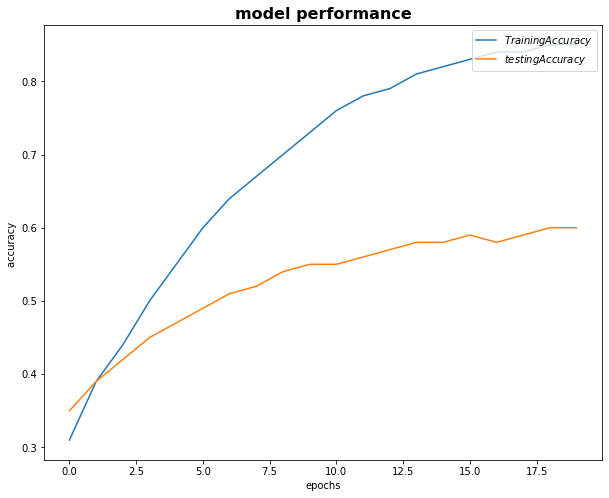
  
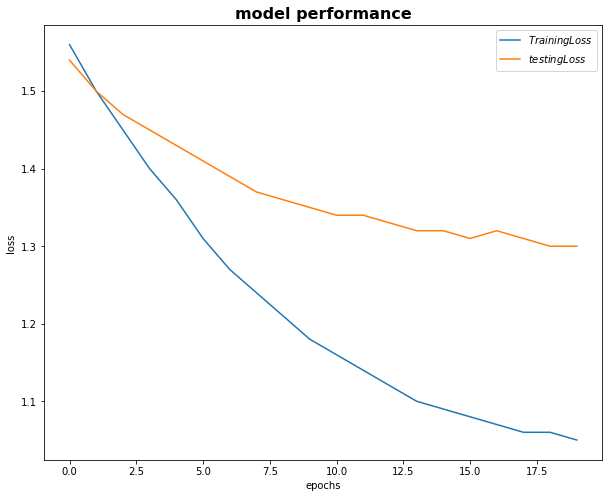

### Model test output for ten record

True label: neutral

Predicted label: neutral

Input Sentence: ape go you this over Will movie ?

---------------------------------

True label: negative

Predicted label: very positive

Input Sentence: However , fliems are their lights , however , in the distribution of the Disney phososophy required , greeting I wish to avoid .

---------------------------------

True label: very positive

Predicted label: positive

Input Sentence: Miyazaki 's nonstop images are so stunning , and his imagination so vivid , that the only possible complaint you could have about Spirited Away is that there is no rest period , no timeout .

---------------------------------

True label: neutral

Predicted label: neutral

Input Sentence: Can not get anywhere near the center of the story .

---------------------------------

True label: negative

Predicted label: negative

Input Sentence: This is the Rotel Drive to my mother and father 's wallet .

---------------------------------

True label: positive

Predicted label: very negative

Input Sentence: Those do n't entirely ` ' Godard ' s distinctive discourse will still come with sense of reserved but existential poignancy .

---------------------------------

True label: negative

Predicted label: negative

Input Sentence: If we do not require the quality standard for the art we choose , we deserve the garbage we get .

---------------------------------

True label: neutral

Predicted label: neutral

Input Sentence: you ' not totally - the notion community therapy spectacle Quitting hits home with force .

---------------------------------

True label: negative

Predicted label: negative

Input Sentence: For a shoot - 'em - up , Ballistic is oddly lifeless .

---------------------------------

True label: neutral

Predicted label: neutral

Input Sentence: The is reasonably well - done yet character and bits are to ever smoothly together .

---------------------------------

#### Further analysis of model performance for different dropout value - 0.2 , 0.4 , 0.6 , 0.8

**without data augmentation**
------------------------------------

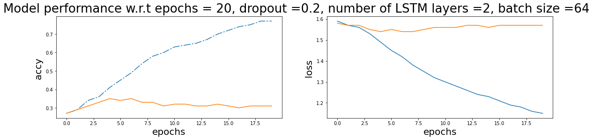

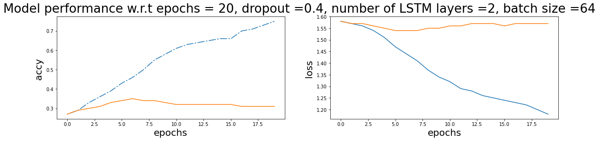

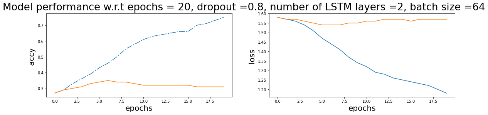

**with data augmentation**
---------------------------------

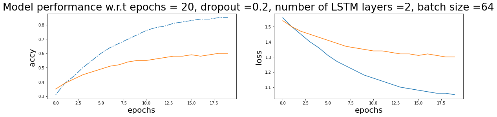

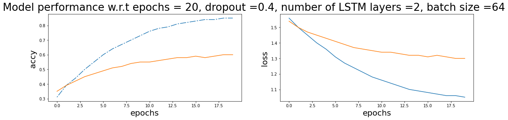

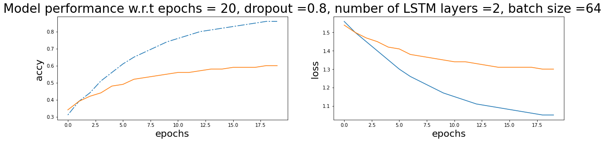

## Summary

| Performance metrics | without **Augmentation**  | with **Augmentation** |
| --- | --- | --- |
| Training accuracy | **75-77%** | **85%** |
| Test accuracy | **31%** | **60%** |
| Training loss | **1.18** | **1.05** |
| Test loss | **1.57** | **1.3** |

The biggest impact is seen in test accuracy , augmentation accuracy improved from 31% to **60%**.

Dropout did regularize during training but the model could not improve its performance.Will try other hyper parameter tuning to improve model performance.

### Future work

Try tuning other parameters like 

+ Number of LSTM layers

+ bidirectional = True

to check model performance

### Training logs 

* A dump of log is given below for reference

	Train Loss: 1.564 | Train Acc: 30.57%
	 Val. Loss: 1.538 |  Val. Acc: 34.71% 

	Train Loss: 1.504 | Train Acc: 38.84%
	 Val. Loss: 1.497 |  Val. Acc: 39.29% 

	Train Loss: 1.453 | Train Acc: 44.38%
	 Val. Loss: 1.471 |  Val. Acc: 42.14% 

	Train Loss: 1.403 | Train Acc: 49.85%
	 Val. Loss: 1.447 |  Val. Acc: 44.71% 

	Train Loss: 1.355 | Train Acc: 54.99%
	 Val. Loss: 1.428 |  Val. Acc: 46.66% 

	Train Loss: 1.310 | Train Acc: 59.74%
	 Val. Loss: 1.407 |  Val. Acc: 48.87% 

	Train Loss: 1.272 | Train Acc: 63.64%
	 Val. Loss: 1.390 |  Val. Acc: 50.60% 

	Train Loss: 1.238 | Train Acc: 67.23%
	 Val. Loss: 1.373 |  Val. Acc: 52.45% 

	Train Loss: 1.207 | Train Acc: 70.43%
	 Val. Loss: 1.362 |  Val. Acc: 53.53% 

	Train Loss: 1.181 | Train Acc: 73.14%
	 Val. Loss: 1.351 |  Val. Acc: 54.65% 

	Train Loss: 1.157 | Train Acc: 75.52%
	 Val. Loss: 1.342 |  Val. Acc: 55.50% 

	Train Loss: 1.136 | Train Acc: 77.52%
	 Val. Loss: 1.336 |  Val. Acc: 56.32% 

	Train Loss: 1.119 | Train Acc: 79.22%
	 Val. Loss: 1.327 |  Val. Acc: 57.00% 

	Train Loss: 1.103 | Train Acc: 80.83%
	 Val. Loss: 1.320 |  Val. Acc: 57.84% 

	Train Loss: 1.091 | Train Acc: 81.93%
	 Val. Loss: 1.319 |  Val. Acc: 57.87% 

	Train Loss: 1.081 | Train Acc: 82.83%
	 Val. Loss: 1.310 |  Val. Acc: 58.87% 

	Train Loss: 1.072 | Train Acc: 83.66%
	 Val. Loss: 1.316 |  Val. Acc: 58.16% 

	Train Loss: 1.065 | Train Acc: 84.38%
	 Val. Loss: 1.308 |  Val. Acc: 59.09% 

	Train Loss: 1.060 | Train Acc: 84.80%
	 Val. Loss: 1.298 |  Val. Acc: 60.09% 

	Train Loss: 1.053 | Train Acc: 85.43%
	 Val. Loss: 1.300 |  Val. Acc: 59.91% 

# Part b

## Question answer and duplicate question dataset analysis

### Abstract

There are 2 dataset 

* Question answer dataset

* Quora duplicate question dataset.

In the first case the model has to learn the answer and generate an answer to a question from the test dataset.

In the second dataset the model has to learn the context of question 2 and generate a duplicate question for question 1 from the test dataset.

The decoder gets the last hidden state from the encoder , then it processes each word from the target and finally returns an array of output

So the output returned by the model is a sparse one dimensional vector with values for the entire vocabulary range in the target dataset.

One thing which is not clear here is 

* output returned by the model is a sparse 1D vector of target vocabulary size

* target sentence is of limited length

How is the cross entropy loss being calculated? This is future work.

#### Dataset :

1. Parse the **question_answer_pairs.txt** file 

* this has 6 columns 

   * ArticleTitle

   * Question

   * Answer 

   * Q_Difficulty

   * A_Difficulty 

   * ArticleFile

* store only Question and Answer in a dataframe and dump to a file as tab separated file

* load the tab separated tokens to a dataframe

* split it into train and test dataset in 70:30 ratio.

  * Train data has **2092** question and answer

  * Test data has **1304** question and answer

2. Parse the **quora_duplicate_questions.tsv** file

* this has 6 columns

  * id,
  
  * qid1,
  
  * qid2,	
  
  * question1,	
  
  * question2,	
  
  * is_duplicate
  
* store these columns in a dataframe and clean records which has null value in question1  and question2.

* split it into train and test dataset in 70:30 ratio.

  * Train data has **282995** question1 and question2

  * Test data has **121284** question1 and question2
  
#### Model design

##### Encoder class

There are 3 layers in the encoder

* Embedding layer which stores the vocabulary of question 1

* LSTM layer to process the sentence and return the hidden and cell state

* Dropout layer for regularization

##### Decoder class

There are 4 layers in the decoder

* Embedding layer which stores the vocabulary of question 2

* LSTM layer to process the TRG sentence and return the output

* Linear layer to process the output returned by LSTM and generate a 1D vector having the size of TRG vocabulary

* Dropout layer for regularization

This class returns 1D vector of prediction and the last hidden and cell state

##### seq2seq class

This is a wrapper class to call the encoder and decoder class 

* The source sentence is supplied to the encoder and the last hidden and cell state is returned.

* This becomes the initial input to the decoder

* In addition first word of the target sentence is passed to the decoder

* In later iterations one word at a time is supplied till the end of the sentence , previous hidden and cell state become input to the decoder.

* The output of each iteration is stored in an array

* A threshold limit is set to decide whether to pick the max from the output returned by the decoder or the next word of the sentence in the next iteration.

* The loop continues till the end of the sentence

* The array of output is returned by the seq2seq model

##### model summary
 
The model has

| Layer | Input nodes | Output nodes |
| --- | --- | --- |
| Encoder |||
| Embedding | 40957 | 256 |
| 2 layers of LSTM  | 256 | 512 |
| Decoder |||
| Embedding | 37753 | 256 |
| 2 layers of LSTM  | 256 | 512 |
| Linear | 512 | 37753 |

The model has **46,873,465** trainable parameters

### Model performance

1. Question answer dataset

The model was run for 10 epochs , in the last epoch

+ Train Loss: 3.859 | Train PPL:  47.398
	 
+ Val. Loss: 3.312 |  Val. PPL:  27.442

A graph showing the plot of loss and accuracy across 10 epochs is shown below.

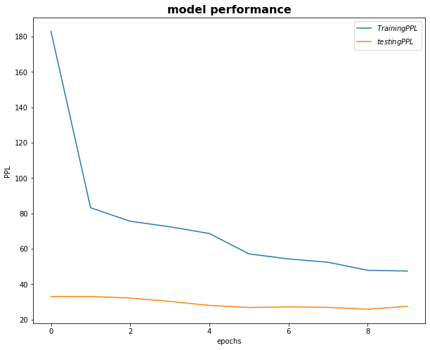
  
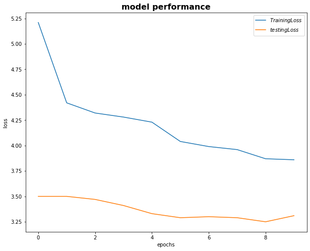

2. Quora dataset

The model was run for 4 epochs , in the last epoch

+ Train Loss: 3.575 | Train PPL:  35.697

+ Val. Loss: 4.639 |  Val. PPL: 103.431

A graph showing the plot of loss and accuracy across 4 epochs is shown below.

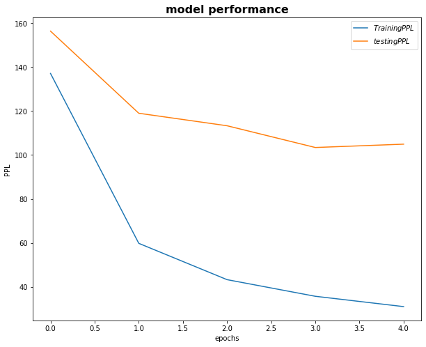
  
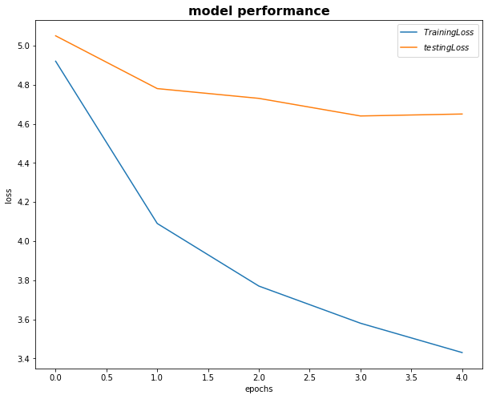

### Training logs 

1. Question answer dataset

* A dump of log is given below for reference

Epoch: 01 | Time: 0m 2s
	Train Loss: 5.209 | Train PPL: 182.924
	 Val. Loss: 3.495 |  Val. PPL:  32.959
Epoch: 02 | Time: 0m 2s
	Train Loss: 4.421 | Train PPL:  83.178
	 Val. Loss: 3.496 |  Val. PPL:  32.995
Epoch: 03 | Time: 0m 2s
	Train Loss: 4.325 | Train PPL:  75.558
	 Val. Loss: 3.470 |  Val. PPL:  32.124
Epoch: 04 | Time: 0m 2s
	Train Loss: 4.283 | Train PPL:  72.432
	 Val. Loss: 3.409 |  Val. PPL:  30.237
Epoch: 05 | Time: 0m 2s
	Train Loss: 4.228 | Train PPL:  68.614
	 Val. Loss: 3.331 |  Val. PPL:  27.962
Epoch: 06 | Time: 0m 2s
	Train Loss: 4.045 | Train PPL:  57.100
	 Val. Loss: 3.287 |  Val. PPL:  26.757
Epoch: 07 | Time: 0m 2s
	Train Loss: 3.993 | Train PPL:  54.236
	 Val. Loss: 3.301 |  Val. PPL:  27.136
Epoch: 08 | Time: 0m 2s
	Train Loss: 3.958 | Train PPL:  52.352
	 Val. Loss: 3.290 |  Val. PPL:  26.847
Epoch: 09 | Time: 0m 2s
	Train Loss: 3.867 | Train PPL:  47.815
	 Val. Loss: 3.249 |  Val. PPL:  25.776
Epoch: 10 | Time: 0m 2s
	Train Loss: 3.859 | Train PPL:  47.398
	 Val. Loss: 3.312 |  Val. PPL:  27.442

1. Duplicate question dataset

* A dump of log is given below for reference

Epoch: 01 | Time: 31m 32s
	Train Loss: 4.921 | Train PPL: 137.144
	 Val. Loss: 5.052 |  Val. PPL: 156.401
Epoch: 02 | Time: 31m 34s
	Train Loss: 4.091 | Train PPL:  59.802
	 Val. Loss: 4.779 |  Val. PPL: 119.021
Epoch: 03 | Time: 31m 25s
	Train Loss: 3.768 | Train PPL:  43.274
	 Val. Loss: 4.730 |  Val. PPL: 113.333
Epoch: 04 | Time: 31m 26s
	Train Loss: 3.575 | Train PPL:  35.697
	 Val. Loss: 4.639 |  Val. PPL: 103.431

