# Session 7

### Authors

* **Deepak Hazarika**
* **Parinita Bora**
* **Mohan Sai Srinivas Y**    

Thursday, 24 June 2021
----------

## Chatbot Dataset - AmbigQA

### Abstract

The AmbigQA dataset is a sample of chatbot question and answer.Questions can be on any subject and the corresponding reply.A encoder and decoder LSTM model with attention mechanism is used to train the model.The question is passed through the encoder and the hidden states are saved for each word in the sentence.The last hidden state of the encoder/decoder along with a single vector of all hidden state of each word of the source sentence is passed to an attention mechanism.This returns a context vector for the decoder.The decoder takes each word of the target sentence and the context vector.The embedding layer is a sparse matrix of entire vocabulary in target sentence.So when the target sentence is given to the embedding layer , it creates a dictionary of words in the target sentence.This is used during back propagation to adjust the weights of the words.There are 2 LSTM layers in the decoder , the first LSTM layer takes the output of the embedding layer.The second LSTM layer takes the hidden and cell state from the first LSTM layer along with the context vector.This provides the the decoder with both the context w.r.t to the question and hidden state for the target word.This is supposed to make the model more robust in predicting the right answer for a given question.It is to be investigated if this is a correct hypothesis.

#### Dataset :

- AmbigQA dataset of chatbot question and answer  ,parse the **nqopen-dev/test/train.json** file 

* which has 3 columns 

   * id

   * question
   
   * answer

src : - https://nlp.cs.washington.edu/ambigqa/

#### Model design

##### Encoder class

There are 3 layers in the encoder

* Embedding layer which stores the vocabulary of question 1

* LSTM layer to process the sentence and return the hidden and cell state

* Dropout layer for regularization

##### Decoder class

There are 5 layers in the decoder

* Embedding layer which stores the vocabulary of answer

* LSTM layer to process the TRG sentence and return the output

* LSTM layer to process the context vector returned by attention mechanism and the hidden state and cell state returned by the above lstm layer and return the output

* Linear layer to process the output returned by LSTM and generate a 1D vector having the size of TRG vocabulary

* Dropout layer for regularization

This class returns 1D vector of prediction and the last hidden and cell state

##### seq2seq class

**Attention mechanism:** An attention mechanism is added in seq2seq class

  * The last hidden state of the decoder is paired with each hidden state of the encoder.

  * Each pair is passed to a linear layer  to get the weight for that word

  * All the weights are then stacked vertically and reshaped to get the relative weight of each word w.r.t the sentence using a softmax function.

  * The relative weight vector is multiplied with the singlevector generated by the encoder to get the **Context vector** of the word w.r.t the sentence.

The attention mechanism is very well illustrated by the following diagram

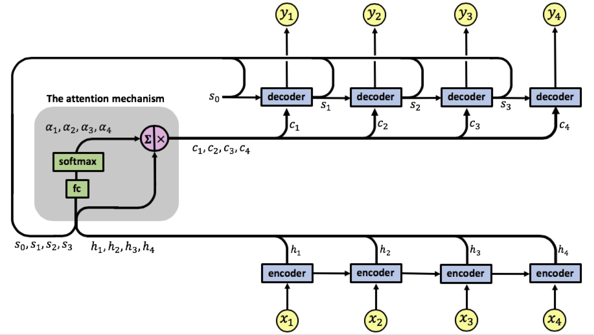

How to calculate the weight for each hidden state is shown by the diagram below

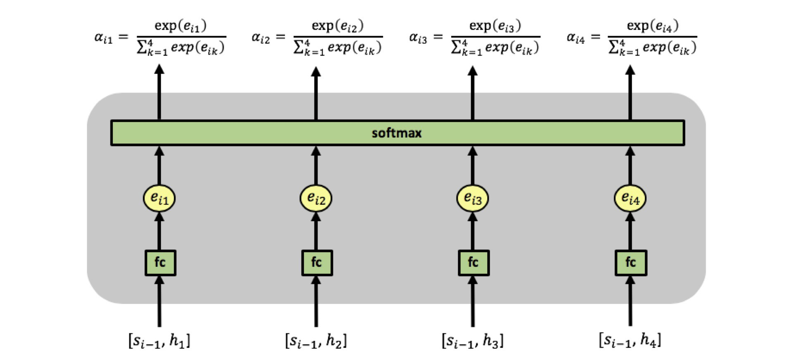

seq2seq is a wrapper class to call the encoder and decoder class 

* Each word of the source sentence is supplied to the encoder and the hidden and cell state are stacked to return a single vector for hidden and cell state.

* This single vector along with the last hidden and cell state of encoder (for the first word) and later from decoder is provided to the attention mechanism , which returns a context vector

* In each iterations one word at a time is supplied till the end of the sentence along with the context vector, previous hidden and cell state.

* The output of each iteration is stored in an array

* In addition a threshhold limit is set to decide whether to pick the max from the output returned by the decoder or the next word of the sentence in the next iteration.

* The loop continues till the end

* The array of output is returned by the seq2seq model
 
### model summary

The model has

| Layer | Input nodes | Output nodes |
| --- | --- | --- |
| Encoder |||
| Embedding | 13655 | 512 |
| LSTM  | 512 | 512 |
| Attention |||
| Linear | 1024 | 1 |
| Decoder |||
| Embedding | 15034 | 512 |
| LSTM  | 512 | 512 |
| LSTM  | 512 | 512 |
| Linear | 512 | 15034 |

**28,705,979** trainable parameters

#### Data split

The data was split into training and validation in the ratio of 70:30 using BucketIterator.

	
* Number of training examples: 64074
  
* Number of testing examples: 27461
  
  
### Model performance 

The model was run for 10 epochs , in the last epoch

+ Epoch: 10 | Time: 1m 46s
	
	+ Train Loss: 3.074 | Train PPL:  21.638
	 
	+ Val. Loss: 4.426 |  Val. PPL:  83.595

A graph showing the plot of loss and accuracy across 10 epochs is shown below.

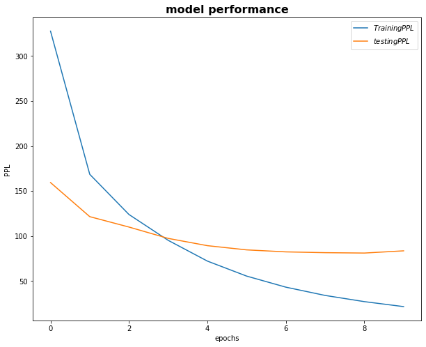
  
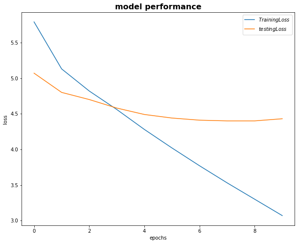

#### **Further analysis of model performance for different dropout value - 0.1 , 0.3 , 0.5 , 0.7**

*embedded dimension 256*

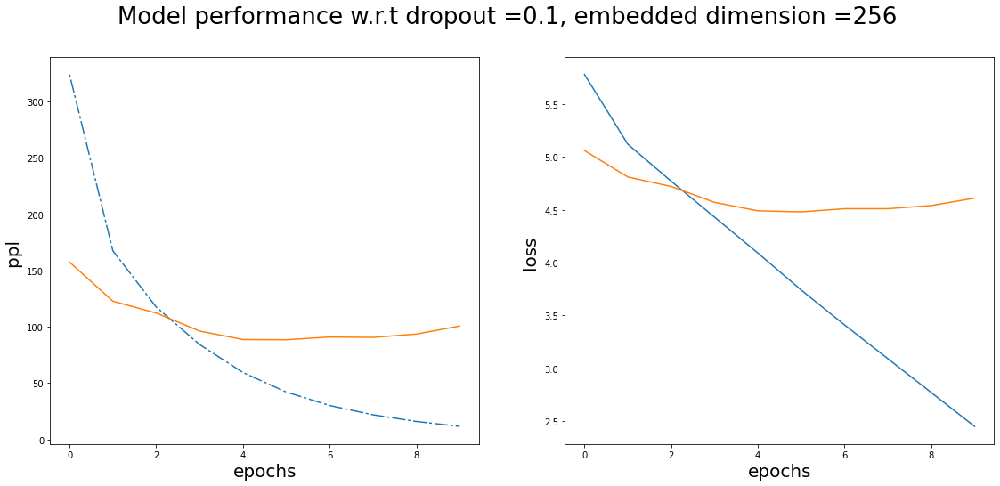

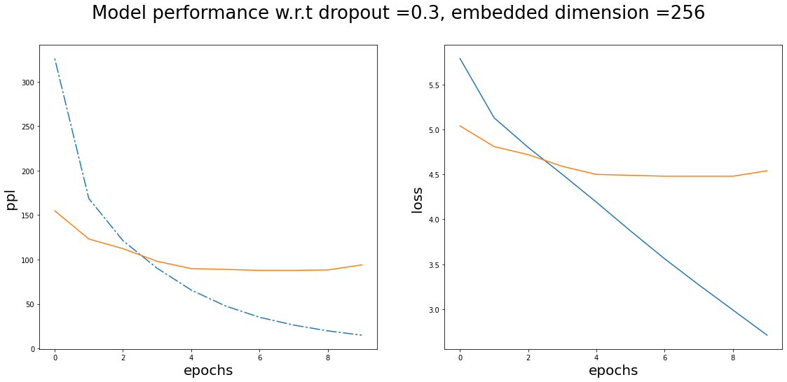

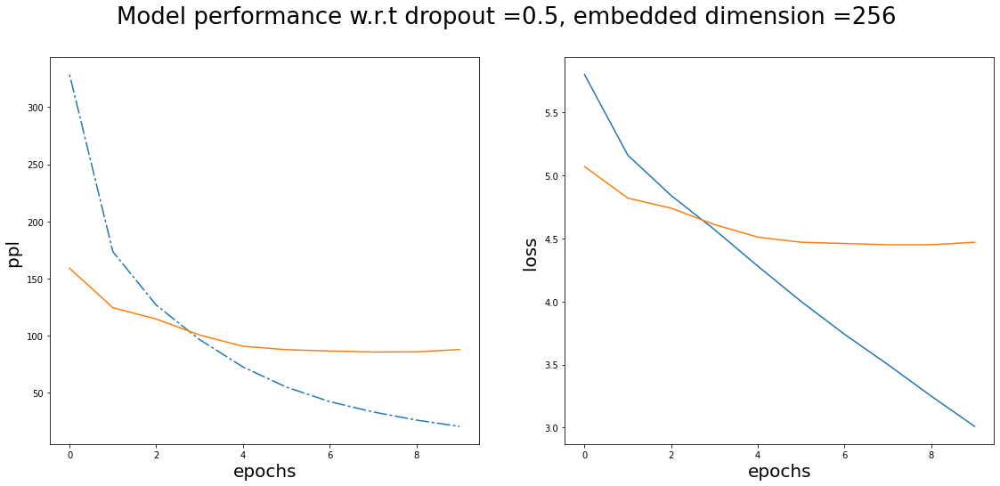

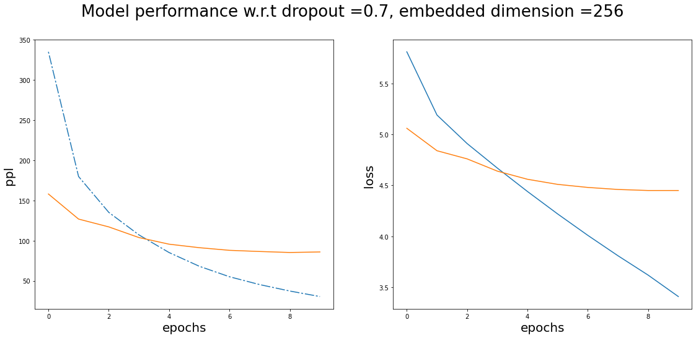

*embedded dimension 512*

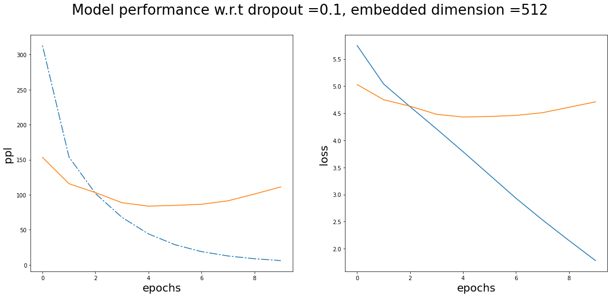

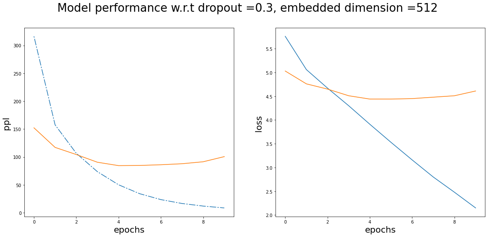

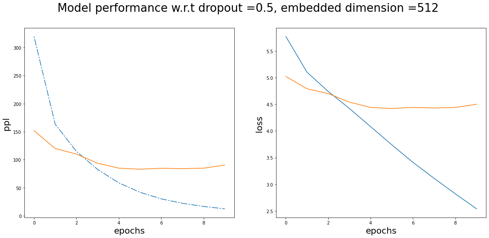

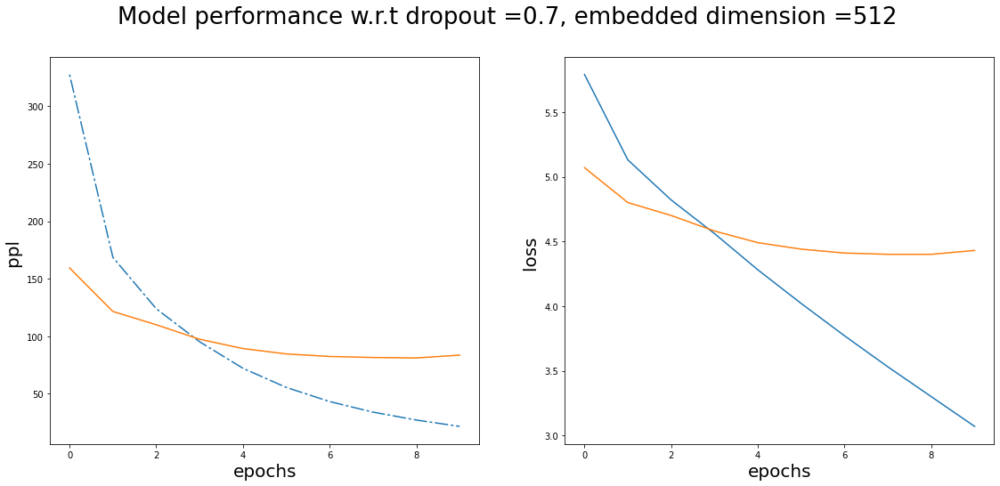

## Summary

1.   Training ppl is between 6 to 30 for different dropout values
2.   Validation ppl is between 83 to 111 for different dropout values, but at higher dropout value the ppl decrease at a slower rate , and at dropout value of 0.1 and 0.3 the ppl tends to increase after 10 epochs
3.   Training loss is between 1.7 to 3.5 and decreases at a lower rate after 10 epochs
4.   Validation loss around 4.5 , it tends to increase at dropout value of 0.1 and 0.3 after 10 epochs.

This time dropout did show a difference in model performance , at 0.5 and 0.7 the model is more robust.
Number of embedded dimension did not have any impact across different dropout values.

### Future work

Try tuning other parameters like 

+ Number of LSTM layers

+ bidirectional = True

to check model performance

### Training logs 

* A dump of log is given below for reference

Epoch: 01 | Time: 1m 47s
	Train Loss: 5.792 | Train PPL: 327.590
	 Val. Loss: 5.072 |  Val. PPL: 159.415
Epoch: 02 | Time: 1m 47s
	Train Loss: 5.127 | Train PPL: 168.591
	 Val. Loss: 4.800 |  Val. PPL: 121.560
Epoch: 03 | Time: 1m 48s
	Train Loss: 4.820 | Train PPL: 123.929
	 Val. Loss: 4.700 |  Val. PPL: 109.999
Epoch: 04 | Time: 1m 47s
	Train Loss: 4.556 | Train PPL:  95.232
	 Val. Loss: 4.579 |  Val. PPL:  97.396
Epoch: 05 | Time: 1m 48s
	Train Loss: 4.279 | Train PPL:  72.165
	 Val. Loss: 4.492 |  Val. PPL:  89.316
Epoch: 06 | Time: 1m 47s
	Train Loss: 4.017 | Train PPL:  55.517
	 Val. Loss: 4.439 |  Val. PPL:  84.651
Epoch: 07 | Time: 1m 48s
	Train Loss: 3.766 | Train PPL:  43.225
	 Val. Loss: 4.412 |  Val. PPL:  82.432
Epoch: 08 | Time: 1m 47s
	Train Loss: 3.528 | Train PPL:  34.050
	 Val. Loss: 4.401 |  Val. PPL:  81.541
Epoch: 09 | Time: 1m 47s
	Train Loss: 3.302 | Train PPL:  27.166
	 Val. Loss: 4.396 |  Val. PPL:  81.135
Epoch: 10 | Time: 1m 46s
	Train Loss: 3.074 | Train PPL:  21.638
	 Val. Loss: 4.426 |  Val. PPL:  83.595

#### Future work:

Debug the output returned by the model and see the predicted answer.