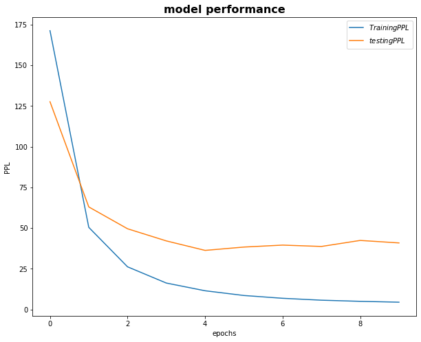
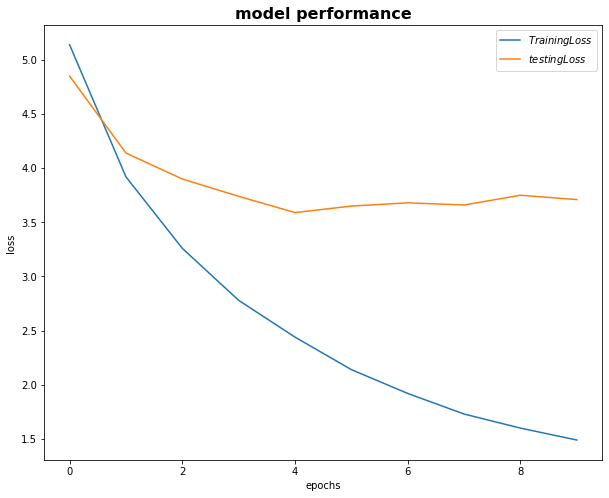

# Session 8

### Authors

* **Deepak Hazarika**
* **Parinita Bora**
* **Mohan Sai Srinivas Y**    

Thursday, 4 July 2021

### Abstract

The purpose of this exercise is to re purpose existing code to replace torchtext.legacy for encoder decoder model using the Multi30k dataset.

A text transform method is used to 

* tokenize

* build vocab 

* convert to a tensor.

This becomes the pipeline to the model during batch processing.The model is evaluated over 10 epochs, then it is used to translate sample sentence from German to English.

BLEU score is calculated to see the model performance.In this case the BLUE score is very low , will have to investigate further.

#### Dataset :

- Multi30k dataset of source sentence in English and target sentence in German.The data is split into 

* Number of training examples: 29000 
  
* Number of valid examples: 1014 

* Number of testing examples: 1000

#### Model design

##### Encoder class

There are 4 layers in the encoder

* Embeddingbag layer which stores the vocabulary of source sentence

* GRU layer with bidirectional set to true, to process the sentence and return the output and hidden state

* Linear layer to reduce 1024 dimension to 512

* Dropout layer for regularization

##### Decoder class

There are 4 layers in the decoder

* Embedding layer which stores the vocabulary of answer

* GRU layer which takes the embedding and the context returned by the encoder.

* Linear layer takes hidden state , embedding and the context to get a context of the source sentence , what to forget, what to pay attention in the target sentence.This will help in fine tuning the weights of words during back propagation.Hence the model accuracy will improve.

* Dropout layer for regularization

This class returns 1D vector of prediction and the last hidden and cell state

##### seq2seq class

**Attention mechanism:** An attention mechanism is added in Decoder class

  * The last hidden state of the decoder is paired with output of the encoder.

  * Each pair is passed through two linear layer to get the weight of encoder output w.r.t that pair of encoder output and hidden state.

  * All the weights are then stacked vertically and reshaped to get the relative weight of each word w.r.t the sentence using a softmax function.

  * The relative weight vector is multiplied with the singlevector generated by the encoder to get the **Context vector** of the word w.r.t the sentence.

The attention mechanism is very well illustrated by the following diagram

How to calculate the weight for each hidden state is shown by the diagram below

seq2seq is a wrapper class to call the encoder and decoder class 

* Source sentence is supplied to the encoder and output is returned.

* This output along with the last hidden state of encoder (for the first word) and later from decoder is provided to the attention mechanism , which returns a context vector

* In each iterations one word at a time is supplied till the end of the sentence along with the context vector, previous hidden state.

* The output of each iteration is stored in an array

* In addition a threshold limit is set to decide whether to pick the max from the output returned by the decoder or the next word of the sentence in the next iteration.

* The loop continues till the end

* The array of output is returned by the seq2seq model
 
### model summary

| Layer | Input nodes | Output nodes |
| --- | --- | --- |
| Encoder |||
| Embedding | 19206 | 256 |
| GRU  | 256 | 512 |
| Linear | 1024 | 512 |
| Attention |||
| Linear | 1536 | 512 |
| Linear | 512 | 1 |
| Decoder |||
| Embedding | 10840 | 256 |
| GRU  | 1280 | 512 |
| Linear | 1792 | 10840 |

**33,561,176** trainable parameters

### Model performance 

Model 1

The model was run for 10 epochs , in the last epoch

+ Epoch: 10 | Time: 1m 20s
 
	+ Train Loss: 1.487 | Train PPL:   4.422
	 
	+ Val. Loss: 3.710 |  Val. PPL:  40.860

A graph showing the plot of loss and accuracy across 10 epochs is shown below.

  

### Future work

Investigate why the BLEU score is low.

### Training logs 

* A dump of log is given below for reference

Epoch: 01 | Time: 1m 20s
	Train Loss: 5.144 | Train PPL: 171.328
	 Val. Loss: 4.849 |  Val. PPL: 127.651
Epoch: 02 | Time: 1m 20s
	Train Loss: 3.921 | Train PPL:  50.434
	 Val. Loss: 4.143 |  Val. PPL:  62.986
Epoch: 03 | Time: 1m 20s
	Train Loss: 3.265 | Train PPL:  26.172
	 Val. Loss: 3.903 |  Val. PPL:  49.563
Epoch: 04 | Time: 1m 20s
	Train Loss: 2.784 | Train PPL:  16.186
	 Val. Loss: 3.740 |  Val. PPL:  42.100
Epoch: 05 | Time: 1m 20s
	Train Loss: 2.438 | Train PPL:  11.451
	 Val. Loss: 3.591 |  Val. PPL:  36.260
Epoch: 06 | Time: 1m 20s
	Train Loss: 2.144 | Train PPL:   8.538
	 Val. Loss: 3.646 |  Val. PPL:  38.305
Epoch: 07 | Time: 1m 20s
	Train Loss: 1.920 | Train PPL:   6.824
	 Val. Loss: 3.677 |  Val. PPL:  39.517
Epoch: 08 | Time: 1m 20s
	Train Loss: 1.731 | Train PPL:   5.647
	 Val. Loss: 3.655 |  Val. PPL:  38.678
Epoch: 09 | Time: 1m 20s
	Train Loss: 1.600 | Train PPL:   4.952
	 Val. Loss: 3.747 |  Val. PPL:  42.392
Epoch: 10 | Time: 1m 20s
	Train Loss: 1.487 | Train PPL:   4.422
	 Val. Loss: 3.710 |  Val. PPL:  40.860

## Summary

The model is able to translate from German to English , but room for improvement is there to increase BLEU score.