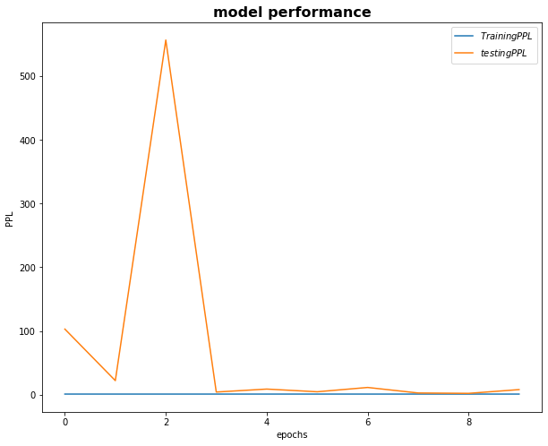
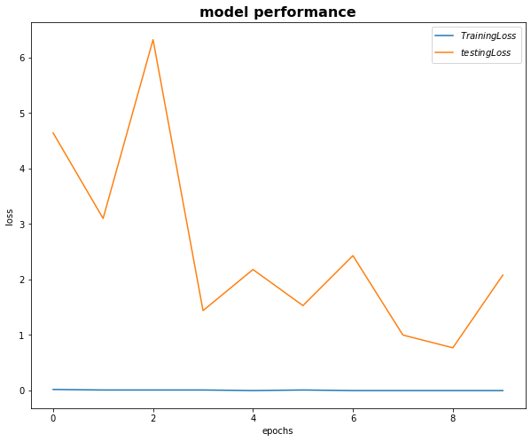
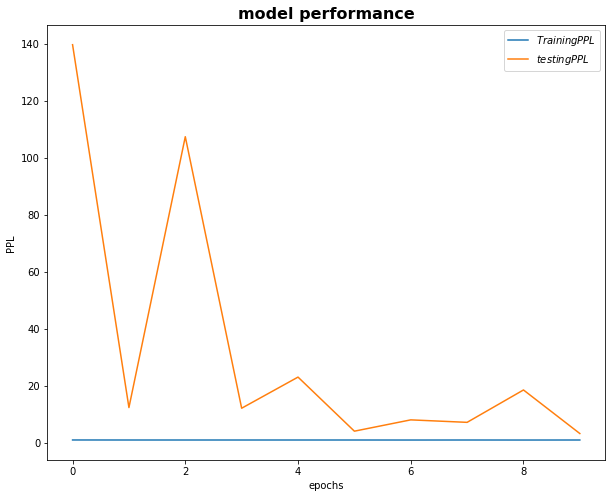
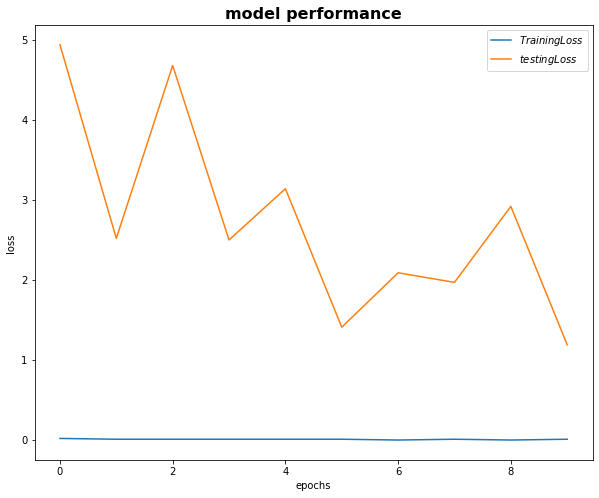

# Session 8

### Authors

* **Deepak Hazarika**
* **Parinita Bora**
* **Mohan Sai Srinivas Y**    

Thursday, 1 July 2021
----------

### Abstract

The purpose of this exercise is to re purpose existing code to replace torchtext.legacy for two encoder decoder model using the Multi30k dataset.This time generators are used instead  of iterators, the benefit is low memory usage, the data is used and cleaned up.The yield keyword in the token function is used along with the generator.The Multi30k dataset returns a generator , that is the reason the dataset is invoked multiple times in the code as and when it is required.

Another major change is in using embeddingbag function which takes a 1 D array of sentences along with the offset of each sentence in the 1 D array.This is an effecient use of memory by avoiding padding the sentences to match the longest sentence.

This method is used in the encoder , the decoder code could not be re-purposed because we are looking at each word in the sentence along with the context of the encoder.The difficulty is in finding the word at the same index for all the sentences in the batch.So the decoder is kept as it is.

The advantage observed in repurposing is the speed of execution , it is faster now.

#### Dataset :

- Multi30k dataset of source sentence in English and target sentence in German.The data is split into 

* Number of training examples: 29000 
  
* Number of valid examples: 1014 

* Number of testing examples: 1000

#### Model design

##### Encoder class

There are 3 layers in the encoder

* Embeddingbag layer which stores the vocabulary of source sentence

* GRU layer to process the sentence and return the output and hidden state

* Dropout layer for regularization

##### Decoder class

There are 4 layers in the decoder

* Embedding layer which stores the vocabulary of answer

* GRU layer which takes the embedding and the context returned by the encoder.

* Linear layer takes hidden state , embedding and the context to get a context of the source sentence , what to forget, what to pay attention in the target sentence.This will help in fine tuning the weights of words during back propagation.Hence the model accuracy will improve.

* Dropout layer for regularization

This class returns 1D vector of prediction and the last hidden and cell state

##### seq2seq class

**Attention mechanism:** An attention mechanism is added in Decoder class

  * The last hidden state of the decoder is paired with output of the encoder.

  * Each pair is passed through two linear layer to get the weight of encoder output w.r.t that pair of encoder output and hidden state.

  * All the weights are then stacked vertically and reshaped to get the relative weight of each word w.r.t the sentence using a softmax function.

  * The relative weight vector is multiplied with the singlevector generated by the encoder to get the **Context vector** of the word w.r.t the sentence.

The attention mechanism is very well illustrated by the following diagram

How to calculate the weight for each hidden state is shown by the diagram below

seq2seq is a wrapper class to call the encoder and decoder class 

* Source sentence is supplied to the encoder and output is returned.

* This output along with the last hidden state of encoder (for the first word) and later from decoder is provided to the attention mechanism , which returns a context vector

* In each iterations one word at a time is supplied till the end of the sentence along with the context vector, previous hidden state.

* The output of each iteration is stored in an array

* In addition a threshold limit is set to decide whether to pick the max from the output returned by the decoder or the next word of the sentence in the next iteration.

* The loop continues till the end

* The array of output is returned by the seq2seq model
 
### model summary

The model 1 has

| Layer | Input nodes | Output nodes |
| --- | --- | --- |
| Encoder |||
| Embedding | 18542 | 256 |
| GRU  | 256 | 512 |
| Decoder |||
| Embedding | 11396 | 256 |
| GRU  | 768 | 512 |
| Linear | 1280 | 11396 |

has **25,414,276** trainable parameters

Model 2 

| Layer | Input nodes | Output nodes |
| --- | --- | --- |
| Encoder |||
| Embedding | 18542 | 256 |
| GRU  | 256 | 512 |
| Linear | 1024 | 512 |
| Attention |||
| Linear | 1536 | 512 |
| Linear | 512 | 1 |
| Decoder |||
| Embedding | 11396 | 256 |
| GRU  | 1280 | 512 |
| Linear | 1792 | 11396 |

**34,530,436** trainable parameters

### Model performance 

Model 1

The model was run for 10 epochs , in the last epoch

+ Epoch: 10 | Time: 1m 46s

	+ Train Loss: 0.002 | Train PPL:   1.002
	 
	+ Val. Loss: 2.084 |  Val. PPL:   8.040

A graph showing the plot of loss and accuracy across 10 epochs is shown below.

  

Model 2

The model was run for 10 epochs , in the last epoch

+ Epoch: 10 | Time: 1m 46s

	+ Train Loss: 0.005 | Train PPL:   1.006
	 
	+ Val. Loss: 1.188 |  Val. PPL:   3.281

A graph showing the plot of loss and accuracy across 10 epochs is shown below.

  

### Future work

Try embedding bag in decoder to check model performance

### Training logs 

Model 1

* A dump of log is given below for reference

Epoch: 02 | Time: 0m 1s
	Train Loss: 0.021 | Train PPL:   1.021
	 Val. Loss: 4.635 |  Val. PPL: 103.032
-----------------------------------------------------------
Epoch: 03 | Time: 0m 0s
	Train Loss: 0.010 | Train PPL:   1.010
	 Val. Loss: 3.097 |  Val. PPL:  22.141
-----------------------------------------------------------
Epoch: 04 | Time: 0m 0s
	Train Loss: 0.008 | Train PPL:   1.008
	 Val. Loss: 6.322 |  Val. PPL: 556.820
-----------------------------------------------------------
Epoch: 05 | Time: 0m 0s
	Train Loss: 0.014 | Train PPL:   1.014
	 Val. Loss: 1.440 |  Val. PPL:   4.220
-----------------------------------------------------------
Epoch: 06 | Time: 0m 0s
	Train Loss: 0.004 | Train PPL:   1.004
	 Val. Loss: 2.182 |  Val. PPL:   8.861
-----------------------------------------------------------
Epoch: 07 | Time: 0m 0s
	Train Loss: 0.005 | Train PPL:   1.005
	 Val. Loss: 1.534 |  Val. PPL:   4.637
-----------------------------------------------------------
Epoch: 08 | Time: 0m 0s
	Train Loss: 0.004 | Train PPL:   1.004
	 Val. Loss: 2.433 |  Val. PPL:  11.397
-----------------------------------------------------------
Epoch: 09 | Time: 0m 0s
	Train Loss: 0.004 | Train PPL:   1.004
	 Val. Loss: 1.005 |  Val. PPL:   2.732
-----------------------------------------------------------
Epoch: 10 | Time: 0m 0s
	Train Loss: 0.003 | Train PPL:   1.003
	 Val. Loss: 0.765 |  Val. PPL:   2.150
-----------------------------------------------------------
Epoch: 11 | Time: 0m 0s
	Train Loss: 0.002 | Train PPL:   1.002
	 Val. Loss: 2.084 |  Val. PPL:   8.040
-----------------------------------------------------------

Model 2

Epoch: 02 | Time: 0m 1s
	Train Loss: 0.021 | Train PPL:   1.021
	 Val. Loss: 4.940 |  Val. PPL: 139.819
-----------------------------------------------------------
Epoch: 03 | Time: 0m 1s
	Train Loss: 0.011 | Train PPL:   1.011
	 Val. Loss: 2.518 |  Val. PPL:  12.398
-----------------------------------------------------------
Epoch: 04 | Time: 0m 0s
	Train Loss: 0.007 | Train PPL:   1.007
	 Val. Loss: 4.678 |  Val. PPL: 107.510
-----------------------------------------------------------
Epoch: 05 | Time: 0m 1s
	Train Loss: 0.010 | Train PPL:   1.010
	 Val. Loss: 2.499 |  Val. PPL:  12.172
-----------------------------------------------------------
Epoch: 06 | Time: 0m 0s
	Train Loss: 0.005 | Train PPL:   1.005
	 Val. Loss: 3.140 |  Val. PPL:  23.105
-----------------------------------------------------------
Epoch: 07 | Time: 0m 0s
	Train Loss: 0.009 | Train PPL:   1.009
	 Val. Loss: 1.414 |  Val. PPL:   4.111
-----------------------------------------------------------
Epoch: 08 | Time: 0m 1s
	Train Loss: 0.004 | Train PPL:   1.004
	 Val. Loss: 2.089 |  Val. PPL:   8.081
-----------------------------------------------------------
Epoch: 09 | Time: 0m 0s
	Train Loss: 0.005 | Train PPL:   1.005
	 Val. Loss: 1.975 |  Val. PPL:   7.206
-----------------------------------------------------------
Epoch: 10 | Time: 0m 1s
	Train Loss: 0.005 | Train PPL:   1.005
	 Val. Loss: 2.922 |  Val. PPL:  18.580
-----------------------------------------------------------
Epoch: 11 | Time: 0m 1s
	Train Loss: 0.005 | Train PPL:   1.006
	 Val. Loss: 1.188 |  Val. PPL:   3.281
-----------------------------------------------------------

## Summary

The model performance on validation dataset did improve in model 2 which has attention mechanism.